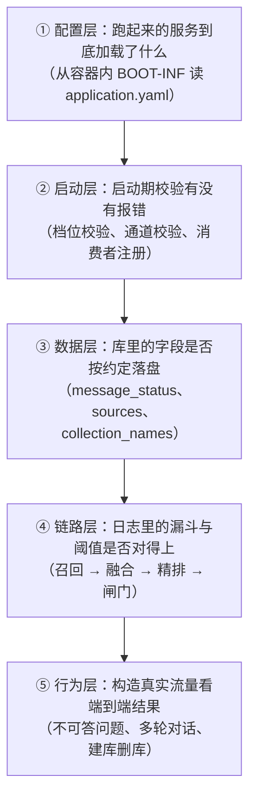
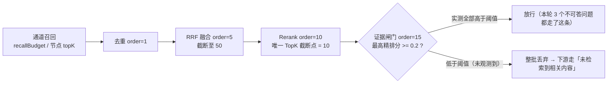
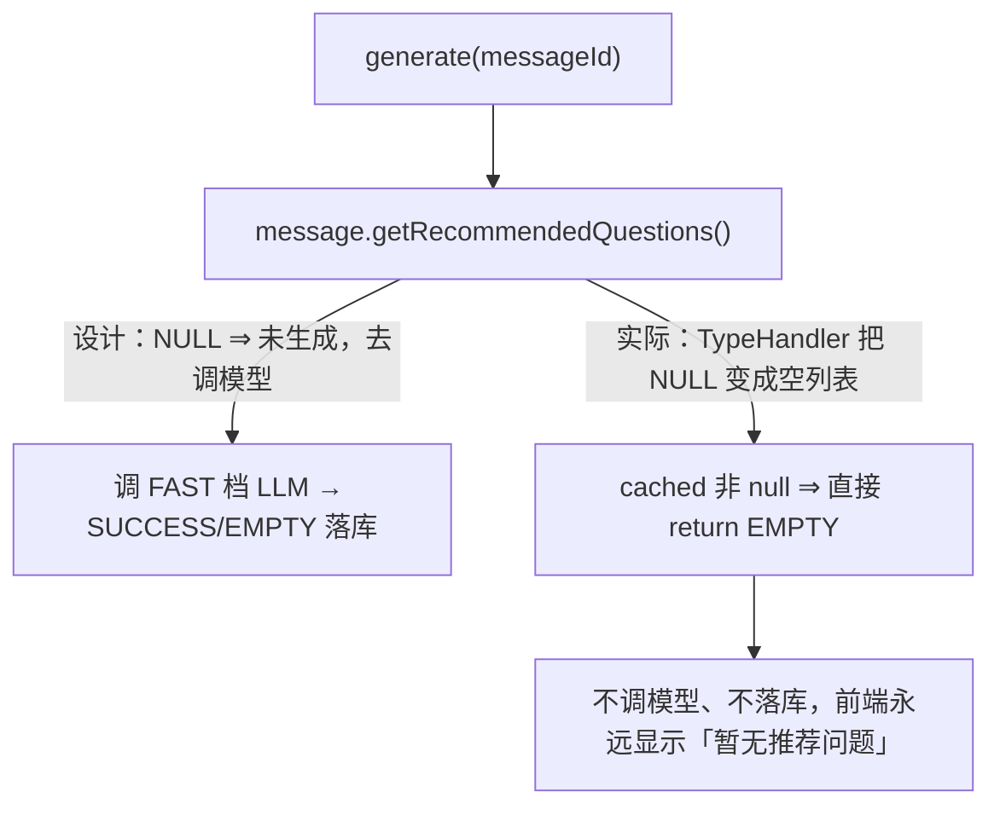
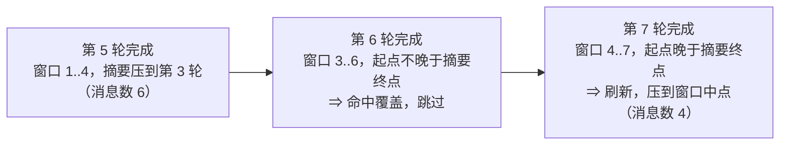

# 批次二上线验证报告（8 项大功能逐项验收）

> 口径说明：本文所有日志、SQL、接口返回都来自**生产环境**（`146.56.241.229`）。
> 被测版本：镜像 tag `b6421f54`（批次二），后端容器 `ragent-backend-1`，生产库 `ragent`。
> 验证方式：**先用接口/浏览器制造真实流量，再去日志和数据库里取硬证据**——不靠"我觉得它能用"。
> 面试时建议先讲「我怎么设计验证」，再讲「发现了什么」，最后讲「怎么定位和收口」。

## 一句话结论

**6 项通过、2 项部分通过、1 项失败**（部分通过=功能生效但有偏差）：

| # | 功能 | 结论 | 决定性证据 |
| --- | --- | --- | --- |
| 1 | 检索管线（UP-07）+ 证据闸门（UP-09） | ⚠️ 部分通过 | 漏斗 `50→50→10` 正常；但**闸门阈值 0.2 在该 reranker 下恒不触发** |
| 2 | 来源 / 行内角标 / 文档预览（UP-12/12b/18/18b） | ✅ 通过 | `t_message.sources` 3 条（4/5/9 个来源）、3 条回答含 `[N](#cite-N)`、预览接口返回原文 |
| 3 | 推荐追问 + 消息状态 + 取消（UP-19/20/38） | ❌ 推荐追问失败，状态通过 | `POST …/recommended-questions` **28ms 返回 EMPTY、不调模型、不落库** |
| 4 | 意图关联多知识库（UP-10） | ✅ 通过 | 一个意图挂两个库时，**一次检索同时召回两个库的片段** |
| 5 | 知识库删除异步清理（UP-15） | ✅ 通过 | 事务消息 `SEND_OK` → 消费者依次清理向量空间、bucket |
| 6 | 模型调用档位（UP-22a/b） | ✅ 通过（有观测缺口） | 启动校验 `tiers=[fast, standard, deep]`；`deepThinking=true` 落库思考内容 114s |
| 7 | 分块合并语义（UP-13） | ⚠️ 部分通过 | 体量预算合并生效（334 + 123 ≤ 400）；**markdown 上传走 Tika，提纲边界规则未被触发** |
| 8 | 会话摘要刷新边界（UP-17） | ✅ 通过 | 7 轮对话只触发 **2 次**摘要；修复前同类会话是 **轮数 − 4 次** |

另外发现 **3 个需要收口的问题**，见文末「发现的问题」。

---

## 1. 验证方法论（这段是面试加分项）

上线验证不是"点点看能不能用"，而是**按证据强度分层**：



上一轮（批次一）是**只读对账**，这一轮是**主动构造流量**：因为"落库了"不等于"逻辑对"，
最好的证据是**主动制造一个只有正确实现才能通过的场景，然后看系统反应**。

几个可以直接复用的技巧：

1. **用测试数据造"唯一解"**：要验证"意图挂多个库真的会都去检索"，看代码是不够的。
   我新建了一个只含一份测试文档的知识库，把内容写成语料里**独有**的字符串（"分块合并验证样例"），
   再把它挂到某个意图上——检索结果里只要出现它，就证明第二条库路径真的被走了。
2. **破坏性验证用自建对象**：删库这类动作不要在真实知识库上做，自己建一个测试库
   （上传 → 分块 → 再删），既验证全链路，又不碰任何真实数据。
3. **对比法替代"我觉得"**：UP-17 的收益是"不再每轮都调 LLM"，
   所以把**修复前的历史会话**当对照组、**今天新建的会话**当实验组，比的全是库里的真实行数。
4. **所有临时改动都要还原**：临时改过的意图节点字段，每次都紧跟一次还原并用接口回读确认。

---

## 2. 逐项验证

### 2.1 检索管线（UP-07）+ 证据闸门（UP-09）——⚠️ 部分通过

**验证方法**：用真实问题打流量，看日志漏斗的每一段数字与配置是否对得上。

**实测证据（生产日志）**：

```text
# 全局向量通道（问题未命中任何意图）
18:21:08 启用的检索通道：[VectorGlobalSearch]
18:21:09 RRF 融合完成 - 通道数: 1, k: 60, 融合后: 50 个, 截断上限: 50, 送入 Rerank: 50 个
18:21:09 检索归因 - 精排分布: 10 条有分, 最高 0.4580073, 最低 0.4342955

# 意图定向通道（命中知识库意图）
18:05:28 启用的检索通道：[IntentDirectedSearch]
18:05:29 意图定向检索完成，检索到 8 个 Chunk，耗时 481ms
18:05:29 检索归因 - 精排分布: 8 条有分, 最高 0.8867079, 最低 0.62501377
```

配置对账：`recall-budget=0` → 跟随 `fusion.rerank-candidate-limit=50`；
精排 `top_n = context.topK = 10`。**漏斗每一段都只有一个旋钮**，这正是 UP-07 要的效果。

**闸门（UP-09）的实测**：构造 3 个语料里**根本不存在**的问题（量子场论重整化群、法国首都、Python asyncio 源码）：

| 问题 | 精排最高分 | 与阈值 `min-rerank-score=0.2` 比较 | 闸门行为 |
| --- | --- | --- | --- |
| 量子场论重整化群方程推导 | 0.4580 | 高于阈值 | 放行 |
| 法国首都与历史建筑 | 0.3943 | 高于阈值 | 放行 |
| Python asyncio 事件循环源码 | 0.3273 | 高于阈值 | 放行 |

结论：**闸门代码生效、开关生效，但 0.2 这个阈值在当前 reranker（`qwen3-rerank`）下永远不会触发**——
该模型对"完全无关"的文本对也会给出 0.33~0.46 的分数，`min-rerank-score` 应落在 **0.5~0.6** 才具备区分度。
好消息是用户可见行为仍然正确（模型自己回了"当前可用信息不足以回答该问题"），
所以这是**成本/鲁棒性问题，不是正确性问题**——但它意味着闸门目前是"装了没通电"。



### 2.2 来源 / 行内角标 / 文档预览（UP-12/12b/18/18b）——✅ 通过

**验证方法**：问一个能命中资料的问题，然后查 `t_message.sources`、看回答正文里的角标、调预览接口。

**实测证据**：`t_message.sources` 已按文档级落库，字段齐全：

```json
[{"docId":"2102384580865589248","index":1,"docName":"湖南大学本科生选课指南.pdf",
  "excerpt":"1. 仅限毕业班学生可申请“冲突选课”…","fileType":"pdf","sourceType":"file"}]
```

```sql
SELECT id, jsonb_array_length(sources) AS n_src, jsonb_array_length(grounding_chunks) AS n_gr
FROM t_message WHERE sources IS NOT NULL;
-- 2104150465817153536 | 4 | 4
-- 2104145304092741632 | 5 | 5
-- 2104144803309621248 | 9 | 8   ← grounding 上限 8，符合 UP-19 的约定
```

行内角标：3 条回答正文里确实带 `[N](#cite-N)`，例如
「开学后的**前两周内**申请退课…`[2](#cite-2)`」——编号与 `sources[].index` 同源。

预览接口：`GET /knowledge-base/docs/{docId}/preview`

- 对 PDF 返回业务错误 `仅支持预览 markdown 格式文档`（**设计如此**，不是 bug）；
- 对自己上传的 `.md` 文档返回**原文全文**（实测返回了完整的标题、段落、表格、代码块）。

### 2.3 推荐追问 + 消息状态 + 取消（UP-19/20/38）——❌ 推荐追问失败

**验证方法**：直接调推荐追问的生成接口，看它是否调模型、是否落库。

**实测证据（失败）**：

```text
POST /api/ragent/conversations/messages/2104150465817153536/recommended-questions
→ {"code":"0","data":{"status":"EMPTY","questions":[]}}     耗时 0.028s

GET  同一个接口 → 同样返回 EMPTY（而不是"推荐问题尚未生成"）

SELECT count(*) AS total, count(recommended_questions) AS not_null FROM t_message;
→ total=464, not_null=0     ← 全库没有一条消息生成过推荐追问
```

28ms、没有 LLM 调用、没有落库 —— 说明它在**调模型之前就短路返回**了。

**根因定位（现象对照 + 读代码）**：`StringListTypeHandler` 把 SQL `NULL` 读成了空数组：

```java
// bootstrap/.../knowledge/dao/handler/StringListTypeHandler.java
private List<String> parse(String raw) {
    if (raw == null || raw.isBlank()) {
        return List.of();          // ← 契约要求返回 null（"未生成"），这里返回了空列表
    }
```

于是推荐追问的**三态契约**（`NULL`=未生成 / `[]`=已生成但无追问 / 非空=生成成功）在持久化边界被压成了两态：



**修复方案（一行）**：`raw == null` 时返回 `null`，只在 **JSON 非法**时降级为空列表
（保留原有"一行脏数据不要让整棵树加载失败"的容错目标）。`GroundingChunkListTypeHandler` 有同样的写法，建议一并检查。

**通过的部分**：

- `message_status` 已按约定落库：8 条 `NORMAL`（其余历史行是 `NULL`）；
- `reply_to_message_id` 有值，指向本轮用户消息；历史消息回显正常。

**未完成的部分**：`INTERRUPTED`（用户点停止）这条路径本轮**没有实测**。
方法已明确：发起一次 SSE 对话 → 从流里拿到 `taskId` → `POST /rag/v3/stop?taskId=…` →
该助手消息的 `message_status` 应为 `INTERRUPTED`，且不生成推荐追问。

### 2.4 意图关联多知识库（UP-10）——✅ 通过

**验证方法**：自己建一个只含测试文档的知识库，把它挂到某个意图上，看检索是否真的覆盖它。

**第 1 步：读写回环**（写入两个库 → 接口回读 → 数据库核对 → 还原）：

```text
PUT /intent-tree/2101688953320005632
    {"collectionNames":["hnu3undergrad3academic","eval-verify-20260927"]}
回读 → {"collectionNames":["hnu3undergrad3academic","eval-verify-20260927"],
        "collectionName":"hnu3undergrad3academic"}
还原 → {"collectionNames":["hnu3undergrad3academic"]}
```

注意 `collectionName` 被自动同步为列表首元素 —— 这就是"旧字段回退 + 新字段并存"的兼容设计。

**第 2 步：决定性验证（对照组 / 实验组）**：

| 组 | 意图挂的库 | 启用通道 | 召回 | 来源里的知识库 |
| --- | --- | --- | --- | --- |
| A（对照） | 仅 `eval-verify-20260927` | `[IntentDirectedSearch]` | 2 个 Chunk | **只有** `eval-verify-20260927` |
| B（实验） | `hnu3undergrad3academic` + `eval-verify-20260927` | `[IntentDirectedSearch]` | 8 个 Chunk | **两个库的文档同时出现** |

```text
18:28:13 启用的检索通道：[IntentDirectedSearch]
18:28:13 意图定向检索完成，检索到 2 个 Chunk        ← A：只挂测试库
18:28:18 启用的检索通道：[IntentDirectedSearch]
18:28:18 意图检索 检索统计 - 总目标数: 1, 检索到 Chunk 总数: 8   ← B：挂两个库，一次检索
```

对照组排除了"测试库被全局通道顺便召回"的可能（通道就是意图定向本身）；
实验组直接证明**一个意图、一次检索请求、覆盖两个库**——正是 UP-10 的验收标准。
`总目标数: 1` 说明该统计口径数的是**意图数**（多库由检索实现内部一条 SQL 的 `IN` 处理），是设计而非缺陷。

迁移侧：`t_intent_node.collection_names` 已存在，42 个节点中 38 个已回填。

### 2.5 知识库删除的底层资源异步清理（UP-15）——✅ 通过

**验证方法**：自建测试库（1 份文档、2 个向量）→ 删文档 → 删知识库 → 看消息与清理日志。

**实测证据**：

```text
18:30:41 [生产者] 知识库删除清理 - 事务消息发送结果: SEND_OK, 本地事务状态: COMMIT_MESSAGE, Keys: 2104153612019109888
18:30:46 [消费者] 开始清理知识库物理资源，kbId=2104153612019109888, collectionName=eval-verify-20260927, operator=admin
18:30:46 PgVectorStoreAdmin  : 已清理知识库残留向量, collection=eval-verify-20260927, rows=0
18:30:46 S3FileStorageService: 已删除知识库 bucket, bucket=eval-verify-20260927
18:30:46 [消费者] 知识库物理资源清理完成，collectionName=eval-verify-20260927

-- 清理后
t_knowledge_base.deleted = 1
t_knowledge_vector WHERE collection_name='eval-verify-20260927'  → 0 行
t_knowledge_document.deleted = 1
```

三个细节值得在面试里点出来：

1. **接口先返回、清理后执行**：删库请求只做数据库软删（本地事务），跨存储清理由事务消息驱动；
   生产者日志里的 `SEND_OK + COMMIT_MESSAGE` 就是这条链路的证据。
2. **清理项幂等可重试**：本例中文档删除已把 2 个向量带走，清理时读到 `rows=0` 仍判定成功并继续删 bucket。
3. **事件最小化**：清理消息只带 `kbId / collectionName / operator`，日志里看不到任何文档内容。

（本轮环境 `rag.keyword.type=none`，ES 关键词索引那一项按设计跳过，属预期行为。）

### 2.6 模型调用档位（UP-22a/b）——✅ 通过（存在观测缺口）

**验证方法**：启动日志 → 配置对账 → 行为验证（深度思考档）。

**实测证据**：

```text
# 启动期 fail-fast 校验通过（档位引用、候选登记、超时预算全部合法）
18:39:23 c.n.a.r.i.model.ChatTierConfigValidator : chat 档位配置校验通过: tiers=[fast, standard, deep]
```

| 档位 | 候选 | timeout-ms |
| --- | --- | --- |
| `fast` | `qwen3-local`, `qwen-plus` | 5000 |
| `standard` | `qwen3-max`, `qwen-plus`, `qwen3-local` | 120000 |
| `deep` | `qwen3-max`, `glm-4.7` | 180000 |

行为验证：`deepThinking=true`（`deep-thinking-tier: deep`）

```text
t_message: role=assistant, thinking_duration=114, thinking_content 已落库（114 秒思考过程）
该轮端到端耗时 130.4s；同一天普通问答耗时 5~13s
```

即"`thinking=true` → 解析到 deep 档 → 调用支持思考的候选 → 思考内容贯通落库"整条链路成立。

**观测缺口（建议收口）**：目前**没有**任何"本次调用用了哪个档位 / 哪个模型"的日志，
`t_rag_trace_node.extra_data` 也是空的（该字段本来就是为调试元数据预留的）。
建议在模型路由的 trace 节点里写入 `tier` + `modelId`，让档位可以被**逐次观测**，而不是只能间接推断。

### 2.7 分块合并语义（UP-13）——⚠️ 部分通过

**验证方法**：构造一份"多小标题 + 表格 + 代码块"的 markdown，用 `structure_aware`
（`{"minChars":80,"targetChars":300,"maxChars":400}`）分块，再看块边界。

**实测证据**：

| 块 | 长度 | 内容 |
| --- | --- | --- |
| chunk 0 | 334 | 标题 + 一（两个短段落）+ 二（短段落）+ 三（表格） |
| chunk 1 | 123 | 四（代码块）+ 五（收尾短段落） |

334 + 123 > 400 → **体量预算合并（`maxChars`）按预期工作**，且没有产生超限块。

**发现的偏差**：这份文档实际走的是 **Tika 平文本解析**，而不是 Markdown 结构化解析：

```text
18:19:24 文档分块-文本提取 docId=2104153691354370048 docName=eval-chunk-merge.md
         fileType=markdown mimeType=text/x-web-markdown 命中解析器=Tika
```

原因是 MIME 正好落在两个解析器的**空档**里：

- `TikaDocumentParser.supports()` 只排除了 `text/markdown` / `text/x-markdown` 前缀，
  而 Tika 对 `.md` 识别出的是 `text/x-web-markdown`，**没被排除**；
- `MarkdownDocumentParser.supports()` 只精确匹配 `text/markdown` / `text/x-markdown` / `text/plain`，**也没接住**。

后果：markdown 文档的 `outlinePath` 全为空 → UP-13 的**"不跨提纲合并 / 原子块独立"规则在上传 markdown 时不会被触发**
（本次 5 个二级标题被合进了同一个块）。PDF / docx 走 MinerU 产结构化 block，不受此影响。
建议把 `text/x-web-markdown`（或统一做 `text/*markdown*` 归一化）在两个解析器上都补上。

### 2.8 会话摘要刷新边界（UP-17）——✅ 通过

**验证方法**：新建会话连续问 7 轮，数**真实发生的 LLM 摘要调用次数**；再用批次二之前的历史会话做对照组。

**实测证据（实验组，批次二）**：

```text
18:24:25 摘要成功 - conversationId：2104154953848262656, 消息数：6, 耗时：1802ms
18:24:47 摘要成功 - conversationId：2104154953848262656, 消息数：4, 耗时：2394ms

-- 该会话共 7 轮用户提问，摘要表只有 2 行
```

对照组（批次二上线前的历史会话，摘要行数 vs 用户轮数）：

| 会话（日期） | 用户轮数 | 摘要行数 | 关系 |
| --- | --- | --- | --- |
| 09-18 | 6 | 2 | 轮数 − 4 |
| 09-19 | 8 | 4 | 轮数 − 4 |
| 09-20 | 9 | 5 | 轮数 − 4 |
| 09-21 | 6 | 2 | 轮数 − 4 |
| 09-23 | 7 | 3 | 轮数 − 4 |
| **09-27（批次二）** | **7** | **2** | **少了一次** |

日志里能直接看到"被跳过"的那一轮：第 6 轮回答完成后窗口右移，
但已有摘要的覆盖终点（`afterId`）仍不小于窗口起点（`historyStartId`），于是**不调 LLM、不落库**：



这正是 UP-17 的设计目标：摘要与原文窗口保持约一半重叠，**重叠还在窗口里就跳过，滑出窗口才刷新一次**，
既省掉每轮的 LLM 调用，又不会出现"摘要没覆盖、原文也滑走了"的记忆空洞。

---

## 3. 发现的问题与收口建议

| 优先级 | 问题 | 影响 | 建议 |
| --- | --- | --- | --- |
| ~~P0~~ **已修复** | `StringListTypeHandler.parse(null)` 返回空列表，破坏推荐追问的三态契约 | 推荐追问**完全不可用**（不调模型、不落库、前端恒显示"暂无推荐问题"） | 已改为"值缺失返回 `null`，仅 JSON 非法才降级为空列表"，TDD 用例 `StringListTypeHandlerTest` 先行失败再转绿；详见 `docs/upstream/features/up-19-follow-up-questions.md`（本地保留，不随仓库发布） |
| **P1** | `rag.search.evidence.min-rerank-score=0.2` 低于当前 reranker 的分数下限（实测无关问题 0.33~0.46） | 证据闸门装了但不触发，弱相关证据仍进提示词（模型仍会拒答，属成本/鲁棒性问题） | 按"精排分布"重标定到 0.5~0.6；换 reranker 后必须重测 |
| **P2** | `.md` 的 MIME 是 `text/x-web-markdown`，两个解析器都没接住 → 走 Tika 平文本 | markdown 上传丢失标题结构，UP-13 的提纲边界规则不生效 | 两个解析器补 `text/x-web-markdown`，或做统一 MIME 归一化 |
| **P2** | 模型调用没有"档位 + 模型"的运行期记录，`trace.extra_data` 为空 | 档位只能间接验证 | 在模型路由 trace 节点写入 `tier` / `modelId` |
| **P3** | 回答"信息不足"时仍会下发来源面板（实测 7 条来源 + "当前可用信息不足以回答该问题"） | 用户可能误以为这些资料就是依据 | 证据不足时前端不展示来源，或标注"未采用" |

## 4. 本轮覆盖面说明

- **已实测**：检索漏斗、证据闸门、来源落库、角标编号、文档预览、推荐追问接口、消息状态与提问引用、
  意图多库读写与定向检索、删库异步清理、档位启动校验与深度思考档、分块体量预算、摘要刷新边界。
- **未实测（方法已明确，留给下一轮）**：
  1. `POST /rag/v3/stop` 的中断链路（`INTERRUPTED` 落库 + 前端"停止中"态）；
  2. 前端交互态（推荐追问面板、角标跳转、来源面板、预览页渲染）——需要浏览器点验；
  3. `rag.keyword.type=es` 的关键词通道（线上未装配 ES，通道与融合处理器都不注册）。
- 所有临时改动（意图节点的 `collection_names` / `examples`、自建测试库与测试文档）**均已还原或删除**，
  临时文件已清理，生产知识库无残留数据。
