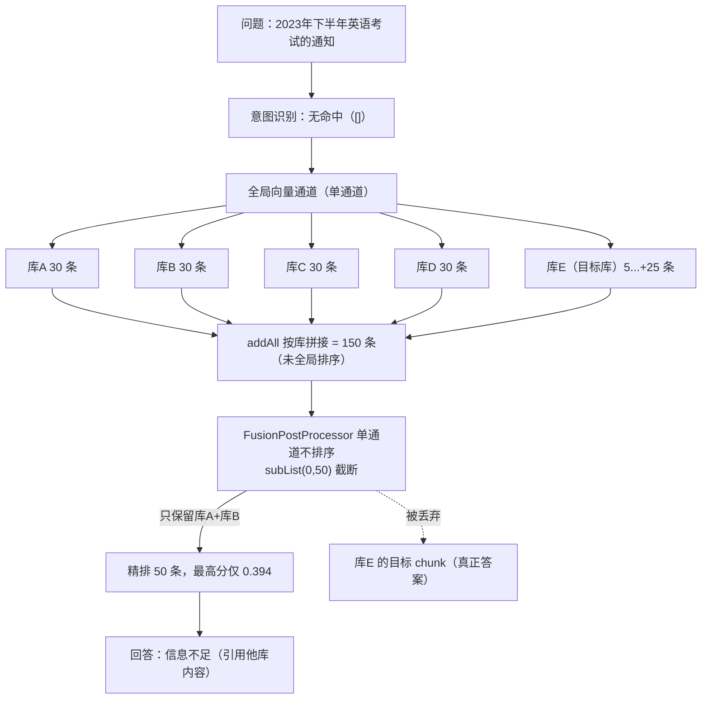

# 线上案例：新知识库「入库成功但检索不到」——候选池截断把整库丢掉

> 口径说明：本文是一次**真实生产排查**的复盘，所有日志、SQL 结果都来自生产服（`146.56.241.229`）与生产库 `ragent`。
> 面试讲的时候建议按「现象 → 漏斗对账 → 根因 → 修复 → 回归」的顺序讲，不要一上来就说结论——排查过程本身才是加分项。

## 一句话结论

**不是数据、不是配置、不是模型，而是检索链路的排序缺陷**：多知识库并行召回后结果**按库拼接**且**未全局排序**，
紧接着候选池又**按这个顺序截断**，导致排在后面的知识库整批被丢在精排之前——用户看到的就是「资料明明传上去了，却答不出来」。

## 1. 现象（用户视角）

1. 上传 `2023-09-12_关于2023年下半年全国大学英语四、六级笔试考试和口语考试报名的通知.pdf` 到知识库「湖大通用概况与校园生活」；
2. 后台**分块管理**页看得到 5 个 chunk（其中 1/2 就是报名费与通知正文），文档状态 `success`；
3. 提问「关于2023年下半年英语考试的通知」，回答却是：
   「当前可用信息不足以回答该问题。现有资料中提到了『图: 等级考试信息』和『图: 测评考试』，并标注了相关文件的审议通过时间……但未提供任何关于『2023年下半年英语考试』的具体通知内容。」

注意那句引用：**模型引用的是另一个库的内容**（本科教学制度库里的素质测评/等级考试信息），说明检索确实返回了东西，只是**没有返回正确的东西**。

## 2. 生产日志时间线（同一问题的 before / after）

| 时间 | 版本 | 关键日志 | 含义 |
| --- | --- | --- | --- |
| 09-27 17:22:18 | `be98b057`（批次一） | `总目标数: 5, 检索到 Chunk 总数: 150` | 5 个库并行召回 150 条 |
| 同上 | | `RRF 融合完成 - 通道数: 1 … 融合后: 150 个, 截断上限: 50, 送入 Rerank: 50 个` | **单通道，按顺序截断掉 100 条** |
| 同上 | | `精排分布: 10 条有分, 最高 0.394, 最低 0.283` | 送进精排的 50 条全都弱相关 |
| 同上 | | 回答：可用信息不足（引用他库内容） | 正确 chunk 已被丢弃 |
| 09-27 17:41:01 | `b6421f54`（批次二，修复后） | `向量全局检索完成，检索到 50 个 Chunk` | 召回预算统一后，全局排序取 50 |
| 同上 | | `融合后: 50 个, 截断上限: 50, 送入 Rerank: 50 个` | **没有候选被丢弃** |
| 同上 | | `精排分布: 10 条有分, 最高 0.8245, 最低 0.345` | 目标 chunk 进入候选，命中 |
| 同上 | | 回答正确（报名费 26/28/50 元、报名流程） | 问题解决 |

顺带一个反向验证：同一天 17:44 的另一个问题（研究生报到+住宿）**意图识别命中**，通道是 `[IntentDirectedSearch]`，
`融合后: 8 条 → 送入 Rerank: 8 条`，精排最高 0.95 —— 印证「意图定向 + 通道出口排序」两条路径都正常。

## 3. 排查过程（可复用的四步法）

### 第 1 步：先排除数据侧（不要一上来读代码）

直接查生产库，确认「文档—分块—向量—模型」四件事：

```sql
-- 文档与分块
SELECT id, kb_id, doc_name, chunk_count, status FROM t_knowledge_document WHERE doc_name LIKE '%2023-09-12%';
-- 分块与向量条数是否一一对应
SELECT (SELECT count(*) FROM t_knowledge_chunk c WHERE c.doc_id = d.id) AS chunks,
       (SELECT count(*) FROM t_knowledge_vector v WHERE v.id IN (SELECT id FROM t_knowledge_chunk c WHERE c.doc_id = d.id)) AS vectors
FROM t_knowledge_document d WHERE d.doc_name LIKE '%2023-09-12%';
-- 各库用的 embedding 模型是否一致
SELECT id, name, collection_name, embedding_model FROM t_knowledge_base WHERE deleted = 0;
-- 向量维度是否一致（schema 固定 vector(1536)）
SELECT metadata->>'collectionName' AS collection, count(*), min(vector_dims(embedding)), max(vector_dims(embedding))
FROM t_knowledge_vector GROUP BY 1;
```

结果：`chunks=5, vectors=5, status=success`，5 个库 `embedding_model` 全是 `qwen3.7-text-embedding`，维度全 1536
→ **数据侧完全正常**，把问题锁定在检索运行时。

### 第 2 步：用日志还原「漏斗」，并做数量对账

```bash
docker logs ragent-backend-1 --since 24h 2>&1 | grep -aE '启用的检索通道|向量全局检索完成|送入 Rerank|精排分布|证据闸门'
```

拿到漏斗：`150（通道召回）→ 50（融合截断）→ 10（精排 topN）`。

再做**配置对账**，证明每个数字都有来源：

- `rag.search.default-top-k = 10`，`channels.vector-global.top-k-multiplier = 3` → 每库 30 条；
- 5 个知识库 → 30 × 5 = **150** ✅ 与日志一致；
- `fusion.rerank-candidate-limit = 50` → 送入精排 50 条 ✅；
- 精排 `top_n = context.topK = 10` → 最终 10 条 ✅。

数量能对上，说明日志没有骗人，问题就出在**这 100 条是被"按什么顺序"截掉的**。

### 第 3 步：读代码定位到具体三处

| 位置 | 行为 | 后果 |
| --- | --- | --- |
| `AbstractParallelRetriever.executeParallelRetrieval()` | `allChunks.addAll(chunks)` —— 按库顺序**拼接**，没有全局按分数重排 | 150 条的顺序 = 库 1 的 30 条 + 库 2 的 30 条 + … |
| `VectorGlobalSearchChannel.search()` | 把拼接结果**原样**塞进 `SearchChannelResult`（无 `sortedByScore`） | 通道出口顺序 = 拼接顺序 |
| `FusionPostProcessor.process()` | 单通道时 `ranked = chunks`（不排序），随后 `truncateForRerank` 取 `subList(0, limit)` | **只保留前 50 条 = 前 1.7 个库** |

### 第 4 步：解释「为什么正好是新库被丢」

新知识库「湖大通用概况与校园生活」是**最后创建**的，`KbCollectionProvider.listActiveCollections()` 返回顺序里排在末尾，
它的 5 个 chunk 落在第 121~150 位 → **在 150→50 截断时被整批丢弃**，从未进入精排。模型能引用的只剩排在前面的
「湖大本科教学与学业制度」库内容 —— 与线上回答完全吻合。

## 4. 根因（一张图）



## 5. 为什么「上线好几周都没事、这次才炸」

这个缺陷要**同时满足 4 个条件**才会暴露，缺一不可：

1. **知识库数量足够多**：只有 1~2 个库时，召回总数 ≤ 50，压根不会触发截断；
2. **走了单通道**：多通道时 `FusionPostProcessor` 会按 RRF 名次重排，各库内容被"打散"参与竞争（同时也掩盖了拼接顺序问题）；
3. **总召回数 > 截断上限**：本例 5 × 30 = 150 > 50；
4. **目标内容在"排在后面"的库里**：用户新建的库恰好排最后。

这也是它躲过前几轮回归测试的原因——**测试数据里没有"多库 + 后面的库包含答案"这种组合**。

## 6. 修复方案

修复提交：`044a99c0 refactor(retrieval): 统一召回预算与通道出口，去掉优先级并复用查询向量`（随批次二上线，镜像 tag `b6421f54`）。

### 改动一：通道出口统一按分数排序（核心）

新增工具类 `ChunkRanking`，三个通道出口统一调用它，把「通道返回什么顺序」变成契约：

```java
// VectorGlobalSearchChannel（修复后）
List<RetrievedChunk> allChunks = ChunkRanking.sortedByScore(
        retrieverService.retrieve(...));   // ← 全库合并后立刻全局排序

// IntentDirectedSearchChannel / KeywordSearchChannel 同样处理
.chunks(ChunkRanking.sortedByScore(allChunks))
```

排序规则明确为：**分数降序 → 缺分沉底 → 同分按 chunk id 稳定**（可复现、不依赖 Map/线程顺序）。
这样"截断前 50"保留的就是全局最相关的 50 条，**与知识库排列顺序无关**。

### 改动二：统一召回预算，去掉「通道级倍数」

原来的 `top-k-multiplier × default-top-k` 语义有两层问题：① 每库乘倍数导致总量不可控；② 与"最终条数"混在一起。
修复后由 `rag.search.scope.recall-budget` 单一来源决定取数深度，全局召回从 **150 → 50**（本例日志可见），
顺带降低了 embedding/检索开销。

### 改动三：把不变量写进规则文档 + 补回归测试

- 规则：`docs/rules/retrieval-invariants.md` 增加「通道出口必须使用 `ChunkRanking.BY_SCORE_DESC` 统一排序」，
  并明确「禁止以声明顺序/库顺序影响结果」；
- 回归测试：`VectorGlobalSearchChannelTest.sortsChunksAndReturnsScoreDescending` ——
  mock 一个检索器返回 `[低分, 高分]`，断言通道出口是 `[高分, 低分]`。
  这条用例如果早就存在，本次线上问题在 CI 阶段就会被拦住。

## 7. 验证方式（可照抄）

```bash
# 1) 确认新镜像已生效
docker ps --format '{{.Names}}\t{{.Image}}' | head -3
cat /home/ubuntu/ragent-deploy/last-successful-release.env

# 2) 复问同一个问题，看漏斗与精排分布
docker logs ragent-backend-1 --since 30m 2>&1 \
  | grep -aE '启用的检索通道|向量全局检索完成|送入 Rerank|精排分布|证据闸门'
```

期望：`送入 Rerank` 的条数不再被"按库截断"，`精排分布` 的最高分显著上升（本例 **0.394 → 0.825**），回答给出正文内容。

## 8. 面试怎么讲（重点）

### 8.1 60 秒电梯版

> 用户上传的 PDF 分块和向量都入库成功，但提问答不出来，而且模型引用的是**别的知识库**的内容。
> 我先查库排除了数据和 embedding 问题，再用日志把检索漏斗还原成「召回 150 → 截断 50 → 精排留 10」，并用配置把每个数字对上。
> 结果发现候选池是**按知识库拼接、没有全局排序**就直接截断的，用户新建的库恰好排在最后，整批被丢在精排之前。
> 修复是把"通道出口按分数统一排序"变成不变量，同时统一召回预算，并补了一条会捕获这个回归的单测。
> 修复后同一个问题精排最高分从 0.39 升到 0.82，回答正确。

### 8.2 3 分钟 STAR 版

| 环节 | 内容 |
| --- | --- |
| **背景 S** | 校内 RAG 系统刚把检索内核升级为「多知识库并行召回 + RRF 融合 + 精排 + 证据闸门」，上线了 5 个知识库 |
| **任务 T** | 新传的英语考试通知 PDF「入库成功但问不到」，需要定位是数据、配置还是代码问题，并修复 |
| **行动 A** | ① 先查库：文档/分块/向量/模型四件套正常，排除数据侧；② 用日志还原漏斗并做数字对账（10×3×5=150、截断 50、精排 topN=10）；③ 读代码定位到「并行检索用 addAll 拼接 → 通道不排序 → 单通道截断」三处；④ 用「新库排在最后」解释被丢原因，并解释为什么之前几周没暴露（需同时满足多库/单通道/超限/命中后库 4 个条件）；⑤ 修复：通道出口统一排序 + 统一召回预算 + 规则与回归测试 |
| **结果 R** | 同一问题精排最高分 0.394 → 0.825，回答正确；代码库里留下不变量与回归测试，避免同类问题再犯 |

### 8.3 高频追问与答法

**Q：你怎么确定不是 embedding 模型不一致导致的？**
A：直接查生产库对比：5 个知识库的 `embedding_model` 全是同一个模型，`t_knowledge_vector` 里维度都是 1536 且条数与 chunk 一一对应；
另外同一天另一个问题（研究生住宿）精排最高 0.95，说明"向量+精排"这条链路本身是好的，问题只在候选集选择上。

**Q：为什么说不是 Rerank 的锅？**
A：Rerank 只对**送进去的 50 条**评分，日志显示它给分本身是正常的（0.28~0.39，只是这批内容确实不相关）；
而正确文档的 chunk 根本不在那 50 条里 —— 顺带说一句，往 Rerank 送 50 条、只留 10 条也说明它的 topN 是按最终条数配的。

**Q：为什么修复后召回数从 150 变成了 50？**
A：这是修复的第二部分：原来每库取 `default-top-k × top-k-multiplier = 30` 条，5 个库共 150 条；修复后由
`rag.search.scope.recall-budget` 单一来源统一预算（本例 50），全局排序后取前 50。既消除了"倍数语义"的二义性，也减少了无谓算力。

**Q：多通道的时候为什么没这个问题？**
A：多通道会走 RRF 融合：按每个通道内的**名次**重新打分再排序，各库内容被打散参与竞争，所以"拼接顺序"被掩盖了。
但它是掩盖、不是修复——所以我把"通道出口统一排序"写进了不变量，任何通道、任何通道数都必须满足。

**Q：为什么用 RRF 而不是把向量分和 BM25 分加权求和？**
A：两类分数量纲不同（余弦 0~1 vs BM25 无上界），加权需要拍系数且换模型就得重调；RRF 只用名次，天然跨模态可比，
对分数尺度不敏感。代价是丢掉"分差信息"，所以多路命中一致时 RRF 反而更稳。

**Q：怎么防止这类问题再发生？**
A：三层：① **规则不变量**（`docs/rules/retrieval-invariants.md`）写清"通道出口必须统一排序、禁止用声明/库顺序影响结果"；
② **回归测试**锁定行为（给出 `[低分, 高分]` 必须返回 `[高分, 低分]`）；③ **可观测性**：检索漏斗每步都打条数日志
（通道召回 / 融合 / 截断 / 精排分布 / 闸门），出问题能一眼看出是哪一段把数据变少。

**Q：这次排查你最大的收获是什么？**
A：**别急着读代码，先把数据对账做出来**。我遇到的这条 bug 只要把"150 / 50 / 10 各由哪个配置决定"对完，方向就唯一了；
反过来，如果一上来怀疑 embedding 或模型，会在数据侧绕很久。另外一点是：**"排序契约"必须显式写下来**，
因为它是隐式的——一旦某个环节不排序，表现就是"偶发、只在特定数据规模下出现"，最难查。

### 8.4 顺带发现的两个次要问题（可以主动提，显示你有全局意识）

1. **意图识别对这个问题返回空**：日志里 `意图识别树如下所示：[ ]`，于是退化到全库检索。若意图能命中，
   走的是范围更小的意图定向检索，本身就绕开了这个截断问题。改进方向：给「考试与成绩管理」这类节点补 examples
   （如「英语四级报名」「CET 考试通知」），并在回归里加"典型问题必须命中意图"的断言。
2. **纯图片 chunk 不可检索**：该 PDF 有 2 个 chunk 内容是 ``，
   说明 MinerU 抽出了图片但**图生文没生效**（未配 VLM key 或图片解析未开），图里的信息（报名入口、时间表）检索不到。
   改进方向：把图片解析并入入库流水线的可观测指标（图 chunk 占比），并在文档模板里给出"图片型通知"的处理建议。

## 9. 附：这次线上的完整操作记录（可直接复现）

### 9.1 先补数据脚本，再部署代码

批次二引入了新列（意图多库、消息来源/推荐追问），项目**没有 Flyway**，必须手工按顺序执行。
执行前先核对生产库已有列，避免重复执行非幂等脚本：

```sql
SELECT column_name FROM information_schema.columns WHERE table_name = 't_knowledge_document_chunk_log';
SELECT column_name FROM information_schema.columns WHERE table_name = 't_message';
SELECT column_name FROM information_schema.columns WHERE table_name = 't_intent_node';
```

本例结论：`001`（RENAME `embedding_duration` → `embed_duration`，**非幂等**）与 `002` 已执行过 → 跳过；
`003/004/005` 需要执行。执行顺序与命令：

```bash
# 备份（生产库）
docker exec ragent-postgres-1 pg_dump -U postgres -d ragent \
  -t t_message -t t_intent_node -t t_knowledge_document_chunk_log > /tmp/backup-before-batch2.sql

# 逐个执行（ON_ERROR_STOP=1：任一失败立刻停）
for f in 003_intent_multi_collections 004_message_sources 005_message_recommendations; do
  docker exec -i ragent-postgres-1 psql -U postgres -d ragent -v ON_ERROR_STOP=1 < /tmp/$f.sql || exit 1
done
```

为什么顺序是「先迁移、后部署」：脚本都是 `ADD COLUMN IF NOT EXISTS`（对旧代码无影响、可回滚重跑），
而新代码的 MyBatis 查询是**显式列出列名**的，缺列会直接抛 SQL 错误 —— 先迁移可以做到**零中断切换**。

### 9.2 发布

```bash
git push origin <批次tip>:master      # 本例：b6421f54
```

`.github/workflows/deploy-production.yml` 会按 `scripts/detect-affected-services.mjs` 判定受影响服务；
**改了 `resources/database/**` 会命中 `addAllServices`，三个镜像（backend / mcp-server / frontend）全部重建**，
所以这批的构建时间会比"只改后端"的批次长一些（本次没改 pom，依赖层命中缓存）。

### 9.3 验证

```bash
docker ps --format '{{.Names}}\t{{.Image}}' | head -3          # 镜像 tag 应等于本次推送的短 SHA
cat /home/ubuntu/ragent-deploy/last-successful-release.env     # 发布记录（digest）
docker logs ragent-backend-1 --since 30m 2>&1 \
  | grep -aE '启用的检索通道|向量全局检索完成|送入 Rerank|精排分布|证据闸门'
```

### 9.4 本次案例涉及的关键配置与代码索引

| 关注点 | 位置 / 取值 |
| --- | --- |
| 最终条数 | `rag.search.default-top-k`（本例 10） |
| 召回预算（修复后） | `rag.search.scope.recall-budget`（修复前为 `default-top-k × top-k-multiplier`） |
| 融合候选池上限 | `rag.search.fusion.rerank-candidate-limit`（本例 50，**这是截断点**） |
| 证据闸门 | `rag.search.evidence.min-rerank-score`（本例 0.2；精排最高 0.39 时仍放行，所以问题表现为"答不出"而不是"没资料"） |
| 并行召回合并 | `bootstrap/src/main/java/.../rag/core/retrieve/channel/AbstractParallelRetriever.java` |
| 全局向量通道 | `.../retrieve/channel/VectorGlobalSearchChannel.java` |
| 融合/截断 | `.../retrieve/postprocessor/FusionPostProcessor.java` |
| 排序契约 | `.../retrieve/channel/ChunkRanking.java` + `docs/rules/retrieval-invariants.md` |
| 回归测试 | `bootstrap/src/test/java/.../retrieve/channel/VectorGlobalSearchChannelTest.java` |
