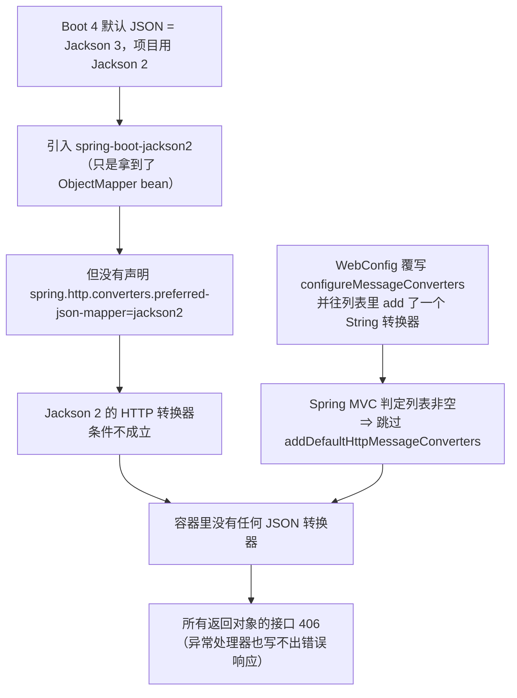
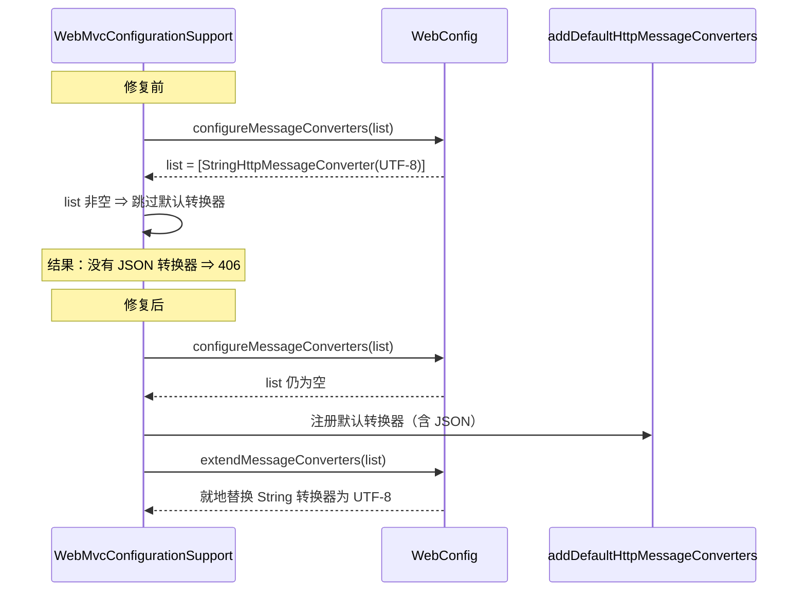

# 线上事故复盘：升级 Spring Boot 4 后全站 406（JSON 转换器被整体禁用）

> 口径说明：本文所有日志、容器信息、接口返回都来自**生产环境**（`146.56.241.229`）。
> 事故版本：镜像 tag `f5771f8b`（含 Spring Boot 4.1.0 升级）；修复版本：`41b64a68`。
> 面试讲的时候建议按「现象 → 先分清前后端 → 用 Accept 头排除内容协商 → 读自动配置条件 → 开 debug 报告 → 读框架字节码 → 定位到自己那行代码」讲，
> **排查路径本身就是这道题的价值**：因为最终那行代码看起来"完全无害"。

## 一句话结论

全站 406 不是前端问题、不是网关问题、也不是"内容协商"问题，而是**后端容器里一个 JSON 消息转换器都没有**。
根因是项目里的 `WebConfig` 覆写了 `configureMessageConverters`——Spring MVC 的语义是
「**只要配置器往列表里放了东西，就跳过全部默认转换器注册**」，于是只剩一个 UTF-8 的
`StringHttpMessageConverter`，所有返回对象的接口必然 406。
同一个写法在 Boot 3 上恰好没暴露，升到 Boot 4 后 JSON 转换器改走"条件化注入"，就彻底没有兜底了。

## 1. 现象

管理员进「知识库管理」：统计卡片全是 0，列表提示「暂无知识库」，右上角红色 toast
`Request failed with status code 406`。

关键点是**它不像局部功能故障**：后端日志里 `/user/me`、`/knowledge-base` 全都在报同一个异常，
连全局异常处理器自己都写不出错误响应：

```text
ERROR c.n.a.r.f.web.GlobalExceptionHandler : [GET] .../api/ragent/knowledge-base?current=1&size=100
org.springframework.web.HttpMediaTypeNotAcceptableException: No acceptable representation
WARN  .m.m.a.ExceptionHandlerExceptionResolver : Failure in @ExceptionHandler
      GlobalExceptionHandler#defaultErrorHandler
org.springframework.web.HttpMediaTypeNotAcceptableException: No acceptable representation
```

「异常处理器也失败」这一条很关键：说明问题不在某个业务分支，而在**响应写出这一层**。

## 2. 定位过程（五步，可复用）

### 第 1 步：先确认线上跑的是哪个版本

```bash
docker ps --format '{{.Names}}\t{{.Image}}\t{{.Status}}'
# ragent-backend-1  ccr.ccs.tencentyun.com/hnu-ragent/ragent-backend:f5771f8b…  Up 7 minutes
```

三个服务（backend / frontend / mcp-server）都是刚发布的 `f5771f8b`，也就是**刚推上去的那一批**。
先把范围锁在"本次发布引入"。

### 第 2 步：分清前端还是后端

浏览器 F12 只能看到 406，但后端日志里同样的 406 带着完整异常栈 —— **响应是后端生成的**，
前端只是如实展示。所以是后端问题。

### 第 3 步：用 Accept 头区分「内容协商失败」和「压根没有转换器」

这是最常见的一种误判：406 容易让人以为是前端 `Accept` 头没协商好。实测三组请求：

| Accept 头 | 返回 |
| --- | --- |
| `application/json` | 406 |
| `*/*` | 406 |
| 不发送 Accept | 406 |
| `application/xml` | 406 |

**任何 Accept 都写不出来** → 不是"挑不出合适的转换器"，而是"转换器链里根本没有能写对象的转换器"。
（如果只是协商问题，`*/*` 必然是 200。）

### 第 4 步：读自动配置的判定条件

Boot 4 默认 JSON 换成了 Jackson 3，项目通过 `spring-boot-jackson2` 保留了 Jackson 2。
把 `spring-boot-http-converter` 的字节码拉出来看，Jackson 2 的转换器是被条件卡住的：

```text
Jackson2HttpMessageConvertersConfiguration$PreferJackson2OrJacksonUnavailableCondition$Jackson2Preferred
  @ConditionalOnProperty(name=["spring.http.converters.preferred-json-mapper"], havingValue="jackson2")
```

同一层还有一个 `JacksonUnavailable`（Jackson 3 不存在才生效）。也就是说，**必须显式声明首选**，
否则 Jackson 3 在场时两条都不成立 —— 这正是"引入 `spring-boot-jackson2` 却没配首选"的坑。

### 第 5 步：线上开 debug 报告，看"Bean 建了但没生效"

用 Spring Boot 的外部配置（`./config/application.yaml`，优先级高于 jar 内配置）临时打开条件评估报告：

```yaml
spring:
  http:
    converters:
      preferred-json-mapper: jackson2
debug: true
```

```bash
docker cp /tmp/ragent-override.yaml ragent-backend-1:/app/config/application.yaml
docker restart ragent-backend-1
```

报告给出了决定性信息 —— **属性匹配了、转换器自定义器也建出来了，但接口依然 406**：

```text
Jackson2HttpMessageConvertersConfiguration.MappingJackson2HttpMessageConverterConfiguration matched:
   - @ConditionalOnClass found required class 'com.fasterxml.jackson.databind.ObjectMapper'
   - … Jackson2Preferred @ConditionalOnProperty (spring.http.converters.preferred-json-mapper=jackson2) matched
   - @ConditionalOnBean found bean 'jackson2ObjectMapper'
Jackson2HttpMessageConvertersConfiguration.MappingJackson2HttpMessageConverterConfiguration#jackson2HttpMessageConvertersCustomizer matched:
   - @ConditionalOnMissingBean (types: MappingJackson2HttpMessageConverter) did not find any beans
JacksonHttpMessageConvertersConfiguration.JacksonJsonHttpMessageConverterConfiguration:
   Did not match: @ConditionalOnProperty (…=jackson) found different value
```

结论：**Boot 那条装配链是通的，真正被使用的转换器列表却不是它产出的**。
说明项目里有人"自己接管"了转换器链。

### 第 6 步：读框架字节码，确认"接管"的语义

`WebMvcConfigurationSupport#getMessageConverters()`（Spring 7.0.8）字节码：

```text
messageConverters = new ArrayList<>();
configureMessageConverters(messageConverters);        // 各配置器在这里填充
if (messageConverters.isEmpty())
    addDefaultHttpMessageConverters(messageConverters);   // 默认转换器（含 JSON）只在这里注册
extendMessageConverters(messageConverters);           // 扩展点
```

于是回到项目里搜"谁动了转换器"，一眼命中：

```java
// bootstrap/.../rag/config/WebConfig.java（修复前）
@Override
public void configureMessageConverters(List<HttpMessageConverter<?>> converters) {
    StringHttpMessageConverter stringConverter = new StringHttpMessageConverter(StandardCharsets.UTF_8);
    stringConverter.setWriteAcceptCharset(false);
    converters.add(0, stringConverter);   // ← 只是想让字符串响应用 UTF-8
}
```

**它往列表里放了一个 String 转换器，就让 JSON 等全部默认转换器再也不会被注册。**
线上唯一的转换器就是它，所以任何对象响应都是 406。

## 3. 根因（两层叠加）



两层缺一不可：只修转换器装配，返回的 JSON 会改用 Jackson 3 序列化（注解来自 Jackson 2，行为可能悄悄变化）；
只修首选属性，转换器列表依然被 `WebConfig` 整体替换掉，等于没修。

**为什么以前不炸**：同一份 `WebConfig` 在 Boot 3.5.7 上运行正常（批次一/批次二都在线上验证过），
说明差异落在 Boot 4 的转换器装配模型上——Boot 4 把 JSON 转换器改成"条件化 customizer"注入，
一旦配置器抢先填充了列表，这条注入就整体跳过，没有了原来的兜底路径。

## 4. 修复（两处，缺一不可）

| # | 改动 | 位置 |
| --- | --- | --- |
| 1 | `configureMessageConverters` → `extendMessageConverters`：**就地替换**默认的 `StringHttpMessageConverter` 为 UTF-8 版本（找不到时才插到首位），不再清空默认链 | `bootstrap/src/main/java/com/hnu/ragent/rag/config/WebConfig.java` |
| 2 | 显式声明 JSON 实现首选 Jackson 2，与项目既有 Jackson 2 代码、注解保持一致 | `bootstrap/src/main/resources/application.yaml` |

```yaml
spring:
  http:
    converters:
      preferred-json-mapper: jackson2
```

修复过程按 TDD 走：先写 `WebConfigTest` 复现（3 个用例全红，其中
`doesNotPopulateConfigureMessageConvertersSoSpringMvcStillRegistersDefaults` 输出的
`Expecting empty but was: [StringHttpMessageConverter@…]` 就是事故现场），再改实现转绿。



## 5. 验收标准

1. `WebConfig` 不再向 `configureMessageConverters` 写入任何转换器（列表保持为空）。
2. `extendMessageConverters` 就地替换默认的 `StringHttpMessageConverter` 为 UTF-8 版本，
   其他转换器位置与实例不变；链上不存在 String 转换器时插到首位。
3. 线上所有 JSON 接口恢复 200，且 `Content-Type: application/json`。
4. 中文内容不乱码（UTF-8 约定保持）。
5. 可执行验证：

```bash
./mvnw -o test -pl bootstrap -am '-Dtest=WebConfigTest' -Dsurefire.failIfNoSpecifiedTests=false
curl -s -o /dev/null -w '%{http_code}\n' -H "Authorization: $TOKEN" \
  'http://146.56.241.229/api/ragent/knowledge-base?current=1&size=10'
```

期望结果：单测 3/3 通过；接口返回 200。

## 6. 代码位置

| 作用 | 位置 |
| --- | --- |
| 事故代码与修复 | `bootstrap/src/main/java/com/hnu/ragent/rag/config/WebConfig.java` |
| JSON 实现首选 | `bootstrap/src/main/resources/application.yaml`（`spring.http.converters.preferred-json-mapper`） |
| Jackson 2 自动配置引入 | `framework/pom.xml`（`spring-boot-jackson2`） |
| 回归测试 | `bootstrap/src/test/java/com/hnu/ragent/rag/config/WebConfigTest.java` |
| 升级背景 | `docs/upstream/features/up-31-spring-boot4.md` |

## 7. 面试讲法

**30 秒版**：升级 Spring Boot 4 后全站 406。406 第一反应是内容协商，但我用 `*/*`、无 Accept
三种请求试了一遍全是 406，说明不是"挑不出转换器"而是"没有转换器"。接着看 Boot 4 的条件报告，
发现 Jackson 2 的转换器 Bean 明明建出来了却没生效，就去读 Spring MVC 的字节码，发现
`getMessageConverters()` 只在配置器列表为空时才注册默认转换器 —— 而项目里一个"只想让字符串响应用 UTF-8"
的配置类恰好往那个列表里塞了个 String 转换器，把整条默认链（含 JSON）全顶掉了。
原来在 Boot 3 上有兜底，Boot 4 改成条件化注入后就没有了。

**可展开的追问点**：

| 追问 | 回答要点 |
| --- | --- |
| 为什么先怀疑内容协商，又怎么排除的？ | 406 的两种成因是"没有可写该类型的转换器"和"Accept 协商失败"；`*/*` 仍然 406 就能排除后者 |
| 为什么不直接回滚？ | 已先确认是纯装配问题、影响面明确；同时用外部配置（`./config/application.yaml`）+ `debug=true` 在不改镜像的前提下做在线验证，把根因锁死再改代码，避免"回滚了但不知道原因" |
| 为什么两处都要改？ | 一个是"链没了"，一个是"链里该用哪个 JSON 实现"；只改一处分别会得到 406 和"用 Jackson 3 序列化 Jackson 2 注解"的隐性行为变化 |
| 怎么防止再犯？ | 把 `configureMessageConverters` 的语义写成回归测试（`WebConfigTest`）；升大版本时把 WebMvc/序列化相关配置列入强制回归清单 |
