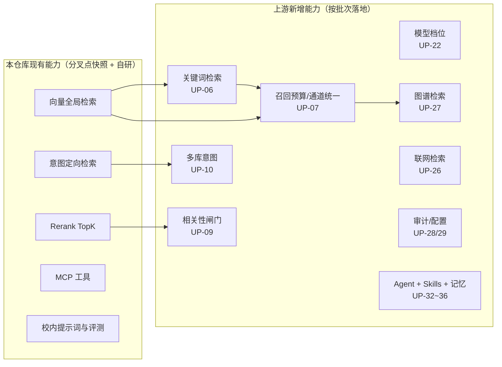

# 上游功能差异清单

本文列出上游 `nageoffer/ragent` 在**分叉点 `56705f27`（2026-06-27）之后**新增或增强、而本仓库当前不具备的功能。分叉点判定见 [`fork-divergence.md`](fork-divergence.md)。

统计范围：分叉点之后的 141 个非合并提交（2026-06-27 → 2026-09-20）。纯 README/赞助商信息等无功能影响的提交已合并到“文档与体验”条目中，不单列。

优先级口径：

- **P0**：直接决定检索效果或模型可用性的核心能力差异。
- **P1**：稳定性、正确性、对话体验类改进，风险低、收益明确。
- **P2**：独立大功能（图谱、审计、Agent 体系等），需要前置设计。
- **P3**：可选能力或对外展示类改动。

## 清单

| 编号 | 上游能力 | 上游提交 | 本仓库现状 | 优先级 |
| --- | --- | --- | --- | --- |
| UP-01 | 检索通道配置一致性校验（通道开关与独立开关冲突时启动即失败） | `ba575908` | 无校验，配置错误只能运行时暴露 | P1 |
| UP-02 | 空意图树时跳过 LLM 意图分类 | `29351243` | 空树仍会走一次 LLM 调用 | P1 |
| UP-03 | 意图缓存 JSON 反序列化失败容错 | `8128b8a9` | 缓存脏数据会抛异常影响检索 | P1 |
| UP-04 | 远程文件刷新：ETag 变化不再误判为“未变更” | `10def629` | 沿用分叉点行为，存在漏刷新风险 | P1 |
| UP-05 | 入库流水线健壮性：任务元数据/节点输出 JSON 解析、非法条件 fail-closed | `d98ec1ec` `1c9bfc16` `dbedd450` `c9c6ee47` `8d314a20` | 沿用分叉点实现 | P1 |
| UP-06 | Elasticsearch 关键词检索通道 + 共享物理索引 | `461d7966` `6859e528` | 仅有枚举占位，无实现（当前为纯向量检索） | P0 |
| UP-07 | 全局跨 Collection 召回、recall-budget 统一召回预算、通道出口统一排序 | `cf5ffa67` `dc0d0013` `886677f9` `f7dea62b` `5dcfb242` `146850f9` `1c40cdd1` `e7ef2629` `9a65b76b` | 分叉点版本：`VectorGlobalSearchChannel` + `IntentDirectedSearchChannel` 双通道、TopK 倍数语义 | P0 |
| UP-08 | 通道级超时降级（单通道超时不拖垮整轮检索） | `d6ad7871` | 无通道级超时/降级 | P1 |
| UP-09 | Rerank 证据相关性闸门（低分证据不进上下文） | `16984b95` | 无相关性闸门，只做 TopK 截断 | P1 |
| UP-10 | 意图关联多个知识库 Collection、意图归属按库推导 | `938ed100` `cf2697c0` `4ac59971` `9d80d7a5` `0f2120cc` | 意图与知识库为单对单；无归属推导 | P1 |
| UP-11 | 意图歧义澄清重构（候选路径重名识别 + LLM 确认） | `5a8ee82c` `a2778fae` | 分叉点版本的歧义判定与引导 | P2 |
| UP-12 | 检索结果元数据富化与上下文渲染、资料引用标识 | `b656feb4` `2a84c7a0` `97c0246c` | `context-format.st` 为分叉点版本，无元数据富化 | P1 |
| UP-13 | 分块策略重构：块级贪心打包、重叠计算、无描述图片合并、删除旧策略模式 | `da91ae9b` `0a4bcf05` `f0f67237` `1bdfe66c` `37f1ac65` | 保留 `StructureAwareTextChunker`/`FixedSizeTextChunker` 策略模式 + 自研 `StructuredChunkAggregator` | P1 |
| UP-14 | 文件存储抽象：移除 S3 强依赖，抽象文件存储服务 | `7cbb02c4` | 仍是 `S3Fetcher` + `S3FileStorageService` | P2 |
| UP-15 | 知识库删除时底层资源异步清理（向量/关键词索引） | `950637ec` | 删除为同步路径，资源清理能力弱 | P2 |
| UP-16 | MinerU 解析并发：分布式信号量替代本地并发控制 | `50afe910` | 分叉点版本的轮询与并发配置 | P2 |
| UP-17 | 会话摘要与上下文裁剪：避免每轮滑动调用 LLM、超长上下文压缩 | `807d422a` `ed059271` `33399fc2` | 旋转窗口 + 摘要，逐轮滑动即调用 LLM | P1 |
| UP-18 | 回答来源与文档预览（消息内溯源） | `ab31f8f1` | 无来源结构化输出与预览 | P1 |
| UP-19 | 相关推荐追问 | `190fc067` `1308dee7` `60e49e11` | 无（仅有欢迎页示例问题） | P1 |
| UP-20 | 消息结束状态与顺序稳定性（雪花 ID 决胜键、排队上下文保留） | `1308dee7` `f3e43a9b` `2fbbb68b` | 无决胜键，排队请求上下文处理按分叉点版本 | P2 |
| UP-21 | 模型调用健壮性：拒绝空白响应并降级、首包探测熔断名额释放、候选模型顺序 | `3bfb3d76` `9509b024` `af4640ff` | 分叉点版本 | P1 |
| UP-22 | 模型调用档位机制（按场景选择 fast/标准档）+ MCP 提参三态校验 | `f104042a` | 单档模型路由，无档位概念 | P0 |
| UP-23 | 百炼（DashScope）向量客户端对齐 | `a6fb7139` | 本仓库自研 `BaiLianEmbeddingClient`，实现不同 | P2 |
| UP-24 | DeepSeek 供应商支持 | `27366d12` | 无 | P1 |
| UP-25 | 供应商自定义 `enable_thinking` 参数（关闭思考时显式传递） | `6e1a55ab` `86da0f9a` | 无 | P1 |
| UP-26 | You.com 联网检索通道 + `youcom_search` MCP 工具 | `6a1ecf7f` `a5994e6a` | 无联网检索 | P2 |
| UP-27 | 知识图谱（Neo4j）接入 + 图谱检索通道 + 前端图谱可视化 | `173f17a9` `b6fd8c9e` `5276bad2` `33acb48b` `4620364d` `c551f685` `4fa882d8` | 完全没有图谱检索 | P2 |
| UP-28 | 审计日志与变更记录 | `951d813e` | 无 | P2 |
| UP-29 | 系统配置页展示与后端设置接口 | `5a1af64b` | 本仓库有自研 `SystemSettingsPage`，能力范围不同 | P2 |
| UP-30 | 数据库 v1.1.0 升级脚本体系（`upgrades/` 目录规范） | `53730fe2` `abcf9095` `fc50ca8d` | 仅 `init_data_pg.sql` 等初始化脚本 | P1 |
| UP-31 | Spring Boot 4 升级与依赖架构调整 | `7f3a7f38` | Spring Boot 3 体系（分叉点版本） | P2 |
| UP-32 | 模块拆分 `agent` / `rag` / `system` + Agent 执行架构 | `020e5c3d` | 保持 `bootstrap` / `framework` / `infra-ai` / `mcp-server` | P2 |
| UP-33 | 智能体（Agent）管理与相关功能 | `17eaaa6f` | 无 | P2 |
| UP-34 | Agent 写操作确认流程（人工确认卡片） | `24e6b4a4` | 无 | P2 |
| UP-35 | Skills 体系（技能手册、Skill 管理、AgentScope 原生 Skill Tool） | `c71f0750` `42a2b918` `7e522563` | 无 | P2 |
| UP-36 | Agent 长期记忆与记忆回归测试框架 | `1cb684ed` `b36a8b16` | 无 | P2 |
| UP-37 | LangFuse 链路追踪与 ReAct 时间线 | `177108bb` `96c528d0` | 仅有自研 `t_rag_trace_node` | P3 |
| UP-38 | 任务取消与中断反馈（停止生成、独立 error 块） | `67624931` `05f045ff` | 流式回答可暂停滚动，但无任务取消链路 | P1 |
| UP-39 | MCP 工具目录重构、工具参数 Schema 构造器、示例工具 | `c2dcc12c` `cb4438c7` `7c418b8d` `eeebcf38` `fd58ec76` `45ec387e` `e4c47f34` | 分叉点版本的 `McpToolRegistry` / `LLMMcpParameterExtractor` | P2 |
| UP-40 | MCP 调用通过 `_meta` 透传登录身份 | `da32db76` | 无身份透传 | P2 |
| UP-41 | 初始化器与场景示例（企业知识库初始化、场景意图、Skill 手册） | `5aabe1ea` `6d3934d9` `765d2b80` `cdace75a` | 有自己的欢迎页示例问题导入脚本 | P3 |
| UP-42 | 事务消息与 MQ 修复（回查消息体类型、发送失败清理回调） | `b0f27491` `e6342eb1` | 分叉点版本 | P1 |
| UP-43 | 文件上传防重复摘要栈溢出 | `2c178b47` | 分叉点版本 | P1 |
| UP-44 | 前端与仪表盘体验（仪表盘多引擎、概览页布局、Vite IPv4 绑定、样式清理） | `d0b744ea` `62a81a58` `444bd161` `fff96c23` `5b2cb080` | 自有前端已做分页、滚动等体验优化 | P3 |

## 与“分叉点已有能力”的边界说明

为避免把分叉点已有的能力误判为“上游新增”，以下能力**不算差异**，本仓库在分叉时就已具备：

- 多通道检索引擎 `MultiChannelRetrievalEngine`、`IntentDirectedSearchChannel`、`VectorGlobalSearchChannel`；
- 去重与 Rerank 后处理器、Rerank 是唯一 TopK 截断点；
- 查询改写与拆分、树形意图识别、歧义引导、纯系统回答短路；
- MCP 工具执行器体系、限流、`@RagTraceNode` 链路追踪、SSE 流式回答；
- 多模态结构化解析、表格与 CSV 解析、MinerU 解析链路。

## 相关图表

## 落地顺序

具体分批、依赖关系和状态跟踪见 [`roadmap.md`](roadmap.md)。
