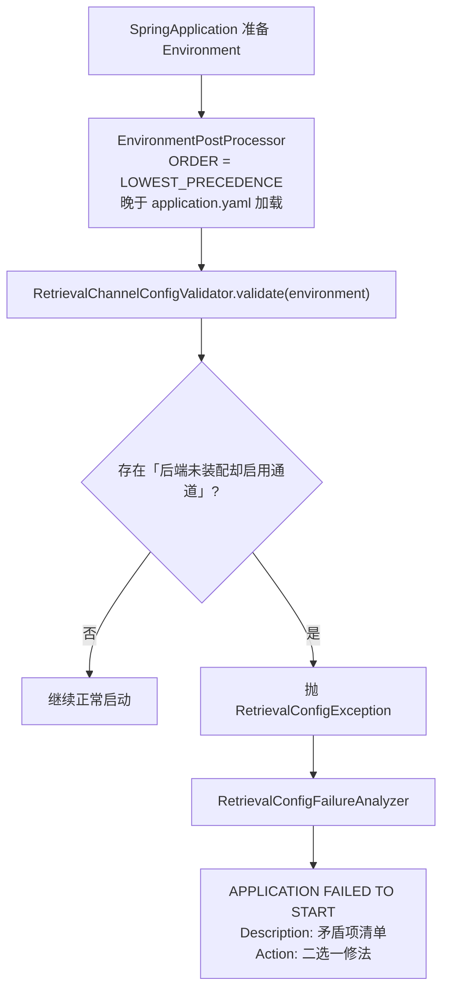
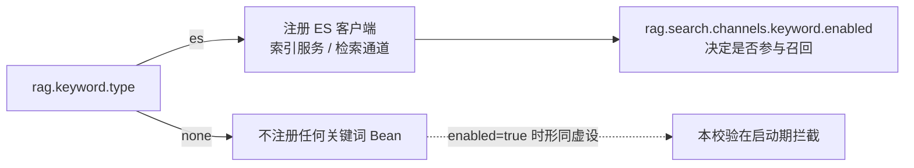

# UP-01 检索通道配置一致性校验

上游对照提交：`ba575908 feat(config): 添加检索通道配置一致性校验机制`

## 功能介绍

引入关键词检索（UP-06）后，检索通道的装配被拆成**两个正交层次**：

| 层次 | 配置项 | 作用 |
| --- | --- | --- |
| 后端装配 | `rag.keyword.type`（`none` / `es`） | 决定 ES 客户端、`EsKeywordIndexService`、`KeywordSearchChannel` 等 Bean 是否注册 |
| 通道启用 | `rag.search.channels.keyword.enabled` | 通道 Bean 存在后，检索期才被 `isEnabled()` 读取 |

有效参与检索 = 后端已装配 **AND** 通道已启用。若配置成 `rag.keyword.type=none` 却又设置 `rag.search.channels.keyword.enabled=true`，就是一个**哑标志**：用户以为开了关键词检索，实际通道类根本没进容器，`enabled=true` 无人读取，检索静默退化为纯向量——这类问题只会在「关键词召回没生效」的模糊现象里暴露，很难定位。

本功能在**应用启动最前置阶段**（`EnvironmentPostProcessor`，早于任何 Bean、Web 容器与 Banner）校验这类单向矛盾：

1. 收集所有通道规格（当前：关键词检索 → 需要 `rag.keyword.type=es`）；
2. 一次性列出全部违规，而不是撞到第一条就停；
3. 抛出 `RetrievalConfigException` 中断启动，并由 `FailureAnalyzer` 渲染成 Spring Boot 的 `APPLICATION FAILED TO START` 诊断框，给出二选一修法。

校验是**单向**的：反过来的 `rag.keyword.type=es` 但 `enabled=false` 合法（后端可用于索引写入/可视化，但不参与召回），不报错。

## 验收标准

1. **矛盾配置启动失败**：`rag.keyword.type=none`（或缺省）且 `rag.search.channels.keyword.enabled=true` 时，启动中断，诊断框 Description 指明 `rag.search.channels.keyword.enabled=true，但关键词检索后端未启用（rag.keyword.type=<未设置>，需为 es）`，Action 给出「设 type=es」或「设 enabled=false」两种修法。
2. **自洽配置正常启动**：`type=none + enabled=false`、`type=es + enabled=true`、`type=es + enabled=false` 三种组合都不报错。
3. **大小写与空白容错**：`type=ES`（含前后空白）视同 `es`，不误报。
4. **一次性收集**：多个通道同时矛盾时，诊断框列出全部违规项。
5. 可执行验证：

```bash
./mvnw test -pl bootstrap -am -Dtest=RetrievalChannelConfigValidatorTest
```

期望结果：全部通过（纯逻辑校验，不依赖 Spring 容器）。

启动期人工验证：

```bash
# 临时把 rag.search.channels.keyword.enabled 改为 true、保持 rag.keyword.type=none
./mvnw spring-boot:run -pl bootstrap
# 期望：APPLICATION FAILED TO START，提示关键词检索后端未装配
```

## 代码位置

| 作用 | 位置 |
| --- | --- |
| 通道规格与纯逻辑校验（可单测） | `bootstrap/src/main/java/com/nageoffer/ai/ragent/rag/config/validation/RetrievalChannelConfigValidator.java` |
| 启动最前置校验钩子 | `bootstrap/src/main/java/com/nageoffer/ai/ragent/rag/config/validation/RetrievalConfigEnvironmentPostProcessor.java` |
| 启动期配置矛盾异常 | `bootstrap/src/main/java/com/nageoffer/ai/ragent/rag/config/validation/RetrievalConfigException.java` |
| 启动诊断框渲染 | `bootstrap/src/main/java/com/nageoffer/ai/ragent/rag/config/validation/RetrievalConfigFailureAnalyzer.java` |
| 扩展点注册 | `bootstrap/src/main/resources/META-INF/spring.factories` |
| 单元测试 | `bootstrap/src/test/java/com/nageoffer/ai/ragent/rag/config/validation/RetrievalChannelConfigValidatorTest.java` |

后续新增带「后端类型开关」的通道（如图谱检索需要 `rag.graph.type`）时，只需在 `RetrievalChannelConfigValidator.SPECS` 增加一条规格，无需改动校验流程。

## 相关图表



两层配置的语义边界：


