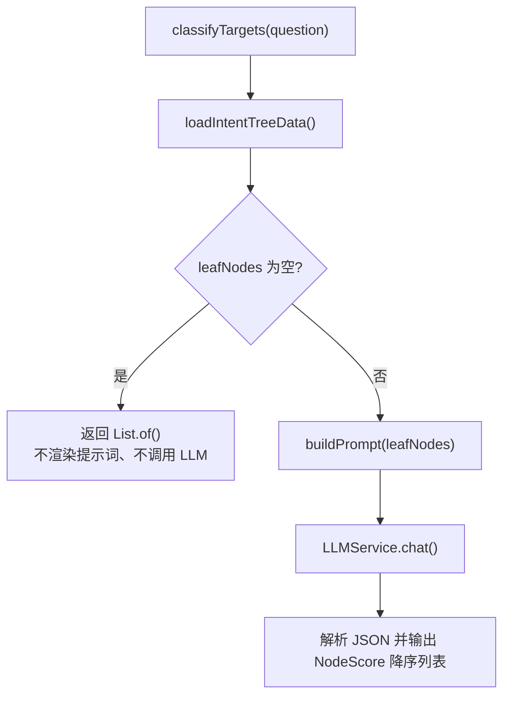
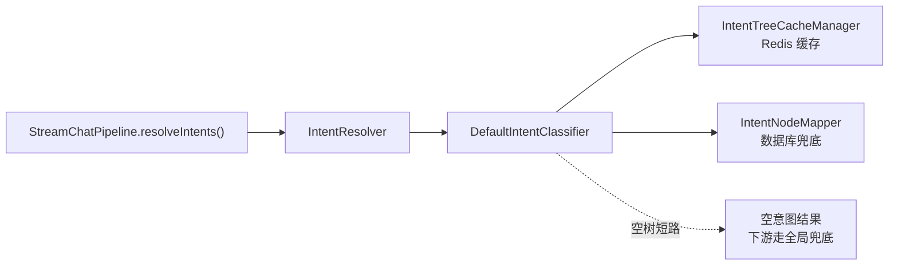

# UP-02 空意图树跳过 LLM 分类

上游对照提交：`29351243 fix(intent): 空意图树跳过 LLM 分类调用 (#65)`

## 功能介绍

意图分类器 `DefaultIntentClassifier.classifyTargets()` 每轮问答都会重新加载意图树并调用 LLM 打分。当意图树缓存与数据库同时为空时（新环境未导入意图树、意图全部被停用、初始化脚本尚未执行），分类器仍会：

1. 用空叶子列表渲染 `intent-classifier.st`，产出一份「没有任何候选意图」的提示词；
2. 发起一次真实的 LLM 调用；
3. 解析必然为空的响应。

这三点没有任何业务收益，却带来可观测的延迟、Token 消耗，以及在模型服务异常时把一次「空意图」问题放大成一次「模型调用失败」的风险。

本功能在叶子节点为空时直接短路返回空结果，保持既有语义（空意图 → 后续检索走无意图分支 / 全局兜底），同时不再渲染提示词、不再调用 LLM。

## 验收标准

1. **功能验收**：意图树缓存为空且数据库查询为空时，`classifyTargets(question)` 返回空列表，且 `LLMService`、`PromptTemplateLoader` 均无任何调用（用 `verifyNoInteractions` 断言）。
2. **回归验收**：意图树非空时行为不变，仍按原有链路渲染提示词并调用 LLM，正常输出按 score 降序的 `NodeScore`。
3. **日志验收**：短路时输出一条 debug 级日志说明「意图树没有可用叶子节点，跳过 LLM 意图识别」，不产生异常堆栈。
4. **可执行验证**：

```bash
./mvnw test -pl bootstrap -Dtest=DefaultIntentClassifierTest
```

期望结果：`Tests run: 1, Failures: 0, Errors: 0`。

## 代码位置

| 作用 | 位置 |
| --- | --- |
| 分类器短路逻辑 | `bootstrap/src/main/java/com/nageoffer/ai/ragent/rag/core/intent/DefaultIntentClassifier.java`（`classifyTargets` 方法，加载 `IntentTreeData` 之后） |
| 意图树加载与缓存 | `bootstrap/src/main/java/com/nageoffer/ai/ragent/rag/core/intent/IntentTreeCacheManager.java`、`DefaultIntentClassifier#loadIntentTreeData` |
| 提示词模板 | `bootstrap/src/main/resources/prompt/intent-classifier.st` |
| 单元测试 | `bootstrap/src/test/java/com/nageoffer/ai/ragent/rag/core/intent/DefaultIntentClassifierTest.java` |

## 相关图表



调用链位置：


