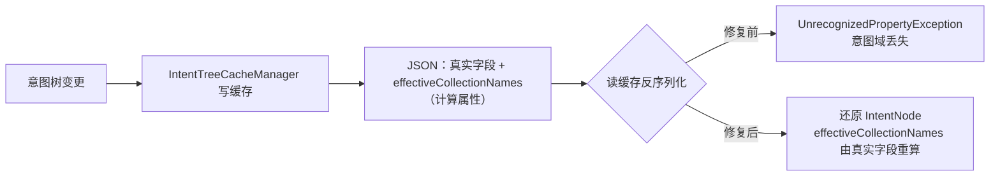

# UP-03 意图节点缓存 JSON 反序列化容错

上游对照提交：

| 提交 | 内容 |
| --- | --- |
| `8128b8a9 fix(intent): 防止 Redis 缓存 JSON 反序列化失败 (#103)` | 计算型 getter 加 `@JsonIgnore`，避免写入缓存后反序列化失败 |

## 功能介绍

意图树在 Redis 里以 JSON 形式缓存（`IntentTreeCacheManager`），读缓存时用 Jackson 反序列化回
`IntentNode`。UP-10 引入「一个意图关联多个知识库 Collection」后，`IntentNode` 多了一个**计算型
getter**：`getEffectiveCollectionNames()`——它按「新字段 `collectionNames` 优先、旧字段 `collectionName`
兜底」算出实际参与检索的库名，本身不是可写属性。

Jackson 序列化对象时会把它当成一个 `effectiveCollectionNames` 属性写进缓存 JSON，但反序列化时找不到
对应的 setter：在 `FAIL_ON_UNKNOWN_PROPERTIES` 开启（本仓库默认）的情况下直接抛
`UnrecognizedPropertyException`，表现是**意图树一旦落过缓存就再也读不回来**，检索退化成无意图域，
日志里只能看到反序列化异常。上游同款问题由社区 PR 修复。

修法很小：给计算型 getter 标注 `@JsonIgnore`，让缓存 JSON 只含真实字段。

| 关注点 | 修复前 | 修复后 |
| --- | --- | --- |
| 缓存 JSON | 含 `effectiveCollectionNames` | 只含 `collectionNames` / `collectionName` 等真实字段 |
| 反序列化 | 抛 `UnrecognizedPropertyException` | 正常还原 |
| 旧缓存（已写入脏字段） | 读失败 | 忽略未知属性后正常还原（依赖 `FAIL_ON_UNKNOWN_PROPERTIES=false`） |

## 验收标准

1. **序列化不含计算属性**：`IntentNode` 序列化后的 JSON 不出现 `effectiveCollectionNames`，
   真实字段 `collectionNames` 正常输出。
2. **往返一致**：序列化 → 反序列化后 `getEffectiveCollectionNames()` 结果不变
   （含去空白、去重、保序）。
3. **兼容旧缓存**：反序列化一份**带脏字段**的历史缓存 JSON（含 `effectiveCollectionNames`）时不报错，
   且以真实字段为准（脏值被忽略）。
4. **其它计算型属性同样安全**：`isLeaf()` / `isKB()` / `isMCP()` / `isSystem()` 这类布尔计算属性
   不得破坏往返一致性（Jackson 对 `isXxx()` 只读属性同样会当属性处理）。
5. 可执行验证：

```bash
./mvnw test -pl bootstrap -am '-Dtest=IntentNodeJsonTest' -Dsurefire.failIfNoSpecifiedTests=false
```

期望结果：全部通过。

## 代码位置

| 作用 | 位置 |
| --- | --- |
| 计算型 getter 加 `@JsonIgnore` | `bootstrap/src/main/java/com/nageoffer/ai/ragent/rag/core/intent/IntentNode.java` |
| 缓存读写 | `bootstrap/src/main/java/com/nageoffer/ai/ragent/rag/core/intent/IntentTreeCacheManager.java` |
| 单元测试 | `bootstrap/src/test/java/com/nageoffer/ai/ragent/rag/core/intent/IntentNodeJsonTest.java` |

## 相关图表



## 与上游的差异

- 语义与修法完全一致（`@JsonIgnore` 打在计算型 getter 上）。
- 本仓库额外把「布尔计算属性」纳入验收标准并写进测试：`isKB()` / `isMCP()` 同样只读，
  缓存往返不得因为它们的默认值（如 `kind == null` 视为 KB）而产生歧义。
