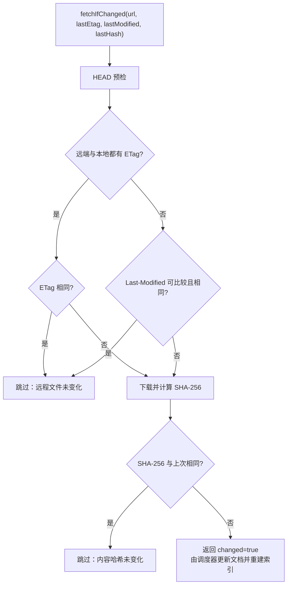
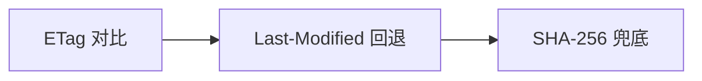

# UP-04 远程文件刷新：ETag 变化不再被误判为未变更

上游对照提交：`10def629 fix(schedule): 避免 ETag 变化时跳过远程文件刷新 (#71)`

## 功能介绍

远程知识库文档的定时刷新依赖 `RemoteFileFetcher.fetchIfChanged()` 判断远端是否发生变化。原实现把两个校验器并列：

1. ETag 取到且与上次相同 → 判定未变化；
2. Last-Modified 取到且与上次相同 → 判定未变化；
3. 命中任意一条即跳过下载。

于是出现两类误判：

- **漏刷新**：ETag 已变化（内容真的改了），但源站 Last-Modified 精度只到秒或恰好未变，第二个条件命中后直接短路，新内容永远不会被拉取；
- **无效下载**：ETag 完全一致（内容没变）但 Last-Modified 变了，仍走完整下载，浪费带宽与解析资源。

改为按强度顺序使用校验器：

1. 远端与本地**双方都有 ETag** → 只用 ETag 判定（ETag 是内容指纹，信号最强）；
2. ETag 无法比较（任一侧缺失）→ 才回退 Last-Modified；
3. 两者都不足以判定 → 下载后按 SHA-256 内容哈希兜底判断。

## 验收标准

1. ETag 变化且 Last-Modified 相同 → 判定为**已变更**，执行下载。
2. ETag 相同且 Last-Modified 变化 → 判定为**未变更**，`openStream` 零调用。
3. 远端无 ETag、Last-Modified 与本地一致 → 判定为未变更，不下载。
4. 两个校验器都缺失、下载后 SHA-256 与上次一致 → 判定为未变更，消息为「内容哈希未变化」。
5. 可执行验证：

```bash
./mvnw test -pl bootstrap -am -Dtest=RemoteFileFetcherTest
```

期望结果：`Tests run: 4, Failures: 0, Errors: 0`。

## 代码位置

| 作用 | 位置 |
| --- | --- |
| 变更判定逻辑 | `bootstrap/src/main/java/com/nageoffer/ai/ragent/knowledge/handler/RemoteFileFetcher.java`（`fetchIfChanged`） |
| 远端元信息获取 | `bootstrap/src/main/java/com/nageoffer/ai/ragent/ingestion/util/HttpClientHelper.java`（`head` / `openStream` 及 `HttpHeadResponse`、`HttpFetchStream`） |
| 刷新调度调用方 | `bootstrap/src/main/java/com/nageoffer/ai/ragent/knowledge/schedule/ScheduleRefreshProcessor.java` |
| 单元测试 | `bootstrap/src/test/java/com/nageoffer/ai/ragent/knowledge/handler/RemoteFileFetcherTest.java` |

## 相关图表



判定优先级（强 → 弱）：


