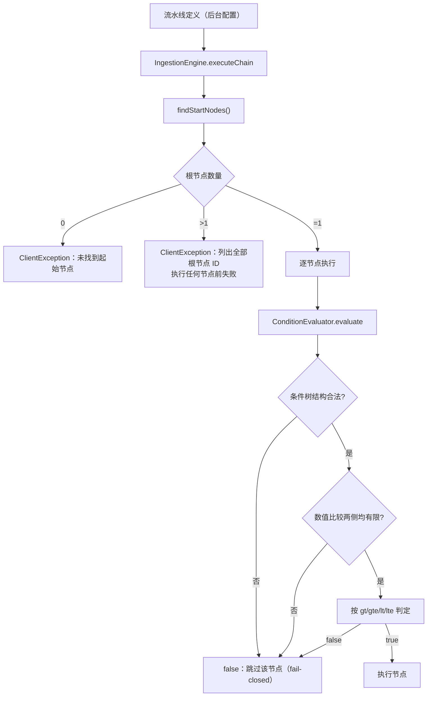
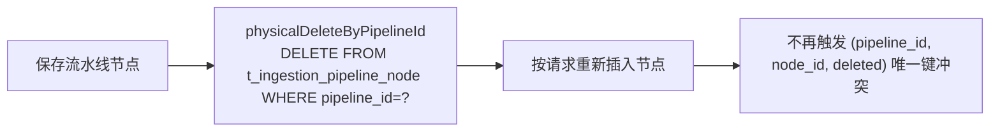

# UP-05 入库流水线健壮性（条件求值、起点判定、节点替换、任务详情）

上游对照提交：

- `1c9bfc16 fix(ingestion): 让非法数值条件安全返回 false (#64)`
- `dbedd450 fix(ingestion): 未知或畸形节点条件结构 fail-closed (#86)`
- `c9c6ee47 fix(ingestion): 多起点流水线配置执行前失败 (#97)`
- `8d314a20 fix(ingestion): 修复 Pipeline 重复更新节点唯一键冲突 (#55)`
- `d98ec1ec fix(ingestion): 正确解析任务元数据与节点输出 JSON (#63)`

## 功能介绍

入库流水线是「解析 → 清洗 → 分块 → 向量化」的可编排链路，配置由后台页面维护。这条链路的四个薄弱点在真实使用中都产生过静默错误，本功能一并修复。

### 1. 数值条件：非法值不得当作 0 参与比较（`1c9bfc16`）

`ConditionEvaluator` 的 `gt/gte/lt/lte` 原实现把「缺失字段、非法字符串、NaN」一律当成 `0` 比较，于是 `gte 0` 这类常见写法会**错误命中**几乎所有畸形输入，本应跳过的节点被执行。修复后：只有两侧都能解析为**有限数值**时才比较，否则条件为 `false`（fail-closed，让节点跳过而不是误执行）。

### 2. 条件结构：未知/畸形结构 fail-closed（`dbedd450`）

原实现遇到未知对象键（例如把 `field` 写成 `fields`）、`all/any` 不是数组、`field` 为空白时会**默认返回 true** 放行。配置笔误因此静默执行了本应跳过的节点。修复后先递归校验整棵条件树的结构，任一结构非法即返回 `false`；结构合法才走原有布尔求值与 `all/any` 短路，不执行额外的 SpEL、正则或字段读取。

### 3. 多起点流水线：执行前失败（`c9c6ee47`）

`IngestionEngine` 原实现用 `findFirst()` 从「未被引用」的节点里任选起点。多根节点配置（画了两条链）会静默只跑一条，任务却被标记成功。修复后收集全部根节点并稳定排序：多于一个立即抛 `ClientException` 并列出全部 ID，无根节点保持原有错误语义，合法单链行为不变。同时 `IngestionTaskServiceImpl.upload` 原样透传 `ClientException`，避免引擎配置错误被「读取上传文件失败」前缀包装误导。

### 4. 节点整体替换：物理删除避免唯一键冲突（`8d314a20`）

`t_ingestion_pipeline_node` 使用逻辑删除（`@TableLogic`），原 `delete` 只把 `deleted` 置 1。再次保存相同 `node_id` 时命中 `(pipeline_id, node_id, deleted)` 唯一约束，流水线保存失败。修复后新增按 `pipeline_id` **物理删除**的 Mapper SQL，并在整体替换节点前调用。

### 5. 任务详情：JSON 字段正确解析（`d98ec1ec`）

任务详情的转换把数据库返回的 JSON **字符串**交给 `BeanUtil.beanToMap`，得到的是字符串对象的属性表（或空对象），导致 `metadata` 与节点 `output` 在前端永远显示为空。修复后改用 `ObjectMapper.readValue(..., new TypeReference<Map<String,Object>>(){})`，无效或空 JSON 保留空 Map 容错。

## 验收标准

1. **数值条件**：缺失字段、非法字符串、空值、`NaN`、`Infinity` 参与 `gt/gte/lt/lte` 时结果为 `false`；两侧都是有限数值时按数值大小正常比较（含等于边界）。
2. **条件结构**：未知对象键、`all/any` 非数组、`field` 为空白/缺失 → `false`；`all`/`any` 空数组分别按「全真」「全假」语义；`not` 递归求值；结构非法时不做字段读取与 SpEL 求值。
3. **流水线起点**：无根节点 → `ClientException("流水线未找到起始节点")`；多于一个根节点 → `ClientException` 且消息包含全部根节点 ID，且**在任何节点执行前**抛出；单根链路行为不变。
4. **节点替换**：`IngestionPipelineNodeMapper#physicalDeleteByPipelineId` 使用硬删除 SQL；`IngestionPipelineServiceImpl` 整体替换节点前调用它。
5. **任务详情**：`metadata_json` / `output_json` 为合法 JSON 对象时解析为对应键值；为空串、空白、非法 JSON 时得到空 Map，不抛异常。
6. 可执行验证：

```bash
./mvnw test -pl bootstrap -am '-Dtest=ConditionEvaluatorTest,IngestionEngineTest,IngestionPipelineNodeMapperTest,IngestionTaskServiceImplTest' -Dsurefire.failIfNoSpecifiedTests=false
```

期望结果：全部通过。

## 代码位置

| 作用 | 位置 |
| --- | --- |
| 条件求值（数值 fail-closed、结构校验） | `bootstrap/src/main/java/com/nageoffer/ai/ragent/ingestion/engine/ConditionEvaluator.java` |
| 流水线起点判定 | `bootstrap/src/main/java/com/nageoffer/ai/ragent/ingestion/engine/IngestionEngine.java` |
| 节点物理删除 SQL | `bootstrap/src/main/java/com/nageoffer/ai/ragent/ingestion/dao/mapper/IngestionPipelineNodeMapper.java` |
| 节点整体替换调用 | `bootstrap/src/main/java/com/nageoffer/ai/ragent/ingestion/service/impl/IngestionPipelineServiceImpl.java` |
| 任务详情 JSON 解析与异常透传 | `bootstrap/src/main/java/com/nageoffer/ai/ragent/ingestion/service/impl/IngestionTaskServiceImpl.java` |
| 单元测试 | `bootstrap/src/test/java/com/nageoffer/ai/ragent/ingestion/**` |

## 相关图表



流水线节点保存（整体替换）的删除语义：



说明：本仓库的「删除整条流水线」路径仍保留逻辑删除，与逻辑删除的流水线主表语义一致，且该路径不存在「删除后立即重插同 ID」的组合。
