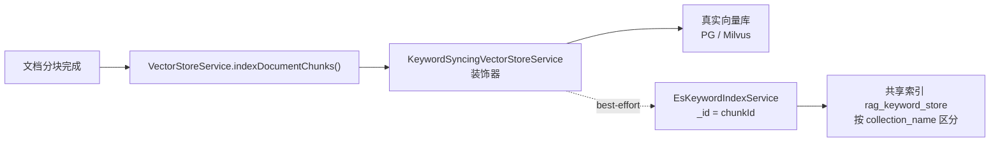
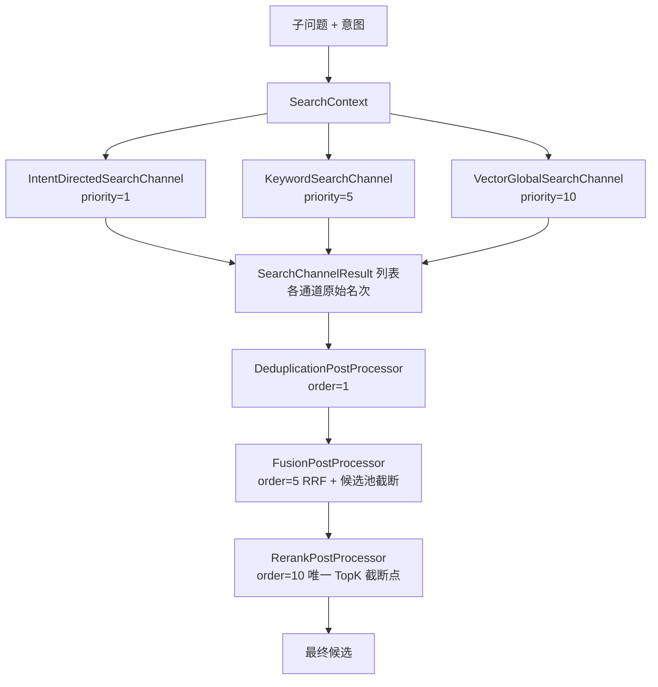
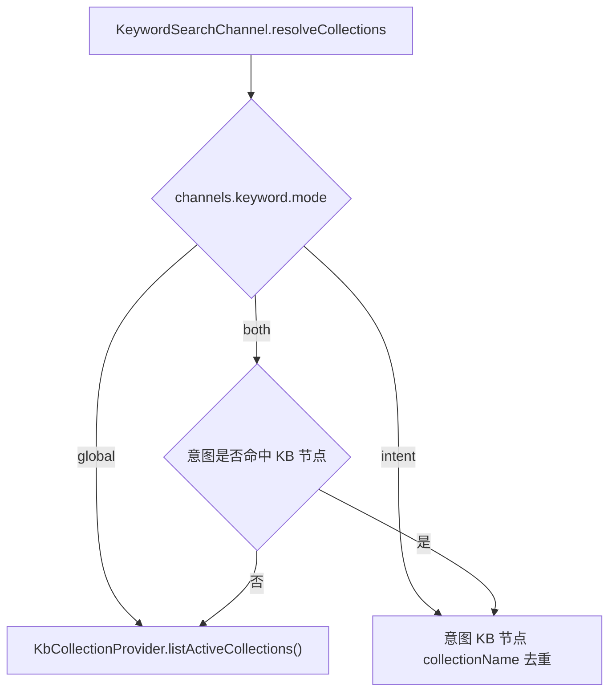

# UP-06 Elasticsearch 关键词检索通道（混合检索）

上游对照提交：

- `461d7966 feat(keyword): 集成基于 Elasticsearch 的关键词检索与索引功能`
- `6859e528 refactor(knowledge): 统一Milvus向量和关键词索引为共享物理索引`
- `ba575908 feat(config): 添加检索通道配置一致性校验机制`（配置一致性校验，见下文 UP-01 说明）

## 功能介绍

分叉点版本的检索只有向量一条语义通路：`VectorGlobalSearchChannel`（全局）和 `IntentDirectedSearchChannel`（意图定向）。向量检索擅长语义相近、措辞不同的问法，但对**精确词**表现弱，例如：

- 编号与代码：学号规则、文件编号、课程代码、表格中的字段名；
- 专有名词与缩写：学院名、专业名、楼栋名、政策文件名；
- 数字与日期：金额、年限、分数门槛。

本功能引入第二条召回通路：**基于 Elasticsearch BM25 的关键词检索通道**，并用 **RRF（Reciprocal Rank Fusion）融合**把向量分与关键词分合并成统一候选池，形成「关键词 + 向量」的混合检索。

整套能力遵循「可插拔、默认关闭」原则：

1. `rag.keyword.type=none`（默认）时，ES 相关 Bean、关键词通道、融合后处理器全部不注册，运行期与分叉点版本完全等价；
2. `rag.keyword.type=es` 时，注册 ES 客户端、关键词索引服务与关键词检索通道；
3. 向量写入通过 `VectorStoreService` 装饰器自动同步关键词索引，**业务写入调用点零改动**（best-effort，不影响向量主链路）。

数据模型采用**共享物理索引**：所有知识库的关键词数据写入同一 ES 索引，以 `collection_name` 字段区分，与「向量库共享 collection / PG 共享表」同构。文档主键（ES `_id`）等于 `chunkId`，与向量库主键对齐，保证跨模态去重与融合能对齐同一条 chunk。

## 验收标准

### 关闭态（默认，回归保障）

1. `rag.keyword.type=none` 启动成功，容器中不存在 `ElasticsearchClient`、`KeywordSearchChannel`、`FusionPostProcessor`；
2. 检索通道列表为 `IntentDirectedSearchChannel`、`VectorGlobalSearchChannel`，检索结果与分叉点版本一致。

### 开启态（需 ES 实例）

3. 配置 `rag.keyword.type=es` 且 ES 可达时，启动后共享索引 `rag_keyword_store` 自动创建，`content` / `outline` 字段使用 `ik_max_word` 写入分词、`ik_smart` 查询分词；
4. 知识库文档分块完成后，同一条 chunk 同时存在于向量库与 ES 索引，ES 文档 `_id` 等于 `chunkId`；
5. 询问包含精确词的校内问题（如「转专业的学分要求」），`KeywordSearchChannel` 返回按 BM25 倒序的命中，日志打印 `关键词检索完成，知识库=[...]，检索到 N 个 Chunk`；
6. 多通道结果经 `FusionPostProcessor` 按 RRF 重排，日志打印 `RRF 融合完成 - 通道数: 2, k: 60, 融合后: N 个, 截断上限: 50, 送入 Rerank: M 个`；
7. 删除文档时，向量与关键词索引同时被清理（ES 按 `doc_id` 删除）；删除知识库时按 `collection_name` 清理。

### 单元测试

```bash
./mvnw test -pl bootstrap -am -Dtest='FusionPostProcessorTest,KeywordSyncingVectorStoreServiceTest'
```

期望结果：全部通过。融合与装饰器为纯逻辑，不依赖真实 ES 实例。

## 代码位置

| 作用 | 位置 |
| --- | --- |
| 关键词配置（`rag.keyword.*`） | `bootstrap/src/main/java/com/nageoffer/ai/ragent/rag/config/KeywordProperties.java` |
| ES 客户端装配（`type=es` 才注册） | `bootstrap/src/main/java/com/nageoffer/ai/ragent/rag/config/EsClientConfig.java` |
| 关键词索引 SPI | `bootstrap/src/main/java/com/nageoffer/ai/ragent/rag/core/vector/keyword/KeywordIndexService.java` |
| ES 索引实现（共享索引、批量写入、按文档/知识库删除） | `bootstrap/src/main/java/com/nageoffer/ai/ragent/rag/core/vector/keyword/EsKeywordIndexService.java` |
| 向量写入的关键词同步装饰器 | `bootstrap/src/main/java/com/nageoffer/ai/ragent/rag/core/vector/KeywordSyncingVectorStoreService.java` |
| 装饰器织入（BeanPostProcessor） | `bootstrap/src/main/java/com/nageoffer/ai/ragent/rag/config/KeywordSyncVectorStorePostProcessor.java` |
| 关键词检索 SPI | `bootstrap/src/main/java/com/nageoffer/ai/ragent/rag/core/retrieve/keyword/KeywordRetrieverService.java` |
| ES 关键词检索实现（multi_match + collection 过滤） | `bootstrap/src/main/java/com/nageoffer/ai/ragent/rag/core/retrieve/keyword/EsKeywordRetrieverService.java` |
| 关键词检索通道（优先级 5） | `bootstrap/src/main/java/com/nageoffer/ai/ragent/rag/core/retrieve/channel/KeywordSearchChannel.java` |
| 全库范围唯一来源（有效知识库 collection） | `bootstrap/src/main/java/com/nageoffer/ai/ragent/rag/core/retrieve/channel/KbCollectionProvider.java` |
| RRF 融合后处理器（order=5） | `bootstrap/src/main/java/com/nageoffer/ai/ragent/rag/core/retrieve/postprocessor/FusionPostProcessor.java` |
| 通道与融合配置 | `bootstrap/src/main/java/com/nageoffer/ai/ragent/rag/config/SearchChannelProperties.java`、`bootstrap/src/main/resources/application.yaml` |
| 依赖声明 | `bootstrap/pom.xml`（`co.elastic.clients:elasticsearch-java`，版本由 Spring Boot BOM 管理） |
| 不变量规则 | `docs/rules/retrieval-invariants.md` |

配置项：

```yaml
rag:
  keyword:
    type: none            # none / es
    es:
      uris: http://127.0.0.1:9200
      index: rag_keyword_store
      analyzer: ik_max_word
      search-analyzer: ik_smart
  search:
    channels:
      keyword:
        enabled: true     # 仅当 rag.keyword.type=es 时该通道才存在
        mode: both        # global / intent / both
        top-k-multiplier: 2
    fusion:
      strategy: rrf
      rrf-k: 60
      rerank-candidate-limit: 50   # <=0 表示不截断
```

## 相关图表

写入链路（向量与关键词同源双写，装饰器一处覆盖全部调用点）：



检索链路（两路召回 + RRF 融合 + 唯一 TopK 截断点）：



关键词通道的目标范围解析：



## UP-01 配置一致性校验的关系

`rag.search.channels.keyword.enabled=true` 只有在 `rag.keyword.type=es` 时才有效；两者不一致时该通道 Bean 根本不会注册，`enabled` 形同虚设。上游为此增加了启动期校验（`ba575908`）。本仓库在引入通道后端类型开关后，同样需要该校验，因此 **UP-01 在本功能之后落地**，规则见 [`../roadmap.md`](../roadmap.md) 批次 2。
