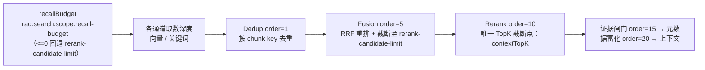
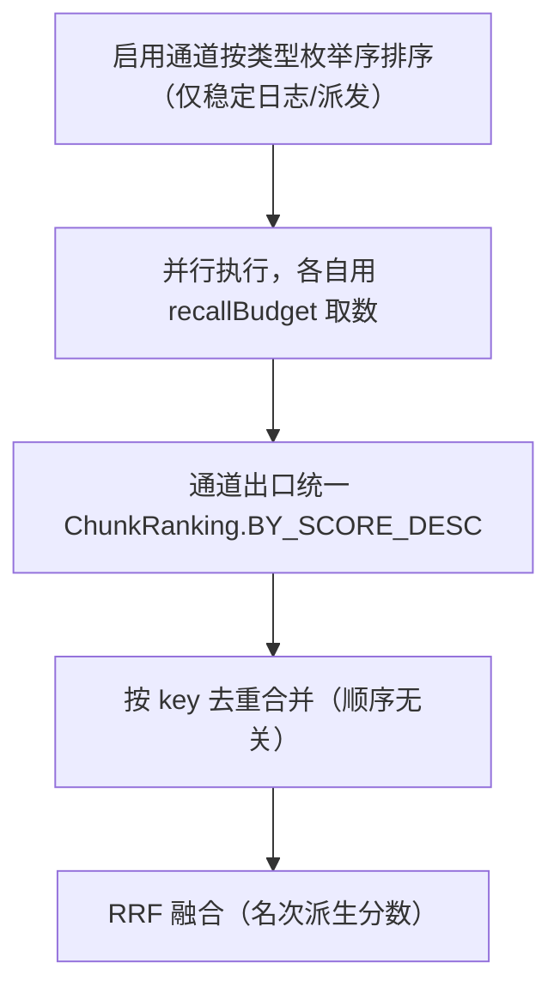

# UP-07 召回预算统一与通道出口统一

上游对照提交：

- `886677f9 refactor(search): 全局向量检索统一使用召回预算 recall-budget`
- `9a65b76b refactor(retrieval): 消除 topK 多义性并按第一性原理精简检索配置`
- `5dcfb242 refactor(retrieval): 统一通道出口结果排序及空结果处理`
- `e7ef2629 refactor(retrieval): 按key去重合并多通道检索结果，移除优先级相关逻辑`
- `dc0d0013 optimize(rag): 复用并行检索 Query Embedding (#69)`
- `f7dea62b refactor(rag): 删除抽象并行检索器，改用逐库并行检索实现`

## 功能介绍

分叉点版本的检索配置有四处语义含糊，扩通道（关键词、图谱、联网）之后问题被放大：

| 问题 | 表现 |
| --- | --- |
| **topK 多义** | `context.topK` 既是「通道取数深度」又是「最终上下文条数」；每个通道再各自乘 `top-k-multiplier`，候选池大小随通道数线性膨胀，谁都说不清一次检索到底取了多少条 |
| **优先级语义** | `SearchChannel.getPriority()` 被用于结果合并顺序，但实际影响结果的是「去重顺序」和「RRF 名次」，优先级成了一个既影响行为又说不清的隐藏开关 |
| **通道出口不一致** | 每个通道自己写排序、自己造空结果对象，空结果的 `latencyMs` 还是 0，归因与耗时统计失真 |
| **重复 embedding** | 全局向量检索逐库 fan-out，每个库各调一次 `embeddingService.embed(query)`——同一个问题被向量化 N 次，是检索链路上最贵的一次同步远端调用 |

本功能把检索配置与通道出口收敛成一套语义：

1. **两个数各管一件事**：`rag.search.default-top-k`（`contextTopK`，最终进入上下文的条数）与 `rag.search.scope.recall-budget`（`recallBudget`，通道取数深度）。通道不再乘倍数，取数深度只由 `recallBudget` 决定；`recall-budget<=0` 时回退到 `rag.search.fusion.rerank-candidate-limit`（单一真源，召回超过候选池上限的部分下游必被截断、属空转）。
2. **漏斗不变式**：`recallBudget` 若配置为正值，必须 ≥ `contextTopK`，否则启动即失败（取数上限小于最终条数必然拿不满）。
3. **去掉优先级**：`SearchChannel.getPriority()` 删除；引擎按通道类型枚举序稳定排序，仅用于日志与派发顺序可复现，不承载任何检索优先级语义。跨通道合并顺序由「按 key 去重 + RRF 融合」决定。
4. **通道出口统一**：新增 `ChunkRanking`（统一 `BY_SCORE_DESC` 比较器、`sortedByScore`、`topScoreOf`、`cap`）与 `SearchChannel.emptyResult(latencyMs)` 默认方法；所有通道用同一套排序与空结果构造，空结果携带真实耗时。
5. **复用 Query Embedding**：全局向量检索改为**一次调用覆盖全部目标库**（PG 单条 SQL `IN` 过滤；Milvus 在服务内部逐物理库检索后合并），不再逐库 fan-out —— 同一个问题只向量化一次。

## 验收标准

1. **取数深度只受 recallBudget 管**：设置 `recall-budget=40` 时，全局/关键词通道请求的候选数都是 40，与通道数、`default-top-k` 无关。
2. **回退语义**：`recall-budget<=0` 时取数深度等于 `fusion.rerank-candidate-limit`。
3. **漏斗不变式**：`recall-budget>0` 且小于 `default-top-k` 时启动失败并给出明确提示；等于或大于时启动成功。
4. **优先级不参与结果**：`SearchChannel` 接口不再有 `getPriority()`；同一组通道的合并结果不随通道声明顺序变化（有单测覆盖）。
5. **空结果携带耗时**：通道超时/异常降级产生的空结果 `latencyMs>0`（用真实耗时构造）。
6. **一次 embedding**：全局向量通道对同一子问题只调用一次检索入口（PG/Milvus 均在服务内部处理多库），不再按库 fan-out。
7. **排序一致**：通道出口一律使用 `ChunkRanking.BY_SCORE_DESC`，分数相同按 chunk id 稳定排序，避免同分随机序。
8. 可执行验证：

```bash
./mvnw test -pl bootstrap -am '-Dtest=ChunkRankingTest,SearchChannelPropertiesTest,MultiChannelRetrievalEngineTest,VectorGlobalSearchChannelTest' -Dsurefire.failIfNoSpecifiedTests=false
```

期望结果：全部通过。

## 代码位置

| 作用 | 位置 |
| --- | --- |
| 召回预算与漏斗校验 | `bootstrap/src/main/java/com/nageoffer/ai/ragent/rag/config/SearchChannelProperties.java`（`Scope.recallBudget` + `afterPropertiesSet`） |
| 检索预算载体 | `bootstrap/src/main/java/com/nageoffer/ai/ragent/rag/core/retrieve/channel/SearchContext.java`（`budget`） |
| 通道接口（去优先级、统一空结果） | `bootstrap/src/main/java/com/nageoffer/ai/ragent/rag/core/retrieve/channel/SearchChannel.java` |
| 统一排序工具 | `bootstrap/src/main/java/com/nageoffer/ai/ragent/rag/core/retrieve/channel/ChunkRanking.java` |
| 通道实现 | `.../channel/VectorGlobalSearchChannel.java`、`IntentDirectedSearchChannel.java`、`KeywordSearchChannel.java` |
| 引擎（稳定派发 + 统一降级） | `bootstrap/src/main/java/com/nageoffer/ai/ragent/rag/core/retrieve/MultiChannelRetrievalEngine.java` |
| 配置项 | `bootstrap/src/main/resources/application.yaml`（`rag.search.scope.recall-budget`） |
| 规则文档 | `docs/rules/retrieval-invariants.md` |
| 单元测试 | `bootstrap/src/test/java/com/nageoffer/ai/ragent/rag/core/retrieve/**` |

## 相关图表

预算漏斗（每一段只有一个旋钮）：



阈值关系（启动期校验）：

| 配置 | 含义 | 约束 |
| --- | --- | --- |
| `rag.search.default-top-k` | 最终进入上下文的条数（`contextTopK`） | ≥1 |
| `rag.search.scope.recall-budget` | 通道取数深度 | `<=0` 回退候选池上限；`>0` 时必须 ≥ `contextTopK` |
| `rag.search.fusion.rerank-candidate-limit` | RRF 之后送入 Rerank 的候选上限 | `<=0` 不截断 |

通道派发与合并（顺序只影响日志，不影响结果）：



## 与上游的差异（有意保留）

上游在 `1c40cdd1` 中把「向量全局」与「意图定向」合并成**单一向量通道**，其前提是上游已把 Milvus 改造成「全库共享物理 collection + `collection_name` 过滤」（`cf5ffa67` / `6859e528`）。本仓库的 `rag.vector.type` 仍支持 **pg（共享表）与 milvus（每知识库一个物理 collection）两种布局**，且意图定向需要「按意图选库」的语义，因此保留两条向量通道，只在**语义层**统一：

- 两者共用同一 `recallBudget`、同一 `ChunkRanking` 出口、同一去重与融合链路；
- 两者都不再按库 fan-out（多库由检索实现内部处理）；
- 通道启用条件仍由「意图置信度」决定，只是不再通过 `getPriority()` 影响结果顺序。

这样既拿到了上游重构的收益（预算单一真源、出口一致、一次 embedding），又不动摇本仓库两种向量后端的既有布局。
