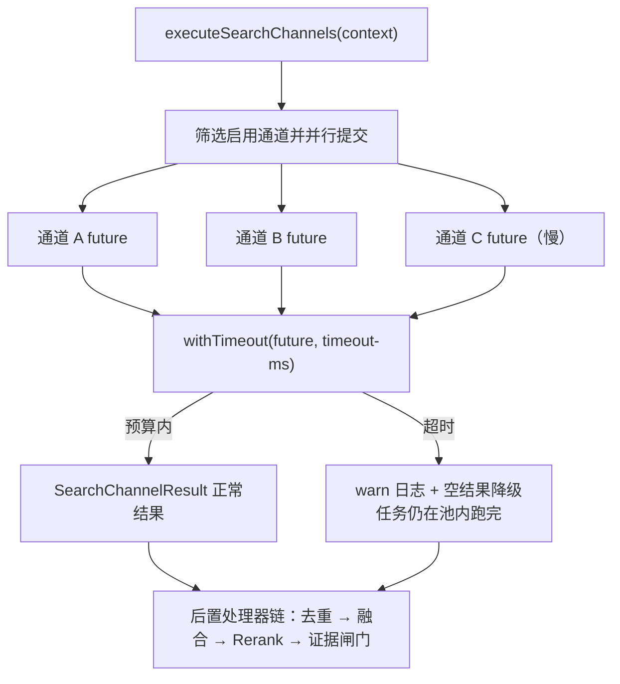

# UP-08 通道级超时降级

上游对照提交：`d6ad7871 feat(rag): 支持通道级超时降级与精准图谱库归属判定`（本文只覆盖其中的超时降级部分；图谱归属判定随 UP-27 落地）

## 功能介绍

`MultiChannelRetrievalEngine` 并行执行所有启用的检索通道，然后 `join` 等待全部完成。并行只解决了「快慢不叠加」，没有解决「最慢一条钳制整体」：

1. 任一通道后端劣化（ES 慢查询、图谱服务 30s 超时、远端向量库网络抖动）时，整个子问题的检索时延被拉到该通道的耗时；
2. 该通道最终往往还是返回空或低质结果，用户却已经等了十几秒；
3. 每次问答都重新做一次这样的等待，故障期间整体不可用。

本功能给每个通道加**独立的执行预算**（`rag.search.channels.timeout-ms`，默认 15000ms）：

1. 通道超过预算 → 该通道结果降级为空，其余通道照常走融合与后续处理；
2. 只放弃结果，不中断执行：任务仍在检索线程池里跑完（Kafka 式的「无法安全取消阻塞 IO」），因此超时值过小等于整路白算；
3. `timeout-ms<=0` 表示不限时，退回「等最慢通道」的旧行为。

通道自身的异常（非超时）同样在该处兜底为空结果并打 error 日志，避免单通道故障让整轮检索失败。

## 验收标准

1. **超时降级**：慢通道（耗时超过 `timeout-ms`）返回空结果，快通道证据完整保留并进入后续处理链。
2. **时延不被钳制**：设 `timeout-ms=200ms`、慢通道阻塞 1s 时，整次检索耗时明显小于慢通道耗时（用例断言 < 800ms）。
3. **不限时回退**：`timeout-ms<=0` 时不加超时包装，行为与分叉点版本一致。
4. **异常兜底**：通道抛异常时该通道降级为空结果，不影响其它通道。
5. 可执行验证：

```bash
./mvnw test -pl bootstrap -am -Dtest=MultiChannelRetrievalEngineTest
```

期望结果：包含 `slowChannelDegradesToEmptyAfterChannelTimeout` 在内的用例全部通过。

## 代码位置

| 作用 | 位置 |
| --- | --- |
| 配置项 `rag.search.channels.timeout-ms` | `bootstrap/src/main/java/com/nageoffer/ai/ragent/rag/config/SearchChannelProperties.java`（`Channels.timeoutMs`） |
| 通道级超时与降级 | `bootstrap/src/main/java/com/nageoffer/ai/ragent/rag/core/retrieve/MultiChannelRetrievalEngine.java`（`withTimeout`） |
| 检索线程池 | `bootstrap` 中 `ragRetrievalExecutor` 的 Bean 定义（`rag` 配置类） |
| 单元测试 | `bootstrap/src/test/java/com/nageoffer/ai/ragent/rag/core/retrieve/MultiChannelRetrievalEngineTest.java` |
| 配置项文档 | `bootstrap/src/main/resources/application.yaml`、`docs/rules/retrieval-invariants.md` |

## 相关图表



超时预算与其它超时的关系：

| 超时 | 作用范围 | 说明 |
| --- | --- | --- |
| `rag.search.channels.timeout-ms` | 单个检索通道 | 本功能，超时只丢该通道结果 |
| 模型客户端超时（如 LightRAG 30s） | 单次后端调用 | 通道内部超时，会先于通道级超时触发或与之叠加 |
| `rag.default.sse-timeout-ms` | 整条 SSE 回答 | 端到端上限，包含模型生成 |

三者的关系必须满足 `通道级超时 <= SSE 全局超时`，否则通道超时永远没有机会生效。
