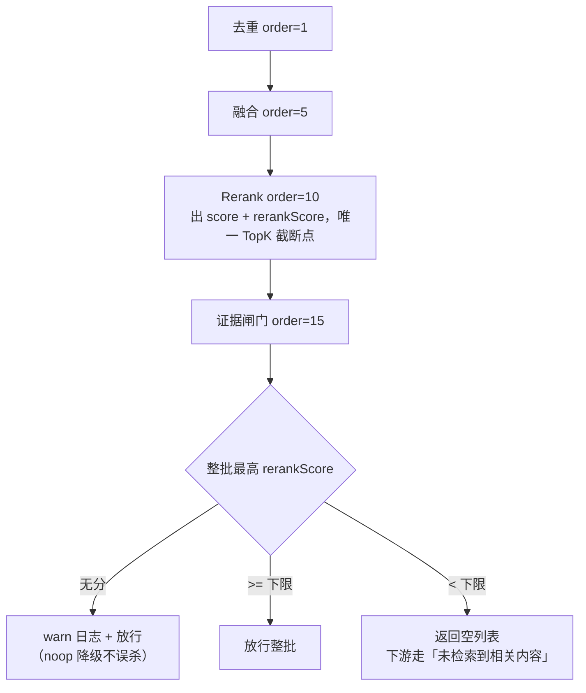

# UP-09 Rerank 证据相关性闸门

上游对照提交：`16984b95 feat(rerank): 添加知识库检索证据相关性闸门及精排分判定机制`

## 功能介绍

检索只保证「返回最像的 N 条」，不保证「真的有相关内容」。当知识库里根本没有答案时：

1. 向量 / 关键词照样把最不相似的 N 条满额返回；
2. Rerank 只是重排序，不会因为「全都弱相关」而返回空；
3. 下游提示词只看「证据文本非空」，于是整批噪声进入上下文，模型基于无关材料编答案。

本功能补一道**证据相关性闸门**：以 `Rerank` 的精排分为依据，取**整批最高精排分**做批级判定，低于下限就整批丢弃，让下游走「未检索到相关内容」分支。

配套三处修正，缺一不可：

| 修正 | 原因 |
| --- | --- |
| `RetrievedChunk` 新增 `rerankScore` 字段 | `score` 会被余弦、BM25、RRF 反复覆写，读到时分不清是谁写的；闸门只认真正跑过精排的分 |
| 精排客户端不再「候选数未超 topN 就早退」 | 库里没料时候选数恰好很少，早退会导致闸门无分可读、在最该拦的场景失效 |
| 未出分 / 回填条目分值沉底 | 留着 RRF 名次派生分（如 0.03）会压过被判弱相关的真实精排分（如 0.01），一个列表里混两把尺子 |

闸门只做**批级去留**，不做逐条过滤：过线后弱证据一并保留。理由是误丢比误放贵——逐条卡会把一份长资料里的低分段落全砍掉。

## 验收标准

1. **批级丢弃**：闸门开启（`rag.search.evidence.min-rerank-score>0`）时，整批最高 `rerankScore` 低于下限 → `process` 返回空列表。
2. **批级放行**：最高 `rerankScore` 不低于下限 → 原样返回，且不修改任何条目。
3. **无分放行**：整批都没有 `rerankScore`（精排关闭 / 降级 noop）→ 原样返回并打 warn 日志，不得因为「读不到分」把整条知识库检索关掉。
4. **开关语义**：`min-rerank-score<=0` 时 `isEnabled` 为 false，闸门不参与处理链。
5. **配置校验**：`min-rerank-score>1` 启动即失败（精排分是 0~1，高于 1 会让 KB 侧永久静默全空）；闸门开启但 `rag.rerank.enabled=false` 时启动即失败（无分可读、闸门恒空转）。
6. **精排客户端契约**：候选数未超 topN 仍然发起精排请求，且请求 `top_n` 夹到候选数；命中条目同时写 `score` 与 `rerankScore`；回填与无 `relevance_score` 条目 `score=0` 且 `rerankScore=null`。
7. 可执行验证：

```bash
./mvnw test -pl bootstrap -am '-Dtest=EvidenceGatePostProcessorTest,SearchChannelPropertiesTest' -Dsurefire.failIfNoSpecifiedTests=false
./mvnw test -pl infra-ai -Dtest=BaiLianRerankClientTest
```

期望结果：全部通过。精排客户端用例用 JDK 自带 `HttpServer` 起真实端点，不依赖外网。

## 代码位置

| 作用 | 位置 |
| --- | --- |
| 精排分字段 | `framework/src/main/java/com/nageoffer/ai/ragent/framework/convention/RetrievedChunk.java`（`rerankScore`） |
| 精排客户端出分契约 | `infra-ai/src/main/java/com/nageoffer/ai/ragent/infra/rerank/BaiLianRerankClient.java` |
| 闸门配置与校验 | `bootstrap/src/main/java/com/nageoffer/ai/ragent/rag/config/SearchChannelProperties.java`（`Evidence` 内嵌类 + `afterPropertiesSet`） |
| 闸门后处理器 | `bootstrap/src/main/java/com/nageoffer/ai/ragent/rag/core/retrieve/postprocessor/EvidenceGatePostProcessor.java` |
| 精排分布日志（用于校准阈值） | `bootstrap/src/main/java/com/nageoffer/ai/ragent/rag/core/retrieve/postprocessor/RerankPostProcessor.java` |
| 配置项 | `bootstrap/src/main/resources/application.yaml`（`rag.search.evidence.min-rerank-score`） |
| 单元测试 | `bootstrap/src/test/java/com/nageoffer/ai/ragent/rag/core/retrieve/postprocessor/EvidenceGatePostProcessorTest.java`、`bootstrap/src/test/java/com/nageoffer/ai/ragent/rag/config/SearchChannelPropertiesTest.java`、`infra-ai/src/test/java/com/nageoffer/ai/ragent/infra/rerank/BaiLianRerankClientTest.java` |

配置项：

```yaml
rag:
  search:
    evidence:
      min-rerank-score: 0.2   # 整批最高精排分低于此值则整批丢弃，0=关闭
```

阈值校准方法：查看日志中的「检索归因 - 精排分布: N 条有分, 最高 X, 最低 Y」，结合有答案 / 无答案问题的分布差异确定下限；更换 rerank 模型后必须重测。

## 相关图表



闸门判据与其它分数的边界：

| 字段 / 配置 | 量纲 | 用途 |
| --- | --- | --- |
| `RetrievedChunk.score` | 余弦 / BM25 / RRF 名次派生 | 通道内排序、融合排序 |
| `RetrievedChunk.rerankScore` | 精排相关度 0~1 | **只有证据闸门读它** |
| `rag.search.scope.confidence-threshold` | 意图分 | 决定检索哪些库（作用域收窄） |
| `rag.search.evidence.min-rerank-score` | 精排分 | 决定这批证据够不够格进提示词 |

意图分与精排分不是一套量纲，刻意分开配置，避免调证据过滤时连带改掉作用域收窄。
