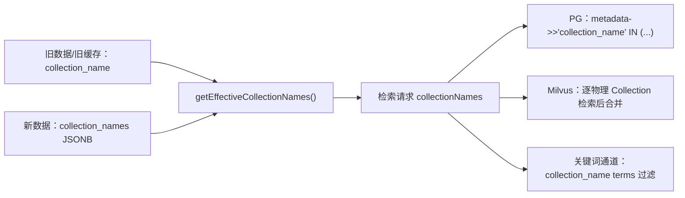
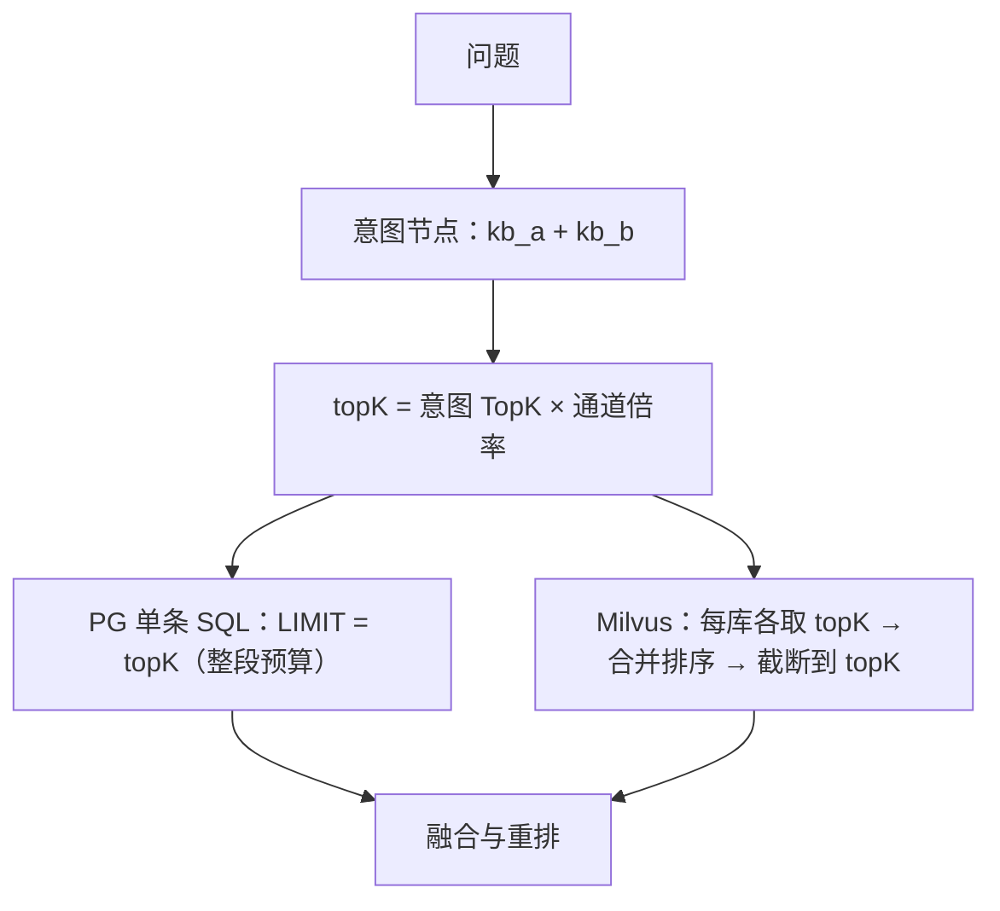

# UP-10 意图关联多个知识库 Collection

上游对照提交：

- `938ed100 feat(intent): 支持意图关联多个知识库 Collection`
- 后续归属推导相关：`cf2697c0`、`4ac59971`、`9d80d7a5`、`0f2120cc`（随 UP-07 的检索内核一并落地）

## 功能介绍

分叉点版本里，一个知识库意图只能绑定**一个** Collection（`IntentNode.collectionName` / `t_intent_node.collection_name`）。校园场景下这条约束很快就不成立：

- 「本科教学与学业制度」既要查教务处制度库，也要查学院教学细则库；
- 「奖助学金」同时涉及学生工作部政策库与财务处发放说明库；
- 同一份资料的正文与附件表格被拆进不同知识库时，意图需要同时命中它们。

本功能把意图与知识库的关系从「一对一」升级为「一对多」，同时保持**旧数据与旧缓存完全兼容**：

1. `IntentNode.collectionNames`（新，列表）+ `collectionName`（旧，单值）并存；
2. 新增 `getEffectiveCollectionNames()`：优先新字段，新字段为空时回退旧单值，并做去重与 trim；
3. 数据库新增 `collection_names JSONB` 列，旧行该列为 `NULL`，仍走旧字段读取；
4. 检索请求 `RetrieveRequest` 同样支持 `collectionNames`，把「一次检索的多个目标库」下推给检索实现：
   - PG（共享表 + `metadata->>'collection_name'`）：一条 SQL 用 `IN (...)` 过滤，`LIMIT` 是整段范围的总预算；
   - Milvus（每个知识库一个物理 Collection）：逐个物理库检索后按分数合并、截断到总预算；
5. 关键词通道（UP-06）与意图定向通道都改用 `getEffectiveCollectionNames()`，保证三路召回对「同一意图覆盖哪些库」的理解一致。

## 验收标准

1. **兼容性**：`collectionNames` 为空且 `collectionName=kb_a` 时，`getEffectiveCollectionNames()` 返回 `["kb_a"]`；两者都有值时只取新字段并去重。
2. **归一化**：列表中的空串、`null`、前后空白被清洗；`[" kb_a ", "kb_a", "kb_b"]` → `["kb_a","kb_b"]`（保持插入顺序）。
3. **意图定向检索**：意图绑定 `[kb_a, kb_b]` 时，一次检索请求覆盖两个库（PG 用 `IN`，Milvus 合并两个物理库结果并按分数取前 topK）。
4. **无库意图不检索**：意图既无新字段也无旧字段时返回空列表，检索器直接返回空结果，不发查询。
5. **数据库**：`t_intent_node` 存在 `collection_names JSONB` 列；升级脚本 `upgrades/v1.1.0/003_intent_multi_collections.sql` 幂等，`schema_pg.sql` 同步。
6. **后台可维护**：意图编辑页可多选知识库（或手工补充 Collection 名称），保存后回显一致。
7. **关键词通道一致**：`KeywordSearchChannel` 解析意图范围时同样使用多 Collection。
8. 可执行验证：

```bash
./mvnw test -pl bootstrap -am '-Dtest=IntentNodeTest,RetrieveRequestTest,IntentParallelRetrieverTest' -Dsurefire.failIfNoSpecifiedTests=false
cd frontend && npm run build
```

期望结果：单元测试全部通过，前端构建通过。

## 代码位置

| 作用 | 位置 |
| --- | --- |
| 意图节点的多 Collection 字段与回退逻辑 | `bootstrap/src/main/java/com/nageoffer/ai/ragent/rag/core/intent/IntentNode.java` |
| JSONB 列表类型处理器 | `bootstrap/src/main/java/com/nageoffer/ai/ragent/knowledge/dao/handler/StringListTypeHandler.java` |
| 实体字段 | `bootstrap/src/main/java/com/nageoffer/ai/ragent/rag/dao/entity/IntentNodeDO.java` |
| 检索请求多库参数 | `bootstrap/src/main/java/com/nageoffer/ai/ragent/rag/core/retrieve/RetrieveRequest.java` |
| 意图定向检索 | `bootstrap/src/main/java/com/nageoffer/ai/ragent/rag/core/retrieve/channel/strategy/IntentParallelRetriever.java` |
| PG 检索实现（`IN` 过滤） | `bootstrap/src/main/java/com/nageoffer/ai/ragent/rag/core/retrieve/PgRetrieverService.java` |
| Milvus 检索实现（逐库合并） | `bootstrap/src/main/java/com/nageoffer/ai/ragent/rag/core/retrieve/MilvusRetrieverService.java` |
| 关键词通道范围解析 | `bootstrap/src/main/java/com/nageoffer/ai/ragent/rag/core/retrieve/channel/KeywordSearchChannel.java` |
| 意图树读写与后台 API | `bootstrap/src/main/java/com/nageoffer/ai/ragent/ingestion/service/impl/IntentTreeServiceImpl.java`、`rag/controller/request/*`、`rag/controller/vo/IntentNodeTreeVO.java` |
| 数据库脚本 | `resources/database/upgrades/v1.1.0/003_intent_multi_collections.sql`、`resources/database/schema_pg.sql` |
| 前端编辑页 | `frontend/src/pages/admin/intent-tree/IntentEditPage.tsx`、`frontend/src/services/intentTreeService.ts` |
| 单元测试 | `bootstrap/src/test/java/com/nageoffer/ai/ragent/rag/core/intent/IntentNodeTest.java`、`rag/core/retrieve/RetrieveRequestTest.java`、`rag/core/retrieve/channel/strategy/IntentParallelRetrieverTest.java` |

## 相关图表

升级路径（新旧字段并存，读侧统一走 `getEffectiveCollectionNames`）：



一次意图检索在多库下的预算语义：



多库并不等于「召回量翻倍」：`topK` 始终是整段过滤范围的**总预算**，避免一个意图绑多库后把候选池撑爆、拖慢重排。
