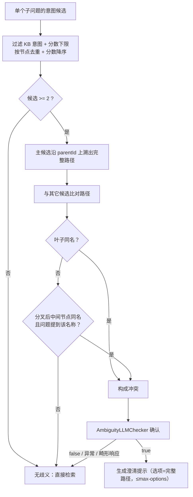
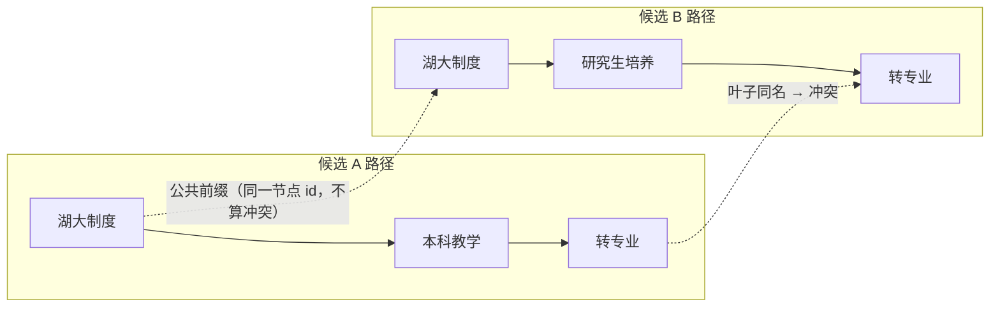

# UP-11 意图歧义澄清重构（候选路径重名 + LLM 确认）

上游对照提交：

| 提交 | 内容 |
| --- | --- |
| `5a8ee82c refactor(rag): 重构意图歧义澄清判定，改为候选路径重名识别 + LLM 确认` | 歧义判定从「分数比值」改为「候选路径重名分叉」，LLM 只做确认，失败一律放行 |
| `a2778fae feat(rag): 添加Agent模式下RAG歧义引导支持` | Agent 模式下的歧义引导（随批次八） |

## 功能介绍

歧义澄清的目标是：**当用户确实站在岔路口时**，先让他选一条路，再检索；判错方向的代价是打断一次正常提问。

分叉点（以及本仓库当前实现）用**分数比值**判定：`ratio = 第二名 / 第一名`，`ratio ≥ 0.8` 视为歧义，落在 `[0.65, 0.8)` 交给 LLM 二次确认。这条规则有两个结构性缺陷：

1. **比值接近只说明「多个候选都相关」**，不代表「用户没说清要哪个」。例如问「转专业和辅修的区别」，两个意图分数自然接近，但它是一句**明确的比较题**，不该弹澄清；
2. **依赖固定的树层级**：原实现沿 `DOMAIN` / `CATEGORY` 固定层级找「系统节点」并据此分组、还做了「系统别名」匹配。而意图树的层级与深度是**用户自行配置**的（本仓库的湖大意图树就与上游企业示例不同），层级假设一旦不成立，判定就会失灵或误判。

本功能把判定换成**基于真实路径的重名检测**，LLM 只做「是否真的需要用户二选一」的确认：

### 判定流程

1. 只处理**单个子问题**（多子问题意味着用户已经拆开了问题，不需要澄清）；
2. 过滤 KB 意图 + 分数下限（`RAGConstant.INTENT_MIN_SCORE`），按节点去重（同节点取高分）后分数降序；
3. 以最高分候选为**主候选**，沿 `parentId` 上溯出「根 → … → 候选」的完整节点路径（`visited` 集合兜住配置成环，父节点缺失时停在已取到的链路上）；
4. 与其它候选逐条比对路径，找出**分叉后的重名**：
   - **叶子同名** → 直接构成冲突；
   - **中间节点同名** → 还要求用户问题里出现过该名称（否则用户问的并不是这个岔路口）；
   - 比较前剥掉最长公共前缀——共享同一真实祖先不算歧义；
   - 名称长度 < 2 的节点不参与比较（避免单字名把无关路径判成冲突）；
5. 有冲突才交 `AmbiguityLLMChecker` 确认；确认通过才生成澄清提示（选项取完整路径，数量受 `max-options` 限制）。

### 失败语义改为「放行」

纯 RAG 是**只读**流程：澄清判错只是浪费一次交互，而**因为模型异常反复阻断用户**更糟。因此 `AmbiguityLLMChecker` 的三条异常路径统一降级为「跳过澄清」：

| 情况 | 原行为 | 现行为 |
| --- | --- | --- |
| 响应不是 JSON 对象 | `return true`（触发澄清） | `return false`（放行检索） |
| 响应缺 `ambiguous` 字段 | `return true` | `return false` |
| LLM 调用异常 | `return true` | `return false` |

澄清提示词也同步更新：明确「多目标表达（都/全部/两个/各自）」「比较/区别/共同点」都不算歧义，并提示模型**不要假设固定的领域/系统/主题层级**、拿不准时返回 false。

## 验收标准

1. **不再按比值判定**：两个候选分数接近但路径不重名时**不触发**澄清；反之路径重名但分数差距大时仍进入 LLM 确认。
2. **叶子重名成组**：两个候选的叶子名称相同且路径不同 → 构成冲突并交给 LLM。
3. **中间节点重名需问题命中**：分叉后中间节点同名，但用户问题未提到该名称 → 不算冲突；提到 → 算冲突。
4. **公共祖先不算冲突**：两候选共享同一真实祖先（按节点 id 判定）时，只比较分叉后的部分。
5. **不等深路径可用**：任意层级/深度的两条路径都能比较（不依赖 `DOMAIN` / `CATEGORY` 固定层级）。
6. **配置异常安全**：父链成环时不会死循环；父节点缺失时使用已取到的链路。
7. **降级放行**：LLM 响应畸形、缺字段或调用异常 → 跳过澄清，检索照常进行（不阻断只读流程）。
8. 可执行验证：

```bash
./mvnw test -pl bootstrap -am '-Dtest=IntentGuidanceServiceTest,AmbiguityLLMCheckerTest' -Dsurefire.failIfNoSpecifiedTests=false
```

期望结果：全部通过。

## 代码位置

| 作用 | 位置 |
| --- | --- |
| 歧义判定（路径重名） | `bootstrap/src/main/java/com/nageoffer/ai/ragent/rag/core/guidance/IntentGuidanceService.java` |
| LLM 确认与降级 | `bootstrap/src/main/java/com/nageoffer/ai/ragent/rag/core/guidance/AmbiguityLLMChecker.java` |
| 判定/澄清提示词 | `bootstrap/src/main/resources/prompt/guidance-ambiguity-check.st`、`guidance-prompt.st` |
| 配置（保留兼容字段） | `bootstrap/src/main/java/com/nageoffer/ai/ragent/rag/config/GuidanceProperties.java` |
| 消费点 | `bootstrap/src/main/java/com/nageoffer/ai/ragent/rag/service/pipeline/StreamChatPipeline.java`（`handleGuidance`） |
| 单元测试 | `bootstrap/src/test/java/com/nageoffer/ai/ragent/rag/core/guidance/**` |

配置项（`rag.guidance.*`）：

```yaml
rag:
  guidance:
    enabled: true
    max-options: 6         # 澄清提示最多列几个选项
    # 以下两项当前不参与判定，保留仅为兼容既有 yaml
    ambiguity-score-ratio: 0.8
    ambiguity-margin: 0.15
```

## 相关图表



路径比较示意（剥掉公共前缀后比名字）：



## 与上游的差异

- 上游该提交在 `rag` 模块，本仓库对应实现位于 `bootstrap`（模块未拆分，见批次八的计划）；语义与判定规则完全一致。
- `a2778fae` 的 Agent 模式歧义引导依赖 Agent 体系，随批次八落地。
