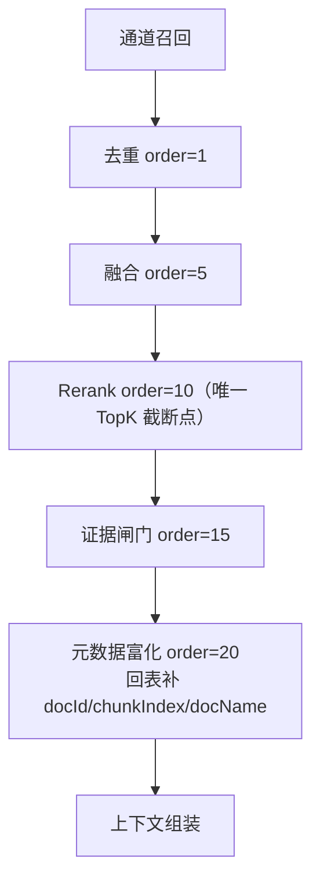
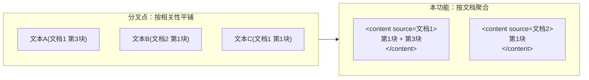

# UP-12 检索结果元数据富化与上下文组装

上游对照提交：

- `b656feb4 optimize(rag-core): 实现检索结果的文档元数据富化和上下文组装优化`
- `97c0246c refactor(context): 精简上下文拼接逻辑，移除重叠去重功能`
- `2a84c7a0 refactor(context): 优化上下文渲染及资料引用标识处理`（其中的**行内引用**部分依赖 UP-18 的回答来源，见 ?? 下文分工）

## 功能介绍

分叉点版本把命中分块**平铺**进提示词：`chunks.stream().map(getText).joining("\n")`。这带来三个问题：

1. **来源不可见**：模型看到的是一堆无标题的文本，无法说明「这条依据来自哪份文件」，也无法回答「依据是什么」；
2. **原文顺序被破坏**：同一份文档的多个分块按相关性分数交错排布，模型容易把不同章节的内容拼接成错误结论；
3. **重复内容灌入**：同一段落命中多次时，多个分块重复进入上下文，浪费 token。

本功能在检索末端补齐文档归属，并按文档重新组织上下文：

1. 新增 `MetadataEnrichmentPostProcessor`（order=20，链末）：对**已截断的最终 TopK** 结果批量回表，补齐 `docId` / `chunkIndex` / `docName`，只富化不重排；
2. `ChunkMetadataResolver` 做两次批量查询（分块表 + 文档表），行数小、开销可忽略；
3. `RetrievedChunk` 增加 `docId`、`chunkIndex`、`docName` 三个可选字段；
4. `DefaultContextFormatter` 改为**按文档聚合**渲染：
   - 文档之间按「该文档最佳命中块的排名」排序（`LinkedHashMap` 首次出现顺序）；
   - 文档内部按 `chunkIndex` 升序还原原文顺序；
   - 同一文档同一块去重（按 chunk id），不再重复灌入；
   - 文档标题作为内部锚点写入 `<content source="...">`；
   - `docId` 缺失的块各自单独成组，留在原位（不丢结果、不乱序）。

开关：`rag.context.enrich.enabled`（默认 `true`）。关闭后退回「按相关性平铺、不带来源」的旧行为。

## 验收标准

1. **只富化不重排**：`MetadataEnrichmentPostProcessor` 输出的顺序与输入完全一致。
2. **补齐字段**：命中块的 `docId` / `chunkIndex` / `docName` 被回填；回表未命中的块保持原值不报错。
3. **按文档聚合**：同一 `docId` 的多个分块在上下文里合成一个 `<content source="文档名">` 块，块内按 `chunkIndex` 升序；文档之间按首次命中顺序排列。
4. **去重**：同一 chunkId 重复出现时只渲染一次。
5. **标题清洗**：文档名剥掉扩展名，且去掉会破坏标签属性的 `"`、`<`、`>` 字符。
6. **无文档归属时不丢内容**：`docId` 为空的块各自成为独立 `<content>` 块，内容照旧进入上下文。
7. **开关语义**：`rag.context.enrich.enabled=false` 时后处理器不参与处理链，渲染退回平铺路径。
8. 可执行验证：

```bash
./mvnw test -pl bootstrap -am '-Dtest=DefaultContextFormatterTest,MetadataEnrichmentPostProcessorTest' -Dsurefire.failIfNoSpecifiedTests=false
```

期望结果：全部通过。

## 代码位置

| 作用 | 位置 |
| --- | --- |
| 分块元数据回表 | `bootstrap/src/main/java/com/nageoffer/ai/ragent/knowledge/service/impl/ChunkMetadataResolver.java` |
| 富化后处理器（order=20） | `bootstrap/src/main/java/com/nageoffer/ai/ragent/rag/core/retrieve/postprocessor/MetadataEnrichmentPostProcessor.java` |
| 命中结果新增字段 | `framework/src/main/java/com/nageoffer/ai/ragent/framework/convention/RetrievedChunk.java` |
| 按文档聚合渲染 | `bootstrap/src/main/java/com/nageoffer/ai/ragent/rag/core/prompt/DefaultContextFormatter.java` |
| 上下文模板段落 | `bootstrap/src/main/resources/prompt/context-format.st` |
| 开关 | `bootstrap/src/main/java/com/nageoffer/ai/ragent/rag/config/RAGConfigProperties.java`（`rag.context.enrich.enabled`）、`application.yaml` |
| 单元测试 | `bootstrap/src/test/java/com/nageoffer/ai/ragent/rag/core/prompt/DefaultContextFormatterTest.java`、`rag/core/retrieve/postprocessor/MetadataEnrichmentPostProcessorTest.java` |

> 说明：上游 `b656feb4` 曾包含「相邻块重叠去重」，随后在 `97c0246c` 中被删除（判定重叠需要额外扫描文本，收益不稳定）。本仓库直接采用删除后的最终形态：**不做重叠去重**，只做按文档聚合与排序。

## 相关图表

处理链位置（富化在最末端，只补字段）：



上下文组装（按文档聚合 vs 旧平铺）：



## 与 UP-18（回答来源）、行内引用的分工

上游把「元数据富化」与「行内引用角标」放在同一批提交里，但后者依赖**回答来源装配**（`SourceRef` + 消息 sources 落库 + SSE 下发），属于 UP-18 的能力。本仓库按依赖顺序落地：

| 阶段 | 内容 | 状态 |
| --- | --- | --- |
| UP-12（本文） | 回表富化 + 按文档聚合渲染 + 文档标题锚点 | 已落地 |
| UP-18 | 回答来源装配、消息 sources 落库与下发、前端来源面板 | 未开始 |
| UP-12b | 行内引用角标 `[N](#cite-N)`：上下文注入 `ref`、引用规则提示词、前端角标渲染、下一轮历史剔除 | 未开始（依赖 UP-18） |
