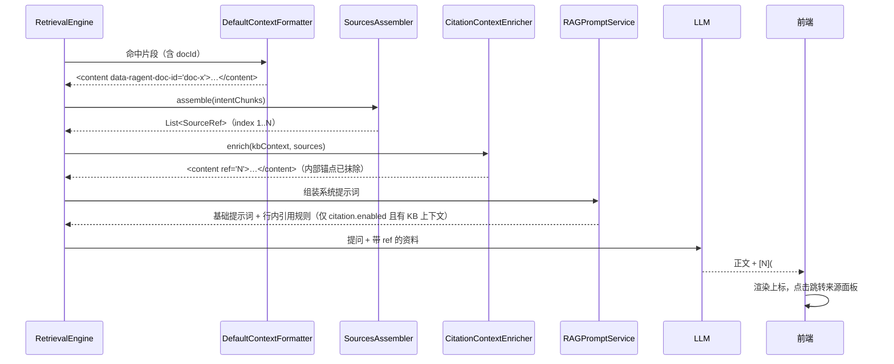
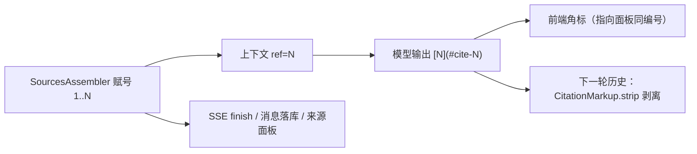

# UP-12b 回答行内引用角标

上游对照提交：`2a84c7a0 refactor(context): 优化上下文渲染及资料引用标识处理`（其中的行内引用部分）

依赖：UP-18a（来源装配与编号）、UP-12a（元数据富化与按文档聚合渲染）

## 功能介绍

有了文档级来源列表（UP-18a）之后，用户仍需要自己把「这句话」和「那份文件」对上。本功能让回答**正文自带出处**：

1. 上下文里的每份资料用**内部锚点** `<content data-ragent-doc-id="doc-x">` 标记，标题**不进入上下文**（标题一旦进入，模型就会写出「出自《XX》」这类归因表述，提示词禁令压不住）；
2. 来源装配完成后，`CitationContextEnricher` 按 `SourceRef.index` 把内部锚点替换成模型可见的 `ref="N"`，同时抹掉 `data-ragent-doc-id`，文档 ID 不泄漏给模型；
3. 系统提示词动态追加 `answer-citation-rules.st`，要求模型在**每个正文单元末尾**输出 `[N](#cite-N)`，与内容紧邻、不得汇总、不得虚构编号；
4. 前端把 `[N](#cite-N)`（以及模型偶发漏写链接的 `[N]` / `【N】`）渲染成上标角标，点击跳到对应来源；
5. 角标随回答持久化以保持位置稳定，但进入**下一轮模型历史前会被剥离**（`CitationMarkup.strip`），避免上一轮的局部编号污染本轮编号。

开关：`rag.citation.enabled`（默认 `true`）。关闭时：不注入编号、不追加引用规则，省下这部分系统提示词与上下文开销以降低首字延迟；文档级来源面板不受影响（它走 SSE 单独下发）。

## 验收标准

1. **编号一致**：上下文中的 `ref="N"` 与 SSE/落库/面板的 `SourceRef.index` 完全一致；单一编号源是 `SourcesAssembler`。
2. **内部锚点不泄漏**：无论开关是否开启，模型可见上下文里都不出现 `data-ragent-doc-id`。
3. **关闭引用时**：上下文只被抹掉内部锚点、不注入 `ref`；系统提示词不含引用规则。
4. **只在有资料时追加规则**：没有知识库上下文（纯 MCP / 纯系统回答）时不追加引用规则。
5. **历史剥离**：进入下一轮历史的助手消息中，`[N](#cite-N)` 已被剥离，正文其余内容不变。
6. **前端角标**：`[1](#cite-1)`、模型漏写链接的 `[1]`、`【1】`（仅当编号在本次来源列表内）渲染为可点击上标；点击后展开来源面板并滚动到对应条目；非引用方括号（如 `[待补充]`）保持原样。
7. 可执行验证：

```bash
./mvnw test -pl bootstrap -am '-Dtest=CitationMarkupTest,CitationContextEnricherTest,RAGPromptServiceTest' -Dsurefire.failIfNoSpecifiedTests=false
cd frontend && npm run test:chat-citations && npm run build
```

期望结果：全部通过。

## 代码位置

| 作用 | 位置 |
| --- | --- |
| 内部锚点渲染（不写标题） | `bootstrap/src/main/java/com/nageoffer/ai/ragent/rag/core/prompt/DefaultContextFormatter.java`、`bootstrap/src/main/resources/prompt/context-format.st` |
| 注入 `ref` / 抹掉内部 docId | `bootstrap/src/main/java/com/nageoffer/ai/ragent/rag/core/source/CitationContextEnricher.java` |
| 引用规则提示词 | `bootstrap/src/main/resources/prompt/answer-citation-rules.st`、`rag/core/prompt/RAGPromptService.java`、`rag/constant/RAGConstant.java` |
| 历史剥离 | `bootstrap/src/main/java/com/nageoffer/ai/ragent/rag/core/source/CitationMarkup.java`、`rag/core/memory/JdbcConversationMemoryStore.java` |
| 管道接线（来源装配 → 上下文注入） | `bootstrap/src/main/java/com/nageoffer/ai/ragent/rag/service/pipeline/StreamChatPipeline.java` |
| 开关 | `rag/config/RAGConfigProperties.java`（`rag.citation.enabled`）、`application.yaml` |
| 前端角标渲染 | `frontend/src/components/chat/MarkdownRenderer.tsx`、`frontend/src/lib/chatCitations.ts`、`frontend/src/components/chat/SourcesPanel.tsx` |
| 单元测试 | `bootstrap/src/test/java/com/nageoffer/ai/ragent/rag/core/source/CitationMarkupTest.java`、`CitationContextEnricherTest.java`、`rag/core/prompt/RAGPromptServiceTest.java`、`frontend/tests/chatCitations.test.mjs` |

## 相关图表



编号生命周期（唯一来源 → 多处复用 → 下一轮剥离）：


