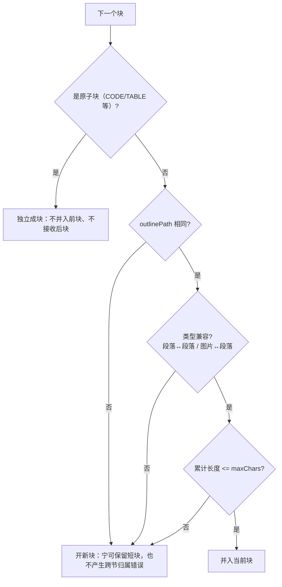
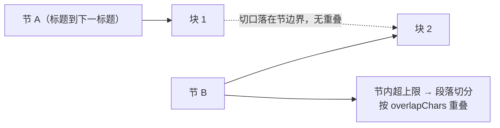

# UP-13 分块合并语义重构（块级打包 / 边界安全 / 图片合并）

上游对照提交：

| 提交 | 内容 | 本仓库落地 |
| --- | --- | --- |
| `da91ae9b feat(chunk): 实现块级贪心打包提升文本块合并效果` | 新增 `ChunkPacker`：以「相邻两个标题之间」为一节，按体量把节装配成块 | 已落地（合并语义，见下） |
| `0a4bcf05 refactor(chunk): 优化 chunk 合并逻辑支持无描述图片合并` | 无描述的图片也可以并进相邻文本块 | 已落地 |
| `f0f67237 refactor(chunk): 优化块合并逻辑以增强文本流和图片处理能力` | 合并时保留文本流、图片资产取并集 | 已落地（沿用本仓库聚合器） |
| `37f1ac65 optimize(chunk): 优化块重叠计算及相关配置说明` | 切口只落在节边界，块级不再人为制造重叠 | 已落地（不引入块级重叠） |
| `1bdfe66c refactor(chunk): 重构知识库文档分块策略，删除旧策略模式与 VectorChunk` | 删除旧策略模式与 `VectorChunk` | 有意不落地，见文末差异说明 |

## 功能介绍

分块决定「一个块里装什么」，直接影响检索能否召回、引用能否对应。分叉点版本（以及本仓库自研的 `StructuredChunkAggregator`）在合并短块时有两个缺陷：

1. **短尾合并跨越提纲边界**：为避免产生几十字的碎块，结尾或段落之间的短块会被并回上一块。但合并判据只看「类型是否兼容 + 是否超过上限」，不看**两块的提纲路径是否相同**，于是 A 节的段落被并进 B 节的块里——这个块的 `outlinePath` 只能标一个，内容却横跨两节，检索命中后引用归属与章节说明都是错的；
2. **原子块被卷入合并**：代码块、表格是「不可切分也不可混合」的原子内容，但短尾合并同样没排除它们。

另外，无描述的图片（解析器没产出图注）此前无法与相邻文本合并，只能单独成块，既召不回（文本量太少）又白占一个 TopK 名额。

本功能把合并判据收敛为三条：

| 规则 | 说明 |
| --- | --- |
| **捆包边界即提纲边界** | 合并（含短尾合并）要求两块 `outlinePath` 相同；不同节的内容不合并，宁可保留一个短块也不产生归属错误的块 |
| **原子块不参与合并** | 代码 / 表格等 `isBarrier` 块自己成块，既不并入前块，也不接收后块 |
| **图片可与文本合并（无论有无描述）** | 图片资产随块保留（`assets` 取并集），无描述图片也不单独成块 |

同时明确一条边界：**块级不做人为重叠**。重叠是为了防答案在切口处被切断，而我们的切口只落在提纲/节边界上，边界处没有被切断的句子；真正需要重叠的是「单节超上限后的节内切分」，那一层由段落切分（`ParagraphChunker` + `overlapChars`）负责。

## 验收标准

1. **同提纲短块可合并**：同一 `outlinePath` 下两个段落且总长不超 `maxChars` 时合并成一块，`sourceBlockIds` 按顺序累加。
2. **不跨提纲合并**：不同 `outlinePath` 的两块即使都低于 `minChars` 也不合并（`[A:p1] [B:p2] [B:code] [B:p3]` → 4 块）。
3. **原子块独立**：代码 / 表格块自己成块，不与相邻文本块合并，也不因体量小被并回上一块。
4. **无描述图片合并**：图片块无 `embeddingText` 时，仍可与同提纲段落合并，合并后 `assets` 保留、`blockType` 归一为 `PARAGRAPH`。
5. **资产与来源不丢**：任何合并路径下 `assets`、`sourceBlockIds`、`sectionContext` 都取并集/非空值，不因合并丢失。
6. 可执行验证：

```bash
./mvnw test -pl bootstrap -am -Dtest=StructuredChunkAggregatorTest -Dsurefire.failIfNoSpecifiedTests=false
```

期望结果：全部通过（含原有的「不跨提纲/原子边界」用例）。

## 代码位置

| 作用 | 位置 |
| --- | --- |
| 合并判据与短尾合并 | `bootstrap/src/main/java/com/nageoffer/ai/ragent/core/chunk/blockaware/StructuredChunkAggregator.java` |
| 分块配置（min/target/max/overlap） | `bootstrap/src/main/java/com/nageoffer/ai/ragent/core/chunk/blockaware/BlockChunkConfig.java` |
| 块级切分入口 | `.../blockaware/BlockAwareChunkerDispatcher.java`、`.../chunk/StructuredChunkingService.java` |
| 段落重叠 | `.../blockaware/ParagraphChunker.java`、`.../chunk/TextBoundaryOptions.java` |
| 单元测试 | `bootstrap/src/test/java/com/nageoffer/ai/ragent/core/chunk/blockaware/StructuredChunkAggregatorTest.java`、`core/chunk/StructuredChunkingServiceTest.java` |
| 不变量规则 | `docs/rules/chunking-invariants.md` |

## 相关图表

合并判据（任一不满足即开新块）：



块级不重叠、节内才重叠：



## 与上游的差异说明

**1. 保留本仓库的聚合器与配置模型（不落地 `1bdfe66c`）**

上游 `1bdfe66c` 用 `ChunkDraft` / `ChunkBudget` / `ChunkPacker` 取代了旧的策略模式与 `VectorChunk`，同时删除 `ChunkingStrategy` / `FixedSizeTextChunker` / `StructureAwareTextChunker`。本仓库的 `VectorChunk` 承载了多模态字段（`assets` / `blockType` / `outlinePath` / `sectionContext` / `sourceBlockIds`），并已贯通入库、向量库与检索；后台「分块策略」下拉、`chunk_config` 落库与既有测试都基于这套模型。直接替换会牵动入库链路、管理端契约与历史数据，收益（更干净的内部模型）却与本次目标（合并语义正确）无关，因此**保留模型，只移植语义**。

**2. 断点判据保留 min/target/max 三档**

上游 `ChunkPacker` 的断点只由 `maxChars`（与容忍上限）决定，`minChars` 只作下限、`target` 概念被移除，理由是「让攒够 minChars 就断兼任断点判据，等于把下限变成事实上的目标」。本仓库对外暴露的正是 `min/target/max` 三档（管理端可配、`ChunkingOptionsValidationTest` 有校验），因此保留「尽量贴近 target」的装填策略，只修正边界安全与图片合并两处语义。

**3. 跨节小节的处置不同**

上游把多个小节装进同一个块、`outlinePath` 取公共前缀（因此允许小节的尾巴跨节合并）。本仓库的块只带一条 `outlinePath`，跨节合并会让归属与引用出错，所以选择「不跨提纲合并，允许保留短块」——这与本仓库既有验收用例 `doesNotCrossOutlineOrAtomicBoundaries` 的契约一致。
