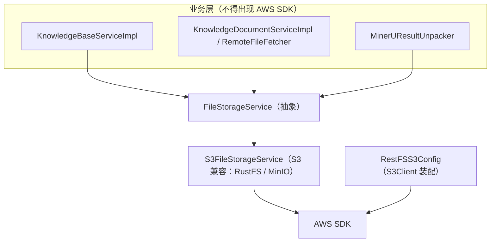
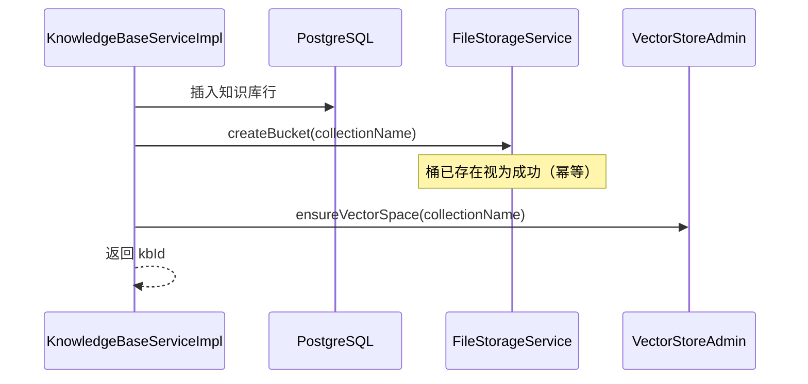

# UP-14 文件存储抽象：业务层不再直接依赖 S3 SDK

上游对照提交：`7cbb02c4 refactor(storage): 移除 S3 存储相关旧代码，新增抽象文件存储服务接口`

## 功能介绍

本仓库在分叉点之后已经把对象存储收敛到 `FileStorageService` 接口（当前实现 `S3FileStorageService`，兼容 RustFS / MinIO 等 S3 协议存储），但**业务层仍有直接依赖 S3 SDK 的残留**：

`KnowledgeBaseServiceImpl` 注入 `S3Client` 并自行 `createBucket`，于是业务代码里出现了 AWS SDK 类型（`S3Client`、`BucketAlreadyOwnedByYouException`、`BucketAlreadyExistsException`）。这带来三个具体问题：

1. **换存储要改业务代码**：要接 OSS / 其他非 S3 的对象存储时，除了写一个新的 `FileStorageService` 实现，还得回来改知识库服务；
2. **语义不一致**：存储层 `S3FileStorageService.createBucket` 已经把「桶已存在视为成功」这类幂等语义处理好了，业务层又用 SDK 异常自己判断一次，两处行为容易漂移（例如重复创建同名知识库时的报错文案）；
3. **难以单测**：「创建知识库」这条路径必须 mock AWS SDK 的 builder 链，测试脆弱且看不出真实契约。

本功能把知识库创建路径统一到存储抽象上：**只有 `S3FileStorageService` 允许出现 AWS SDK 类型**，业务层只调用 `FileStorageService`。

## 验收标准

1. **依赖边界**：`bootstrap` 业务代码（`knowledge/**`、`rag/service/**`、`rag/core/**`）中不再出现 `software.amazon.awssdk.services.s3.*` 的导入与使用；AWS SDK 类型只允许出现在 `rag/config/RestFSS3Config`（客户端装配）与 `rag/service/impl/S3FileStorageService`（实现）中。
2. **创建知识库走抽象**：`KnowledgeBaseServiceImpl.create` 通过 `FileStorageService.createBucket(collectionName)` 建桶，异常语义由存储实现负责（幂等：桶已存在视为成功）。
3. **可单测**：创建知识库的用例只需 mock `FileStorageService` 即可断言「按 collectionName 建桶」，不再需要 AWS SDK。
4. **行为等价**：创建知识库成功时依旧：写库 → 建桶 → 确保向量空间；建桶失败时抛业务异常并回滚（`@Transactional`）。
5. 可执行验证：

```bash
./mvnw test -pl bootstrap -am -Dtest=KnowledgeBaseServiceImplTest -Dsurefire.failIfNoSpecifiedTests=false
```

期望结果：全部通过。

## 代码位置

| 作用 | 位置 |
| --- | --- |
| 存储抽象接口 | `bootstrap/src/main/java/com/nageoffer/ai/ragent/rag/service/FileStorageService.java` |
| S3 兼容实现（唯一允许出现 AWS SDK 的实现） | `bootstrap/src/main/java/com/nageoffer/ai/ragent/rag/service/impl/S3FileStorageService.java` |
| S3 客户端装配（唯一允许出现 AWS SDK 的配置） | `bootstrap/src/main/java/com/nageoffer/ai/ragent/rag/config/RestFSS3Config.java` |
| 业务层改为依赖抽象 | `bootstrap/src/main/java/com/nageoffer/ai/ragent/knowledge/service/impl/KnowledgeBaseServiceImpl.java` |
| 单元测试 | `bootstrap/src/test/java/com/nageoffer/ai/ragent/knowledge/service/impl/KnowledgeBaseServiceImplTest.java` |

`FileStorageService` 已覆盖的能力（业务层可用的全部存储操作）：

| 能力 | 方法 |
| --- | --- |
| 上传（流 / 字节 / 分片可靠上传） | `upload(...)`、`reliableUpload(...)` |
| 读取 | `openStream(url)` |
| 删除对象 | `deleteByUrl(url)` |
| 桶生命周期 | `createBucket(bucket)`、`bucketExists(bucket)`、`deleteBucket(bucket)`、`setBucketPublicReadOnly(bucket)` |
| 对外可访问 URL | `getPublicUrl(url)` |

## 相关图表

依赖方向（业务层只认抽象，SDK 只在实现与装配处）：



创建知识库的存储操作（幂等语义由实现负责）：



后续接入非 S3 存储（如阿里云 OSS）时，只需新增一个 `FileStorageService` 实现并按 `storage.type` 条件装配，业务层零改动。
