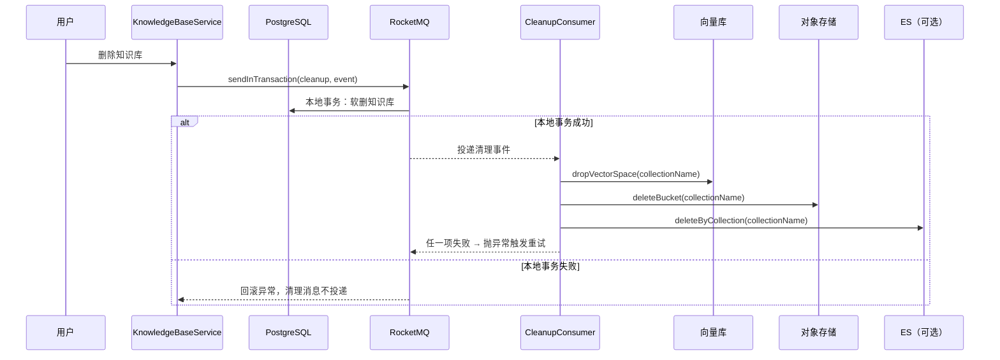
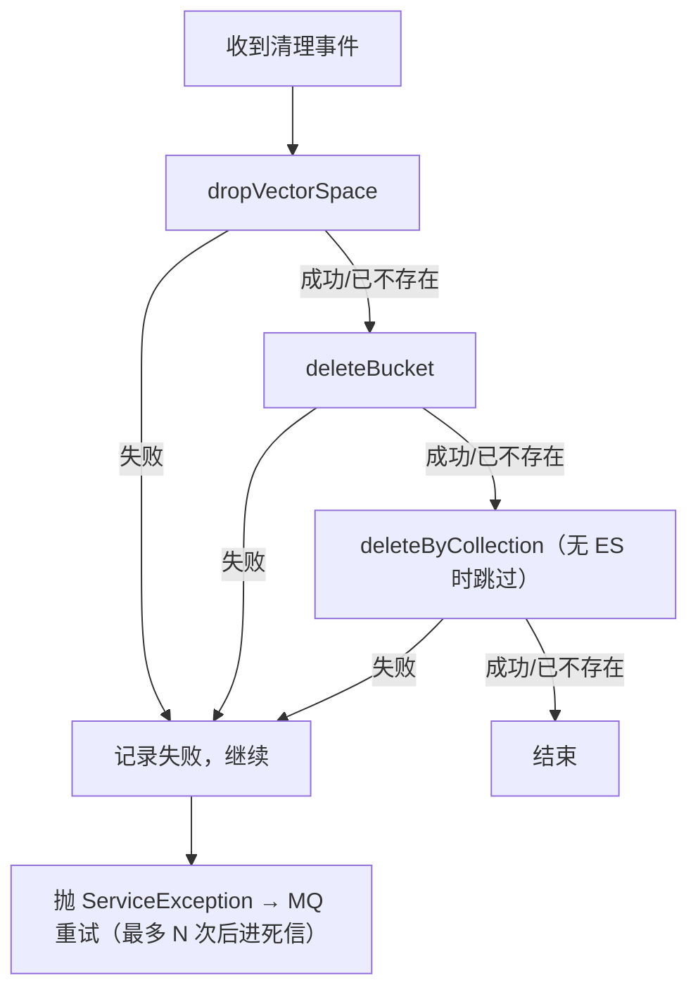

# UP-15 知识库删除的底层资源异步清理

上游对照提交：`950637ec feat(knowledge): 实现知识库删除时底层资源异步清理机制`

## 功能介绍

删除知识库是一次**跨存储的删除**：除了数据库里的知识库行，还要回收三类底层资源：

| 资源 | 位置 | 不清理的后果 |
| --- | --- | --- |
| 向量空间 | Milvus collection（每库一个物理 collection）或 PG 共享表中的该 collection 行 | 残留向量仍可能被全局检索召回，用户「删了库却还能问到」 |
| 对象存储 bucket | S3 兼容存储中该库独占的 bucket | 文件永久占用存储且可被直链访问 |
| 关键词索引 | ES 共享索引中 `collection_name = 该库` 的文档 | 关键词通道继续召回已删库内容 |

分叉点版本只做**数据库软删**：`t_knowledge_base.deleted=1`，底层资源原样保留。而且删除动作是同步的——如果删 bucket / 删 collection 这类跨网络操作写在请求线程里，一旦对象存储或向量库抖动，用户看到的是「删除失败」，重试又会因为库已被软删而报「知识库不存在」。

本功能把删除拆成「**事务内软删 + 事务后异步清理**」两段：

1. `KnowledgeBaseServiceImpl.delete` 改为发送**事务消息**：本地事务只做知识库软删（`deleteById`），事务提交后由消费者执行清理；
2. `KnowledgeBaseCleanupConsumer` 消费清理事件，逐项 best-effort 执行：向量空间销毁、bucket 删除、关键词索引按库删除；任一项失败则抛异常**触发 MQ 重试**（三项操作都幂等，重试安全）；
3. `KnowledgeBaseCleanupTransactionChecker` 提供事务回查：Broker 回查时按 `kbId` 查库，**查不到即视为本地事务（软删）已提交**，消息可以投递；
4. 清理用事件只携带 `kbId` / `collectionName` / `operator`，不携带任何文档内容。

这样「用户点删除」只依赖数据库事务，返回快且语义确定；跨存储清理的失败由 MQ 重试兜底，不影响用户操作结果。

## 验收标准

1. **软删与清理解耦**：`delete()` 不再持有跨越网络调用的长事务；知识库行在本地事务内软删，清理由消息驱动。
2. **幂等**：同一事件重复消费不报错（Milvus collection 不存在跳过、bucket 不存在视为成功、ES 索引不存在跳过）。
3. **逐项独立**：某一项失败不影响其它项执行；只要存在失败项就抛异常触发重试（不能静默吞掉，否则资源永久残留）。
4. **关键词索引可选**：未启用 ES（`rag.keyword.type=none`）时，清理流程不因缺少关键词索引实现而失败。
5. **回查语义**：事务回查时知识库已不可见 → 返回「已提交」；仍可见 → 返回「未提交」（消息不投递）。
6. **事件最小化**：清理事件只含 `kbId`、`collectionName`、`operator`，不含文档正文或文件内容。
7. 可执行验证：

```bash
./mvnw test -pl bootstrap -am '-Dtest=KnowledgeBaseCleanupConsumerTest,KnowledgeBaseCleanupTransactionCheckerTest' -Dsurefire.failIfNoSpecifiedTests=false
```

期望结果：全部通过。

## 代码位置

| 作用 | 位置 |
| --- | --- |
| 删除入口（事务内软删 + 发事务消息） | `bootstrap/src/main/java/com/nageoffer/ai/ragent/knowledge/service/impl/KnowledgeBaseServiceImpl.java` |
| 清理事件 | `bootstrap/src/main/java/com/nageoffer/ai/ragent/knowledge/mq/event/KnowledgeBaseCleanupEvent.java` |
| 清理消费者（best-effort + 重试） | `bootstrap/src/main/java/com/nageoffer/ai/ragent/knowledge/mq/KnowledgeBaseCleanupConsumer.java` |
| 事务回查 | `bootstrap/src/main/java/com/nageoffer/ai/ragent/knowledge/mq/KnowledgeBaseCleanupTransactionChecker.java` |
| 向量空间销毁 | `rag/core/vector/VectorStoreAdmin.java`、`PgVectorStoreAdmin.java`、`MilvusVectorStoreAdmin.java` |
| bucket 删除 | `rag/service/FileStorageService.java`、`rag/service/impl/S3FileStorageService.java` |
| 关键词索引清理 | `rag/core/vector/keyword/KeywordIndexService.java`（`deleteByCollection`，仅 `rag.keyword.type=es` 时存在） |
| 单元测试 | `bootstrap/src/test/java/com/nageoffer/ai/ragent/knowledge/mq/**` |

## 相关图表



清理项的失败语义（幂等 + 逐项独立 + 有失败必重试）：



## 相关规则

- 清理只允许在**知识库软删事务提交后**执行；禁止把跨存储删除放进用户请求事务内。
- 清理项顺序固定为「向量空间 → bucket → 关键词索引」，且每项都必须幂等；新增清理项时必须同时声明失败语义（是否触发重试）。
- 清理事件不得携带知识库内容（正文、文件名、URL 等），只允许标识与操作人。
