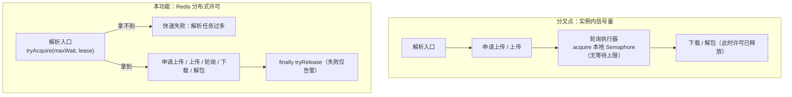
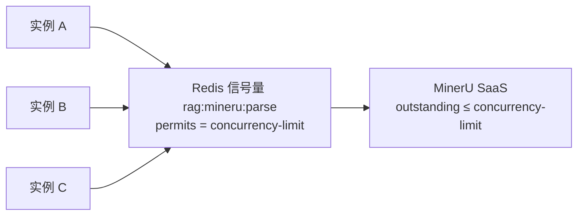

# UP-16 MinerU 解析并发改由分布式信号量控制

上游对照提交：`50afe910 refactor(mineru): 重构分布式信号量控制MinerU解析并发`

## 功能介绍

MinerU 是外部 SaaS 解析服务，官方对**同时进行中（outstanding）的任务数**有限制。分叉点版本用 JVM 内的 `java.util.concurrent.Semaphore` 限制并发，在多实例部署下失效：

| 问题 | 表现 |
| --- | --- |
| **限流是单实例的** | 每个实例各自持有一份信号量，N 个实例的实际并发是 `N × concurrencyLimit`，多副本部署时直接打爆 SaaS 配额 |
| **许可与解析生命周期错位** | 许可在轮询执行器里获取/释放，而「申请上传 → 上传 → 轮询 → 下载解包」是一次完整解析；轮询还没开始就已经占坑、解包阶段已经释放许可，配额窗口与实际占用不一致 |
| **业务线程被无界阻塞** | `acquireUninterruptibly()` 把解析线程压住且不设等待上限，任务堆积时线程池被占满，用户侧只看到请求悬挂 |

本功能把限流上移到**解析入口**，并换成 Redisson 的 `RPermitExpirableSemaphore`（跨实例共享、许可自带租约）：

1. `MinerUDocumentParser` 启动时（`@PostConstruct`）设置信号量许可数为 `mineru.concurrency-limit`；
2. 每次解析先 `tryAcquire(maxWaitSeconds, leaseSeconds)`：拿到许可才继续，拿不到直接抛业务异常（`MinerU 解析任务过多，请稍后重试`），不再无界阻塞；
3. 许可覆盖**整个解析链路**（申请上传 → 上传 → 轮询 → 下载 → 解包），`finally` 中 `tryRelease`；释放失败只告警——说明许可已按租约自动过期，属于异常路径的兜底；
4. `leaseSeconds` 必须大于解析超时（默认 900s vs 超时 600s 级），保证进程崩溃时许可最终会被自动回收，不会永久占坑；
5. `MinerUPollingExecutor` 删除本地 `Semaphore`，只保留「轮询调度 + 取消调度」职责，命名与注释同步说明「全局并发由解析入口的分布式信号量控制」。

## 验收标准

1. **跨实例共享限流**：许可存在 Redis（`mineru.semaphore-name`，默认 `rag:mineru:parse`），多实例共用同一配额；启动时按 `concurrency-limit` 设置许可数。
2. **拿不到许可快速失败**：等待超过 `max-wait-seconds` 时抛 `ServiceException`，消息包含「解析任务过多」，不无限等待。
3. **许可覆盖全链路**：许可在解析开始前获取、在 `finally` 中释放；解析中途抛异常时同样释放。
4. **释放被中断的语义**：等待许可时线程被中断 → 恢复中断位并抛 `ServiceException`，不静默继续。
5. **租约兜底**：`lease-seconds` 大于解析超时；`tryRelease` 返回 false（许可已过期）时只打 warn，不抛异常。
6. **轮询执行器不再限流**：`MinerUPollingExecutor` 中不存在本地 `Semaphore`，其并发行为完全由上游分布式信号量决定。
7. 可执行验证：

```bash
./mvnw test -pl bootstrap -am -Dtest=MinerUDocumentParserTest -Dsurefire.failIfNoSpecifiedTests=false
```

期望结果：全部通过。

## 代码位置

| 作用 | 位置 |
| --- | --- |
| 许可获取/释放与解析入口拆分 | `bootstrap/src/main/java/com/nageoffer/ai/ragent/core/parser/mineru/MinerUDocumentParser.java`（`parseStructured` / `doParseStructured` / `initSemaphore`） |
| 限流配置项 | `bootstrap/src/main/java/com/nageoffer/ai/ragent/core/parser/mineru/MinerUProperties.java`（`semaphoreName` / `maxWaitSeconds` / `leaseSeconds`） |
| 轮询执行器（去掉本地信号量） | `bootstrap/src/main/java/com/nageoffer/ai/ragent/core/parser/mineru/MinerUPollingExecutor.java` |
| 配置 | `bootstrap/src/main/resources/application.yaml`（`mineru.semaphore-name` / `max-wait-seconds` / `lease-seconds`） |
| 单元测试 | `bootstrap/src/test/java/com/nageoffer/ai/ragent/core/parser/mineru/MinerUDocumentParserTest.java` |

配置示例：

```yaml
mineru:
  concurrency-limit: 5        # 跨实例的 outstanding 上限（写入 Redis 信号量许可数）
  semaphore-name: rag:mineru:parse
  max-wait-seconds: 30        # 等待许可上限，超时快速失败
  lease-seconds: 900          # 许可租约，必须大于解析超时；进程崩溃后自动回收
  timeout-seconds: 600        # 单次解析超时
```

## 相关图表

限流位置前移（从「轮询阶段」移到「解析入口」，并跨实例共享）：



多实例下的配额视图：



## 相关规则

- MinerU 并发上限**只能**由 `mineru.concurrency-limit` 经 Redis 许可控制；禁止在业务代码里再加实例内信号量或线程池隔离来做「限流」。
- 许可必须在解析入口获取、覆盖整条解析链路，并在 `finally` 释放；`lease-seconds` 必须大于解析超时。
- 获取许可失败必须快速失败并返回可重试的业务错误，禁止无界等待。
