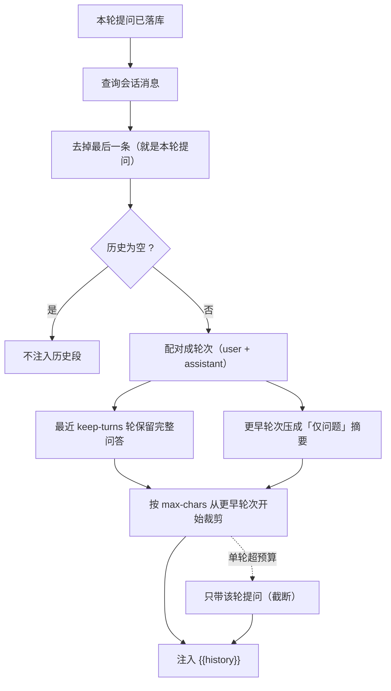

# UP-17（Agent 侧）多轮上下文装配与压缩

上游对照范围：`807d422a` / `ed059271` / `33399fc2`（会话摘要与上下文裁剪）中的 **Agent 侧上下文**
部分；RAG 侧的摘要刷新边界已在 [`up-17-memory-compaction.md`](up-17-memory-compaction.md) 落地。

## 功能介绍

Agent 上线时只带「当前问题 + 本轮工具观察」，于是出现两个问题：

1. **记不住上一轮**：用户问「转专业需要什么材料」→ 得到回答 → 接着问「那奖学金呢」，模型不知道「那」指什么，
   也不知道前一轮答过什么，容易重复回答或答偏；
2. **不敢带全量历史**：Agent 的历史消息里含工具观察结果（一次检索可能上千字），全量塞进提示词会迅速撑爆上下文，
   成本与时延都不可接受。

本功能按「**近期完整 + 远期摘要 + 总预算**」装配历史：

| 规则 | 说明 |
| --- | --- |
| 近期完整 | 最近 `ai.agent.history.keep-turns` 轮（默认 4）保留完整问答 |
| 远期摘要 | 更早的轮次压成「仅保留问题」的一行摘要，让模型知道「问过什么」，但不带长回答 |
| 总量预算 | 整个历史块受 `max-chars`（默认 2000）约束；超预算时**从更早的轮次开始丢**，保证留下的是近期上下文 |
| 单轮兜底 | 单轮就超预算时，至少带上这一轮的**提问**（截断），避免模型完全失忆 |
| 未答提问 | 最后一轮只有提问（还没答完）时也带上，标注「（尚未回答）」 |

装配逻辑在 `AgentHistoryAssembler`，是**纯函数**（输入消息列表、输出文本块），因此可单测、可复现；
压缩不额外调用模型——确定性规则先满足需求，将来要「模型级摘要」时替换实现即可，调用方不变。

装配时**排除本轮提问**：本轮用户消息在调模型前已经落库，若不排除，模型会把当前问题当成历史的一部分。

## 验收标准

1. **空历史**：没有历史、只有落单的 assistant 消息时返回空串，调用方据此不注入历史段（提示词写「本次是新会话的第一轮」）。
2. **轮次配对**：`user` 开一轮，紧随的 `assistant` 挂到该轮；未回答的提问也保留并标注「（尚未回答）」。
3. **超轮次压缩**：轮次数超过 `keep-turns` 时，更早轮次只保留问题（带「更早的对话（仅保留问题）」标题），不带回答。
4. **超预算裁剪**：总长度超过 `max-chars` 时优先保留最近的轮次，更早的整轮被丢弃。
5. **单轮兜底**：单个轮次本身超预算时，历史块仍包含该轮的提问（截断后），长度受预算约束。
6. **开关**：`ai.agent.history.enabled=false` 时装配返回空（每轮失忆，仅适合单轮工具调用场景）。
7. **失败降级**：装配或查询历史抛异常时按「无历史」处理并记 WARN，不影响本轮回答。
8. 可执行验证：

```bash
./mvnw test -pl bootstrap -am '-Dtest=AgentHistoryAssemblerTest' -Dsurefire.failIfNoSpecifiedTests=false
```

期望结果：全部通过。

## 代码位置

| 作用 | 位置 |
| --- | --- |
| 装配与压缩（纯逻辑） | `bootstrap/src/main/java/com/nageoffer/ai/ragent/agent/service/AgentHistoryAssembler.java` |
| 请求字段 | `agent/dto/AgentRequest.java`（`history`） |
| 提示词段 | `bootstrap/src/main/resources/prompt/agent-react.st`（`{{history}}`）与 `ReActAgentEngine` 的渲染 |
| 接入点 | `agent/service/impl/AgentChatServiceImpl.java`（`resolveHistory`：查消息 → 去掉本轮提问 → 装配） |
| 配置 | `ai.agent.history.{enabled,keep-turns,max-chars}` |
| 单元测试 | `bootstrap/src/test/java/.../agent/service/AgentHistoryAssemblerTest.java` |

## 相关图表



历史装配的三层约束：

| 层 | 参数 | 作用 |
| --- | --- | --- |
| 完整轮次 | `keep-turns` | 保证近期上下文细节完整（含助手回答） |
| 远期摘要 | 同上触发 | 只保留问题，避免长回答占用预算 |
| 总量预算 | `max-chars` | 兜住极端情况（长问题 + 多轮），优先保近期 |

## 与上游的差异

- **压缩不调模型**：上游的上下文压缩会调用模型生成摘要（`AgentContextCompactor` + 压缩表）。本仓库先用确定性规则
  （丢整轮 + 仅问题摘要），理由是「Agent 当前只带历史问答、不带工具观察」，量级与收益都比上游场景小；
  真要模型级摘要时替换 `AgentHistoryAssembler` 的实现即可。
- **不建压缩表**：没有压缩产物需要落库，因此不引入 `t_agent_context_compaction`；等引入模型摘要后再补。
- **不做 token 级精确预算**：用字符预算近似（中文 1 字 ≈ 1~2 token），实现简单且可测；需要精确控制时再接 tokenizer。
