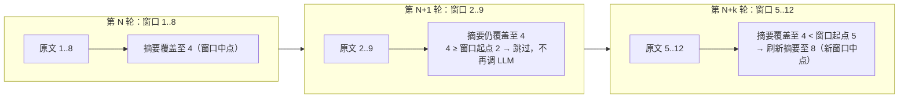
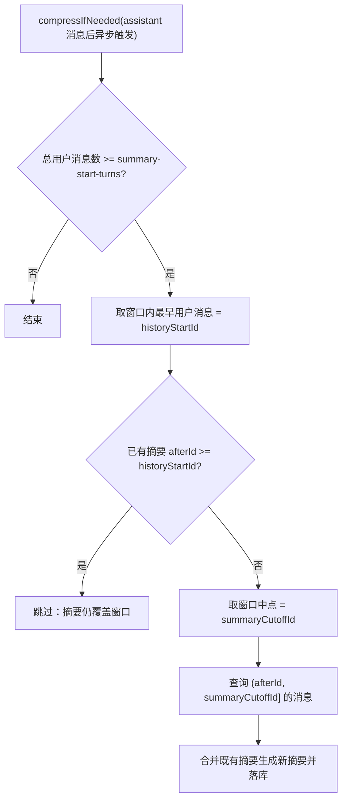

# UP-17 会话摘要刷新边界与上下文裁剪

上游对照提交：

| 提交 | 内容 | 本仓库落地 |
| --- | --- | --- |
| `807d422a fix(memory): 避免摘要窗口每轮滑动都调用 LLM (#56)` | 拆分「摘要覆盖判断边界」与「摘要截止边界」 | 已落地（本文） |
| `33399fc2 feat(memory): 实现Agent会话上下文裁剪机制优化内存使用` | Agent 会话上下文裁剪 | 依赖 Agent 体系（UP-36） |
| `ed059271 refactor(memory): 优化会话上下文裁剪与压缩逻辑` | 裁剪与压缩逻辑重构 | 依赖 Agent 体系（UP-36） |

## 功能介绍

多轮对话的上下文由两块组成：**原文窗口**（最近 N 轮原文）与**滚动摘要**（更早内容的压缩）。分叉点版本在「要不要重新生成摘要」上用了同一个边界：

1. 取原文窗口里**最早**一条用户消息的 id 作为 `cutoffId`；
2. 若已有摘要的覆盖终点 `afterId` 已经不小于 `cutoffId`，就跳过；否则从 `afterId` 摘要到 `cutoffId`。

于是只要窗口右移一轮，`cutoffId` 就变新一次，判定必然「未覆盖」→ **每轮对话都额外调用一次 LLM 生成摘要**，既费钱又拖慢首字延迟；而摘要真正新增的信息其实只有一轮。

修复方式是把两个边界拆开：

| 边界 | 取值 | 用途 |
| --- | --- | --- |
| 原文窗口起点 `historyStartId` | 窗口内最早一条用户消息 | 判断已有摘要是否仍覆盖窗口（`afterId >= historyStartId` 即跳过） |
| 摘要截止边界 `summaryCutoffId` | 窗口**中部**的那条用户消息，`latestUserTurns.get((size-1)/2)` | 摘要只压缩到窗口中点 |

效果：摘要与原文窗口保持约**一半重叠**。重叠部分还在窗口内时判定为「已覆盖」，不再调用 LLM；只有重叠部分滑出窗口（`afterId < historyStartId`）时才刷新摘要一次，同时因为只压到中点，刷新时仍有大量原文可用，不会出现「摘要没覆盖、原文也滑走了」的历史空洞。

## 验收标准

1. **首次摘要**：达到 `rag.memory.summary-start-turns` 且无历史摘要时生成一次摘要，调用 LLM 一次，落库摘要的 `last_message_id` 为被压缩批次的最后一条消息。
2. **覆盖期跳过**：已有摘要的 `afterId` 不小于窗口起点时，**不调用 LLM、不落库**，也不查询待摘要消息。
3. **边界滑出后刷新**：已有摘要的 `afterId` 小于窗口起点时，重新生成一次摘要，且摘要区间为 `(afterId, 窗口中点]`。
4. **未达轮数不摘要**：用户消息数小于 `summary-start-turns` 时不做任何摘要动作。
5. **静默失败**：摘要过程异常只记日志，不影响当轮回答（异步执行 + 异常兜底）。
6. 可执行验证：

```bash
./mvnw test -pl bootstrap -am -Dtest=JdbcConversationMemorySummaryServiceTest -Dsurefire.failIfNoSpecifiedTests=false
```

期望结果：4 项用例全部通过（首次摘要 / 覆盖期跳过 / 滑出后刷新 / 未达轮数）。

## 代码位置

| 作用 | 位置 |
| --- | --- |
| 摘要刷新判定与两个边界 | `bootstrap/src/main/java/com/nageoffer/ai/ragent/rag/core/memory/JdbcConversationMemorySummaryService.java`（`resolveHistoryStartId` / `resolveSummaryCutoffId`） |
| 会话历史加载（含行内引用剥离） | `bootstrap/src/main/java/com/nageoffer/ai/ragent/rag/core/memory/JdbcConversationMemoryStore.java` |
| 配置项 | `bootstrap/src/main/java/com/nageoffer/ai/ragent/rag/config/MemoryProperties.java`（`rag.memory.*`）、`application.yaml` |
| 单元测试 | `bootstrap/src/test/java/com/nageoffer/ai/ragent/rag/core/memory/JdbcConversationMemorySummaryServiceTest.java` |

关键配置：

```yaml
rag:
  memory:
    history-keep-turns: 8      # 原文窗口保留轮数
    summary-enabled: true
    summary-start-turns: 9     # 超过该轮数才开始滚动摘要
    summary-max-chars: 400
```

## 相关图表

窗口滑动与摘要刷新（重叠一半 → 减少 LLM 调用，同时不留空洞）：



判定流程：



## 后续（Agent 侧裁剪）

上游 `33399fc2` / `ed059271` 的「会话上下文裁剪与压缩」是 **Agent 模式**下对工具调用轨迹的裁剪（工具结果降采样、超长历史压缩），依赖 Agent 执行架构（UP-32~36）。本仓库在 Agent 体系落地时一并实现，届时在本文档补充对应章节与验收标准。
