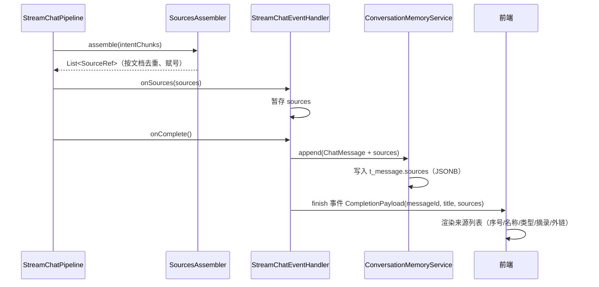
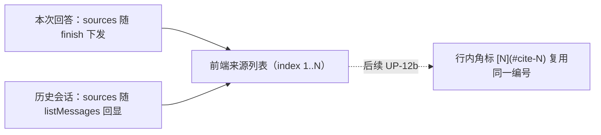

# UP-18 回答来源（文档级来源列表与来源面板）

上游对照提交：`ab31f8f1 feat(chat): 支持对话消息中的回答来源及文档预览功能`

本仓库按依赖拆成两段落地：

| 阶段 | 内容 | 状态 |
| --- | --- | --- |
| **UP-18a（本文）** | 来源装配、SSE 下发、消息落库、历史消息回显、前端来源列表 | 已落地 |
| UP-18b | 本地文档预览页（`docId` → 原文提取与渲染） | 未开始 |
| UP-12b | 行内引用角标 `[N](#cite-N)`（依赖 UP-18a 的编号源） | 未开始 |

## 功能介绍

分叉点版本的问答只回一段文本：用户看不到依据来自哪份文件，管理员也无法判断「这条回答到底检索到了什么」。本功能补齐**文档级来源**链路：

1. 检索与重排结束后（此时元数据富化已完成，片段带有 `docId` / `docName`），`SourcesAssembler` 把命中片段**按文档归并**、按相关度赋号，产出稳定排序的来源列表；
2. 来源列表同时走三条路：
   - **SSE 下发**：`StreamCallback.onSources()` 暂存，随 `finish` 事件的 `CompletionPayload.sources` 下发；
   - **消息落库**：作为 `ChatMessage.sources` 写入 `t_message.sources`（JSONB），重开会话时随消息回放；
   - **前端展示**：回答下方的来源列表（序号 / 文档名 / 类型 / 摘录 / 外部链接）。
3. 编号从 1 开始且与来源列表顺序一致，为后续行内引用角标提供唯一编号源。

关键设计约束：

- 来源是**文档级**而不是片段级：同一份文件命中多个分块时只出现一次，摘录取该文件最高分片段的前 100 字；
- 条数上限 20，避免极端召回场景把面板撑爆；
- 只装配**有文档归属**的片段（依赖 UP-12 的元数据富化），不会产出「无名来源」；
- `url` / `feishu` 来源携带外部原始链接，本地文件来源 `url` 为空（由 UP-18b 的预览页按 `docId` 取原文）。

## 验收标准

1. **文档级去重**：同一 `docId` 的多个命中断片只产生一条来源，摘录取最高分片段。
2. **编号与排序**：`index` 从 1 连续递增，顺序按来源最高分降序；条数不超过 20。
3. **无来源不伪造**：`docId` 为空的片段被忽略；全部无归属时返回空列表（`finish` 事件不携带 `sources` 字段）。
4. **来源类型解析**：`sourceType=url|feishu` 时 `url` 取 `sourceLocation`；`file` 时 `url` 为 `null`；`fileType` 原样带出。
5. **落库与回显**：助手消息的 `sources` 写入 `t_message.sources`；`listMessages` 返回的 VO 带同样的 `sources`；历史消息该列为 `NULL` 时返回空列表而不是报错。
6. **下发时机**：来源在检索完成后、模型开始生成前回调一次，不参与提示词组装（不能改变模型输入）。
7. 可执行验证：

```bash
./mvnw test -pl bootstrap -am -Dtest=SourcesAssemblerTest -Dsurefire.failIfNoSpecifiedTests=false
```

期望结果：全部通过。

## 代码位置

| 作用 | 位置 |
| --- | --- |
| 来源数据结构 | `framework/src/main/java/com/nageoffer/ai/ragent/framework/convention/SourceRef.java` |
| 来源装配 | `bootstrap/src/main/java/com/nageoffer/ai/ragent/rag/core/source/SourcesAssembler.java` |
| 回调接口 | `infra-ai/src/main/java/com/nageoffer/ai/ragent/infra/chat/StreamCallback.java`、`ForwardingStreamCallback.java` |
| 管道触发装配 | `bootstrap/src/main/java/com/nageoffer/ai/ragent/rag/service/pipeline/StreamChatPipeline.java` |
| SSE 下发与落库 | `bootstrap/src/main/java/com/nageoffer/ai/ragent/rag/service/handler/StreamChatEventHandler.java`、`rag/dto/CompletionPayload.java` |
| 消息实体与历史回显 | `bootstrap/src/main/java/com/nageoffer/ai/ragent/rag/dao/entity/ConversationMessageDO.java`、`rag/service/impl/ConversationMessageServiceImpl.java`、`rag/controller/vo/ConversationMessageVO.java` |
| JSONB 类型处理器 | `bootstrap/src/main/java/com/nageoffer/ai/ragent/knowledge/dao/handler/SourceRefListTypeHandler.java` |
| 数据库脚本 | `resources/database/upgrades/v1.1.0/004_message_sources.sql`、`resources/database/schema_pg.sql` |
| 单元测试 | `bootstrap/src/test/java/com/nageoffer/ai/ragent/rag/core/source/SourcesAssemblerTest.java` |

## 相关图表



历史消息与实时消息共用同一份编号语义：


