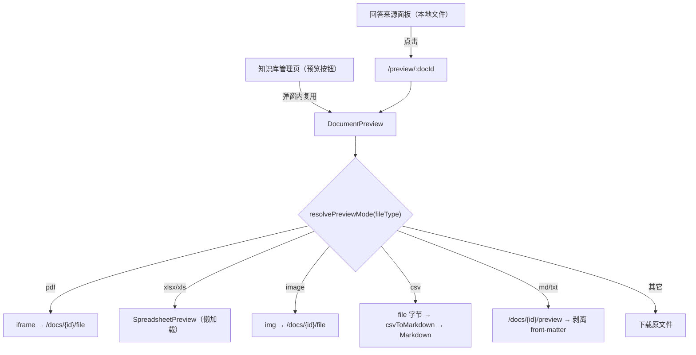
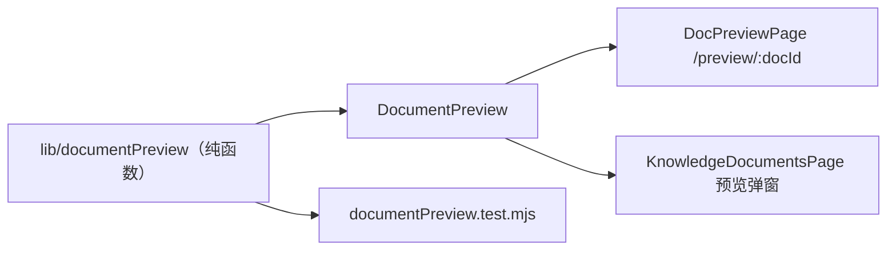

# UP-18b 本地文档预览页

上游对照提交：`ab31f8f1 feat(chat): 支持对话消息中的回答来源及文档预览功能`（其中的文档预览部分）

依赖：UP-18a（来源列表）

## 功能介绍

来源面板里已经能列出「这条回答依据了哪几份文件」（UP-18a），但本地文件来源点不动——用户只能看到文件名与摘录，无法核对原文。上游的做法有两种：

1. **抽取共享预览组件**：把知识库管理页里内联的预览逻辑（pdf → iframe、xlsx/xls → 表格渲染、图片 → ``、csv → 转 markdown、markdown/txt → 正文、其余 → 下载）抽成 `DocumentPreview`，管理页与来源预览页共用一份实现；
2. **新增独立预览路由** `/preview/:docId`：来源面板里的本地文件以新标签打开该路由，聊天上下文不被打断。

本仓库按同样方式落地，并额外把「类型判定 / front-matter 剥离 / 文件地址拼接」抽成纯函数模块便于单测：

| 预览方式 | 触发类型 | 实现 |
| --- | --- | --- |
| `pdf` | `pdf` | `iframe` 直出 `/knowledge-base/docs/{docId}/file` |
| `spreadsheet` | `xlsx` / `xls` | 懒加载 `SpreadsheetPreview`（exceljs + x-data-spreadsheet，保留多 sheet 与样式） |
| `image` | `png` / `jpg` / `jpeg` / `gif` / `webp` / `bmp` / `svg` | `` 直出源文件 |
| `csv` | `csv` | 取源文件字节 → `csvToMarkdown` → Markdown 渲染成表格 |
| `markdown` / `text` | `md` / `markdown` / `txt` | 调 `/preview` 取正文，front-matter 单独展示 |
| `download` | 其它 | 提供「下载原文件」入口 |

后端接口复用既有实现，**不需要新增接口**：`GET /knowledge-base/docs/{docId}`（元信息）、`GET /knowledge-base/docs/{docId}/preview`（正文文本）、`GET /knowledge-base/docs/{docId}/file`（原始文件流）。

## 验收标准

1. **来源可点开**：来源面板中带 `docId` 且无外链的本地来源，点击后在新标签打开 `/preview/{docId}`；带外链的来源仍直接打开外链。
2. **类型判定一致**：同一份文件在知识库管理页与预览页选择同一种预览方式（判定逻辑只有 `lib/documentPreview` 一份实现）。
3. **不需要预取的类型不发正文请求**：pdf / 表格 / 图片打开时只请求原始文件，不调用 `/preview`。
4. **front-matter 单独展示**：markdown 正文以 `---` 开头时，元信息块以等宽样式独立展示，不混入正文渲染。
5. **兜底可用**：不支持在线预览的类型给下载入口，能下载到原始文件；文档被删除时页面提示「无法加载该文档」而不是白屏。
6. **未登录拦截**：`/preview/:docId` 走登录校验，未登录跳转登录页。
7. 可执行验证：

```bash
cd frontend && npm run test:document-preview && npm run build
```

期望结果：6 项单测通过，构建通过。

人工验证路径：

1. 在知识库上传一份 PDF、一份 XLSX、一份 CSV、一份 Markdown；
2. 提一个能命中这些文档的问题，等待回答完成，展开「参考来源」；
3. 点击本地文件来源 → 新标签打开预览页，分别确认 iframe 渲染、表格渲染、表格化 markdown、正文渲染；
4. 在知识库管理页点同一份文档的「预览」，确认两者表现一致。

## 代码位置

| 作用 | 位置 |
| --- | --- |
| 类型判定与正文解析（纯函数） | `frontend/src/lib/documentPreview.ts` |
| 共享预览组件 | `frontend/src/components/document/DocumentPreview.tsx` |
| 来源预览页 | `frontend/src/pages/DocPreviewPage.tsx` |
| 路由注册 | `frontend/src/router.tsx`（`/preview/:docId`，走 `RequireAuth`） |
| 来源面板链接 | `frontend/src/components/chat/SourcesPanel.tsx`、`frontend/src/lib/chatSources.ts`（`previewPath`） |
| 管理页复用（去重） | `frontend/src/pages/admin/knowledge/KnowledgeDocumentsPage.tsx` |
| 单元测试 | `frontend/tests/documentPreview.test.mjs` |

## 相关图表



一处实现、两处使用（避免管理页与来源页行为漂移）：


