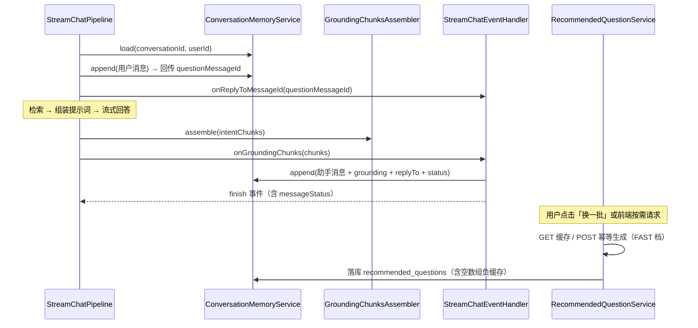
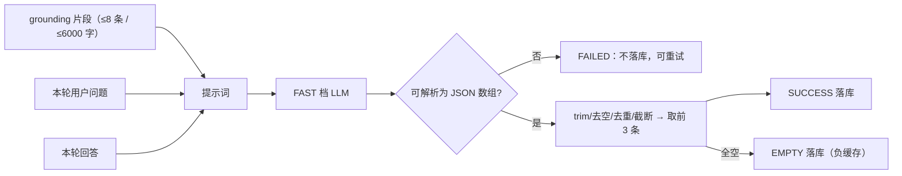
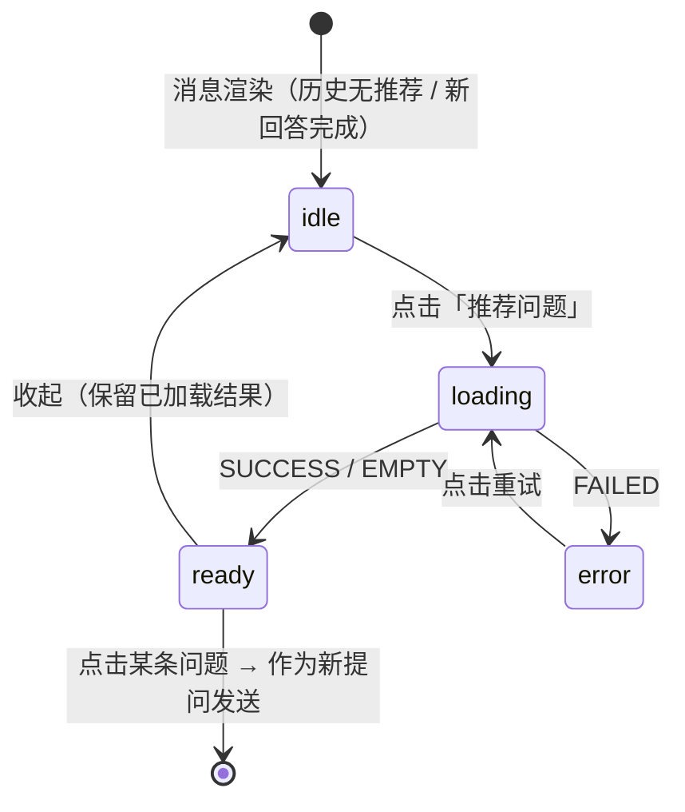
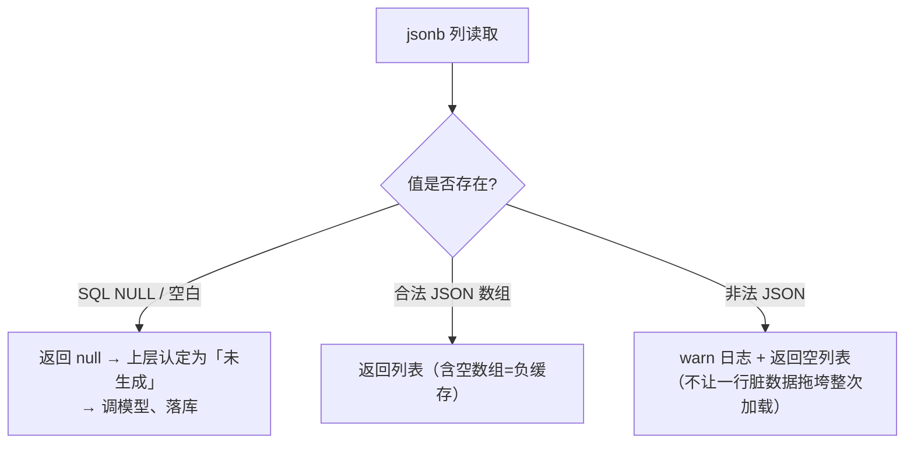
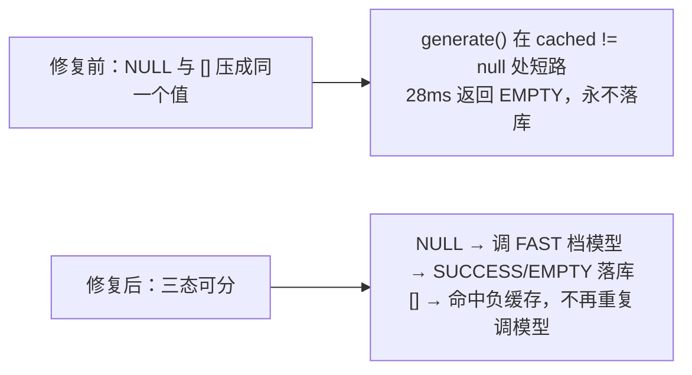

# UP-19 相关推荐追问（含 UP-20 消息状态与提问引用）

上游对照提交：

| 提交 | 内容 |
| --- | --- |
| `190fc067 feat(chat): 添加用户问题相关推荐追问功能实现` | grounding 片段、推荐问题生成与落库、按需生成接口、前端展示 |
| `1308dee7 optimize(rag): 优化消息结束状态与推荐追问功能` | 消息结束状态（NORMAL / INTERRUPTED / REJECTED）、`reply_to_message_id`、推荐生成改为按需触发 |
| `60e49e11 refactor(chat): 优化推荐问题加载与渲染逻辑` | 前端加载与渲染细节 |

本仓库拆成三段落地：

| 阶段 | 内容 | 状态 |
| --- | --- | --- |
| **UP-19a（本文）** | 后端：grounding 片段装配、消息字段与迁移（`grounding_chunks` / `recommended_questions` / `reply_to_message_id` / `message_status`）、生成器（FAST 档）、服务与接口（GET 缓存 / POST 幂等生成）、消息状态贯通落库与 SSE | 已落地 |
| UP-19b | 前端：回答下方推荐追问列表（点击即追问）+ 生成按钮 + 历史会话回显 | 已落地（见下文 UP-19b 章节） |
| UP-20 剩余 | 消息顺序决胜键（雪花 id）等前端顺序稳定性细节 | 未开始 |

## 功能介绍

回答结束后，用户往往还想接着问（「那研究生呢？」「材料要交到哪？」）。让用户自己想下一个问题，不如由系统基于**本轮真实检索到的证据**给出 3 条可追问的问题。

分叉点版本没有任何推荐能力，而且消息表缺少两块关键信息，导致「推荐」即使做了也不稳：

1. **缺少 grounding**：只能拿「问题 + 回答」去让模型编推荐问题，编出来的问题经常**库里没有答案**（问下去检索不到，体验更差）；
2. **缺少提问引用**：助手消息不知道自己回答的是哪条用户消息，生成推荐时只能「猜上一条」，多轮或并发时会串。

本功能补齐这两块，并把推荐生成做成**按需触发**（不拖慢首字）：

### 数据与语义

| 字段 | 含义 |
| --- | --- |
| `grounding_chunks` | 本轮命中的证据片段（按文档去重、取最高分、上限 8 条 / 单条 1200 字 / 总计 6000 字），**只用于推荐生成**，不参与正式回答上下文 |
| `recommended_questions` | 已生成的问题（`NULL`=未生成，`[]`=已生成但无合适追问的负缓存，非空=生成成功） |
| `reply_to_message_id` | 该助手消息回答的用户消息 id；管道改为「先 load 历史 → 再单独 append 用户消息 → 回传其 id」 |
| `message_status` | `NORMAL`（正常完成）/ `INTERRUPTED`（用户中断）/ `REJECTED`（被拒），中断的回答不生成推荐 |

### 生成与接口

- 生成走 **FAST 档**（高频、可降级），提示词注入 grounding 片段 + 原问题 + 回答；
- 解析容忍模型输出 ```` ```json ```` 围栏，做 trim / 去空 / 去重 / 截断（单条 200 字、最多 3 条）；
- 接口按需触发：`POST /conversations/messages/{id}/recommended-questions` **幂等生成并落库**（已有缓存直接返回），`GET` 只读缓存；
- `FAILED` 不落库（可重试），`SUCCESS` 与 `EMPTY` 都落库（空数组作为有效负缓存，避免每次点都重新调模型）。

## 验收标准

1. **grounding 装配**：同一文档只取最高分片段；最多 8 条；单条截断 1200 字、总量不超过 6000 字；无命中返回空列表。
2. **提问引用落库**：助手消息的 `reply_to_message_id` 指向本轮用户消息 id；取消与正常完成两条路径都要写。
3. **消息状态落库**：正常完成写 `NORMAL`，用户中断写 `INTERRUPTED`；完成事件 `CompletionPayload` 也带该状态，前端可据此区分。
4. **推荐生成健壮**：模型输出带代码围栏、含非字符串元素、含重复项时都能正确处理；条数超过 3 条只取前 3 条；非 JSON / 调用异常返回 `FAILED` 且不落库。
5. **幂等与负缓存**：已生成（含空数组）时再次调用不重复调模型；仅 `FAILED` 允许重试。
6. **归属校验**：只能读取/生成自己的 assistant 消息的推荐（他人消息、非 assistant 消息、已删除消息一律按「消息不存在」处理）。
7. 可执行验证：

```bash
./mvnw test -pl bootstrap -am '-Dtest=GroundingChunksAssemblerTest,RecommendedQuestionGeneratorTest,RecommendedQuestionServiceImplTest' -Dsurefire.failIfNoSpecifiedTests=false
```

期望结果：全部通过。

## 代码位置

| 作用 | 位置 |
| --- | --- |
| grounding 片段模型 | `framework/src/main/java/com/nageoffer/ai/ragent/framework/convention/GroundingChunk.java` |
| 消息模型（状态 / 提问引用 / grounding） | `framework/src/main/java/com/nageoffer/ai/ragent/framework/convention/ChatMessage.java` |
| grounding 装配器 | `bootstrap/src/main/java/com/nageoffer/ai/ragent/rag/core/source/GroundingChunksAssembler.java` |
| 推荐生成器（FAST 档 + 提示词） | `bootstrap/src/main/java/com/nageoffer/ai/ragent/rag/service/impl/RecommendedQuestionGenerator.java`、`bootstrap/src/main/resources/prompt/recommended-questions.st` |
| 推荐服务（缓存 / 幂等生成） | `bootstrap/src/main/java/com/nageoffer/ai/ragent/rag/service/RecommendedQuestionService.java`、`rag/service/impl/RecommendedQuestionServiceImpl.java` |
| 接口 | `bootstrap/src/main/java/com/nageoffer/ai/ragent/rag/controller/RecommendedQuestionController.java` |
| 消息实体与 JSONB 处理器 | `rag/dao/entity/ConversationMessageDO.java`、`knowledge/dao/handler/GroundingChunkListTypeHandler.java`、`StringListTypeHandler.java` |
| 管道与完成事件 | `rag/service/pipeline/StreamChatPipeline.java`、`rag/service/handler/StreamChatEventHandler.java`、`rag/dto/CompletionPayload.java` |
| 落库与回显 | `rag/core/memory/JdbcConversationMemoryStore.java`、`rag/service/impl/ConversationMessageServiceImpl.java`、`rag/controller/vo/ConversationMessageVO.java` |
| 数据库 | `resources/database/upgrades/v1.1.0/005_message_recommendations.sql`、`schema_pg.sql` |
| 单元测试 | `bootstrap/src/test/java/com/nageoffer/ai/ragent/rag/core/source/GroundingChunksAssemblerTest.java`、`rag/service/impl/RecommendedQuestionGeneratorTest.java` |

## 相关图表

一次问答的完整时序（推荐生成不阻塞回答）：



推荐生成的输入与判据：



## 数据与顺序说明

- `grounding_chunks` 与 `sources`（UP-18a）职责分离：前者供推荐生成（片段更长），后者供来源面板与预览（摘录 100 字），两者都不进入正式回答的提示词上下文。
- 中断（`INTERRUPTED`）的回答不生成推荐；`REJECTED` 同理由 UP-20 的前端与消息顺序细节补齐。

# UP-19b 前端推荐追问

## 功能介绍

后端（UP-19a）已经能按需生成推荐追问，但用户看不到也点不了。前端补齐三段体验：

1. **入口按钮**：助手消息操作行上的「推荐问题」按钮（`Sparkles` + 展开箭头），点击才请求——避免每条消息都自动调模型；
2. **追问面板**：展开后显示加载骨架 / 问题列表 / 「暂无推荐问题」/ 失败可重试；点击某条问题即作为新提问发送；
3. **历史回显**：重新打开会话时，已生成过推荐的消息（`recommendedQuestions` 非 `null`，含空数组负缓存）直接以「已就绪」渲染，不再请求接口。

状态挂在**消息对象**上（`recommended` / `recommendedState` / `recommendedOpen`），天然按消息隔离，不会出现「展开 A 却显示 B 的问题」。

## 验收标准

1. **按需加载**：`recommendedState` 为 `idle` 时点击按钮 → 置 `loading` 并调 `POST /conversations/messages/{id}/recommended-questions`；已 `ready` 时点击只切换展开态，不发请求。
2. **三态渲染**：`SUCCESS` → 列表；`EMPTY` → 「暂无推荐问题」；`FAILED` → 错误文案 + 重试按钮（重试再次发请求）。
3. **点击即追问**：点击某条推荐问题把它作为用户消息发送（复用现有发送链路），发送后自动收起面板。
4. **历史回显**：`listMessages` 返回 `recommendedQuestions` 为空数组时也视为「已就绪（无推荐）」，不会重复请求。
5. **条件显示**：仅对「已生成完成（`done`）且 `messageStatus` 为 `NORMAL`」的助手消息显示推荐入口；中断（`INTERRUPTED`）的回答不显示。
6. **可执行验证**：

```bash
cd frontend && npm run test:chat-recommendations && npm run build
```

期望结果：单测通过、构建通过。

## 代码位置（UP-19b）

| 作用 | 位置 |
| --- | --- |
| 接口调用 | `frontend/src/services/chatService.ts`（`getRecommendedQuestions` / `generateRecommendedQuestions`） |
| 展示规则（纯函数） | `frontend/src/lib/chatRecommendations.ts` |
| 面板与按钮 | `frontend/src/components/chat/RecommendedQuestions.tsx`、`RecommendedQuestionsButton.tsx` |
| 消息渲染接线 | `frontend/src/components/chat/MessageItem.tsx` |
| 状态与动作 | `frontend/src/stores/chatStore.ts`（`loadRecommended` / `toggleRecommended`）、`frontend/src/types/index.ts` |
| 单元测试 | `frontend/tests/chatRecommendations.test.mjs` |

## 相关图表（UP-19b）



## 上线缺陷修复：JSONB 的 NULL 与空数组必须可区分（2026-09-27）

批次二上线后，生产验证发现推荐追问**完全不可用**，本仓库在批次二之后修复。

### 功能介绍

推荐追问依赖 `recommended_questions` 的三态语义：`NULL`=未生成、`[]`=已生成但无合适追问（负缓存）、
非空=生成成功。但 `StringListTypeHandler` 在读侧把 SQL `NULL` 归一化成了空数组：

```java
// 修复前
private List<String> parse(String raw) {
    if (raw == null || raw.isBlank()) {
        return List.of();          // ← 把"未生成"读成了"已生成且为空"
    }
```

于是 `RecommendedQuestionServiceImpl` 的两个分支全部走错：

- `generate()`：`cached != null` 恒成立 → 直接返回 `EMPTY`，**不调模型、不落库**；
- `getCached()`：永远返回 `EMPTY`，而不是"推荐问题尚未生成"，前端无从区分"没生成"与"没有可推荐的问题"。

线上现象：`POST /conversations/messages/{id}/recommended-questions` **28ms** 返回 `EMPTY`，
全表 464 条消息 `recommended_questions` 无一条非空。

修复：读侧只在**值缺失**时返回 `null`，把"降级为空列表"的容错收敛到**JSON 非法**这一种情况。
`collectionNames`（`IntentNodeDO`）复用同一个处理器，其读侧 `getEffectiveCollectionNames()` 已能容忍 `null`，
且 `null` 与 `[]` 对它的语义一致，因此同一次修复对意图多库无行为影响。

### 验收标准

1. **NULL 读回 null**：列值为 `NULL` 时 `getNullableResult` 返回 `null`，不是空列表。
2. **非法 JSON 仍不炸行**：列值不是合法 JSON 时降级为空列表并打 warn（保留原有容错目标）。
3. **正常解析不变**：`["a","b"]` 按序解析为 `a`、`b`。
4. **端到端**：`recommended_questions` 为 `NULL` 的助手消息调用生成接口时，**会真正调用 FAST 档模型**并落库
   （`SUCCESS` 落非空数组、`EMPTY` 落空数组作为负缓存、`FAILED` 不落库）。
5. 可执行验证：

```bash
./mvnw test -pl bootstrap -am '-Dtest=StringListTypeHandlerTest,IntentNodeTest,RecommendedQuestionGeneratorTest' -Dsurefire.failIfNoSpecifiedTests=false
```

期望结果：全部通过；其中 `nullColumnIsReadBackAsNullNotAsEmptyList` 在修复前必然失败（`expected: null but was: []`）。

### 代码位置

| 作用 | 位置 |
| --- | --- |
| 修复点（NULL 语义） | `bootstrap/src/main/java/com/nageoffer/ai/ragent/knowledge/dao/handler/StringListTypeHandler.java` |
| 三态消费方 | `bootstrap/src/main/java/com/nageoffer/ai/ragent/rag/service/impl/RecommendedQuestionServiceImpl.java` |
| 复用同一处理器的字段 | `rag/dao/entity/ConversationMessageDO.java`（`recommendedQuestions`）、`rag/dao/entity/IntentNodeDO.java`（`collectionNames`） |
| 单元测试 | `bootstrap/src/test/java/com/nageoffer/ai/ragent/knowledge/dao/handler/StringListTypeHandlerTest.java` |
| 生产验证记录 | `docs/evaluation/batch-2-verification.md`（第 2.3 节） |

### 相关图表




