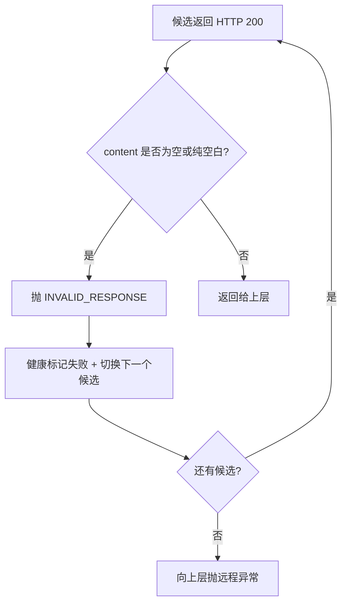
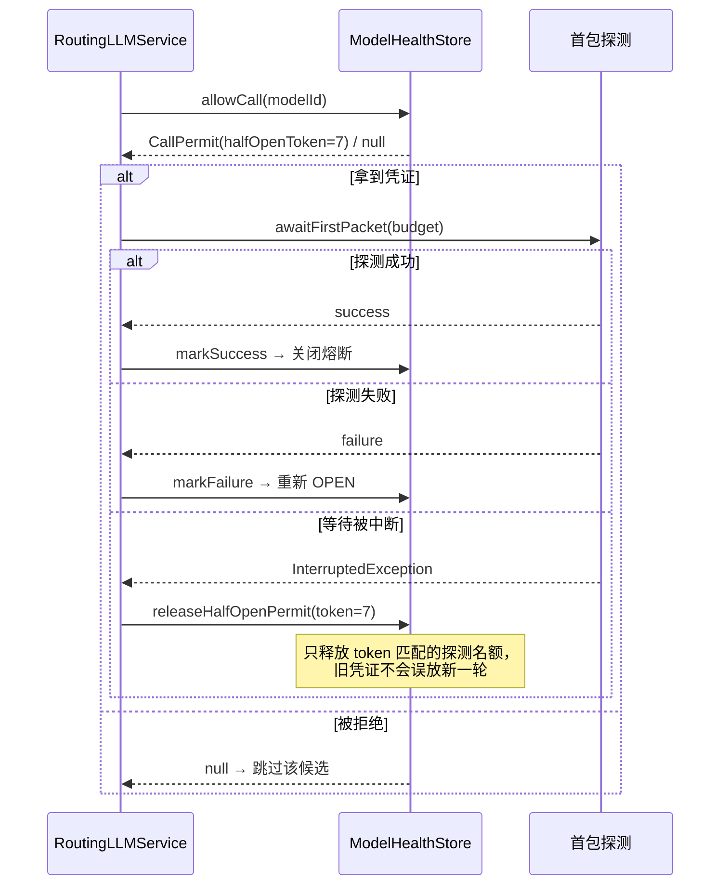

# UP-21 模型调用健壮性（空白响应 / 熔断探测名额 / 候选顺序）

上游对照提交：

| 提交 | 内容 |
| --- | --- |
| `3bfb3d76 fix(chat): 拒绝空白 LLM 响应并触发模型降级 (#102)` | 同步响应的 content 为空串或纯空白时抛 INVALID_RESPONSE 触发降级；流式解析改用 `isBlank` 判断是否有正文 |
| `9509b024 fix(chat): 首包探测中断时由持有者释放熔断半开探测名额 (#75)` | 熔断 HALF_OPEN 探测名额改为带 token 的凭证，避免中断路径漏释放而永久占位 |
| `af4640ff optimize(model): 调整常规模型候选顺序，将 QwenPlus 替换为 Qwen3Max，避免能力下降影响使用` | 标准档候选首位换回能力更强的模型 |

## 功能介绍

模型路由的容错依赖「候选失败就换下一个」，但分叉点版本有三条路径会让容错失效，表现为**用户看到空白回答**或**某个模型永久不可用**：

### 1. 空白响应被当成成功

部分网关在某些情况下返回 HTTP 200、但 `content` 为空串或纯空白（推理模型想完就停、被截断、被内容策略拦下）。分叉点版本：

- 同步调用把空白 content 原样返回 → 上层拿到空答案，**不会切换下一个候选**；
- 流式解析用 `isEmpty()` 判断「有正文」，单个空格/换行分片也算有效内容 → 首包探测把它当成首包成功，实际什么都没输出。

修复：同步响应 content 为空白时抛 `ModelClientException(INVALID_RESPONSE)`（路由层据此切下一个候选）；流式解析 `hasContent()` 改用 `isBlank()`，纯空白分片不算正文，无正文完成走 `NO_CONTENT` 切换候选。

### 2. HALF_OPEN 探测名额泄漏

断路器进入 HALF_OPEN 时只放**一个**探测请求通过（`halfOpenInFlight`）。分叉点版本用布尔标记表示「有探测在跑」，且只在 `markSuccess` / `markFailure` 里清除。若等待首包时线程被中断（用户取消、SSE 断开、超时打断），既不走成功也不走失败回调 → **名额永久占用**，该模型此后一直被判为不可用，直到进程重启。

修复：`allowCall` 返回带 `halfOpenToken` 的 `CallPermit` 凭证；中断路径先 `handle.cancel()` 再 `releaseHalfOpenPermit(permit)`，且**只释放本凭证持有的那一份名额**（token 不匹配不释放），避免旧调用误放掉新一轮探测。

### 3. 标准档候选首位能力偏弱

标准档首位是便宜模型时，正式回答的质量会被它拉低。修复：标准档候选首位换成能力更强的模型（本仓库为 `qwen3-max`），便宜模型退到其后作为降级候选。

## 验收标准

1. **同步空白响应触发降级**：候选返回 `content` 为 `""` 或 `"   "` 时抛 `ModelClientException`（`INVALID_RESPONSE`），路由层继续尝试下一个候选，绝不把空白答案返回给用户。
2. **流式空白分片不算正文**：SSE 片段 `content` 只有空白字符时 `hasContent()` 为 false；整段流没有任何非空白正文时按「无内容」处理并切换候选。
3. **探测名额不泄漏**：等待首包被中断时释放 HALF_OPEN 探测名额，该模型之后仍可被再次探测（不会永久 `isUnavailable`）。
4. **只释放自己的名额**：携带旧 token 的 `releaseHalfOpenPermit` 不会清掉新一轮探测的 `halfOpenInFlight`；非 HALF_OPEN、token 为 0（正常调用）时不产生副作用。
5. **候选顺序**：标准档首位是能力更强的模型（本仓库 `qwen3-max`），其余候选按降级顺序排列。
6. 可执行验证：

```bash
./mvnw test -pl infra-ai -Dtest='OpenAIStyleSseParserTest,ModelHealthStoreTest,ModelBlankResponseTest'
```

期望结果：全部通过。

## 代码位置

| 作用 | 位置 |
| --- | --- |
| 同步空白响应拒绝 | `infra-ai/src/main/java/com/nageoffer/ai/ragent/infra/chat/AbstractOpenAIStyleChatClient.java`（content 提取处） |
| 流式空白分片判定 | `infra-ai/src/main/java/com/nageoffer/ai/ragent/infra/chat/OpenAIStyleSseParser.java`（`hasContent()`） |
| 探测名额凭证与释放 | `infra-ai/src/main/java/com/nageoffer/ai/ragent/infra/model/ModelHealthStore.java`（`CallPermit` / `allowCall` / `releaseHalfOpenPermit`） |
| 中断路径释放 | `infra-ai/src/main/java/com/nageoffer/ai/ragent/infra/chat/RoutingLLMService.java`（`awaitFirstPacket`） |
| 同步路由的许可判定 | `infra-ai/src/main/java/com/nageoffer/ai/ragent/infra/model/ModelRoutingExecutor.java` |
| 候选顺序 | `bootstrap/src/main/resources/application.yaml`（`ai.chat.tiers.standard.candidates`） |
| 单元测试 | `infra-ai/src/test/java/com/nageoffer/ai/ragent/infra/chat/**`、`infra/model/ModelHealthStoreTest.java` |

## 相关图表

空白响应的降级路径：



熔断探测名额的所有权（token 凭证）：



## 相关规则

- 任何「HTTP 成功但无有效内容」的模型响应都必须视为**失败**并触发候选降级；禁止把空白答案透传给用户。
- 熔断半开探测名额只能由**持有该名额的凭证**释放；新增任何提前返回/中断路径时必须成对释放。
- 档位候选顺序即降级顺序：能力最强的模型放首位，后续按「能力递减 / 成本递减」排列（见 [UP-22 档位机制](up-22-model-tiers.md)）。
