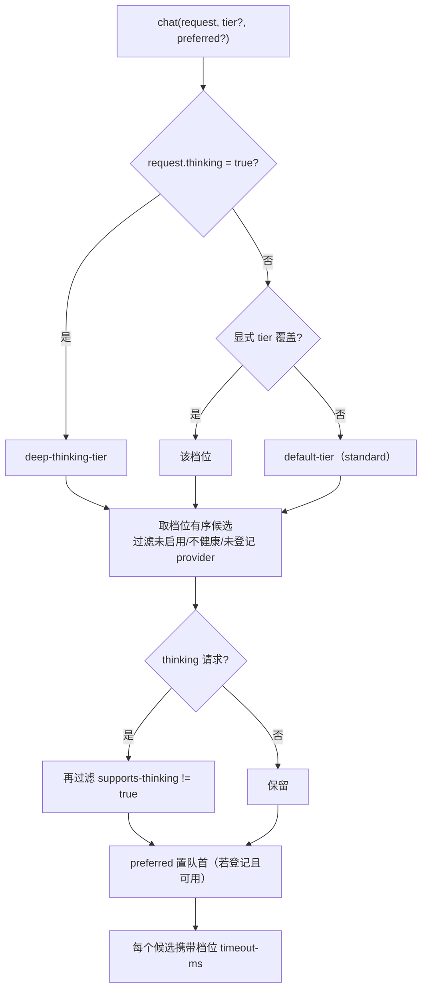

# UP-22 模型调用档位机制

上游对照提交：`f104042a feat(core): 支持模型调用档位机制与MCP提参三态校验`

本仓库按依赖拆成两段落地：

| 阶段 | 内容 | 状态 |
| --- | --- | --- |
| **UP-22a（本文）** | 档位枚举、档位化候选选择、启动期档位校验、`LLMService` 档位 API、高频调用点迁到 fast 档 | 已落地 |
| UP-22b | MCP 提参三态校验（`McpExtractionResult`） | 已落地，见 [`up-22b-mcp-extraction-states.md`](up-22b-mcp-extraction-states.md) |
| UP-22c | 设置页/接口暴露档位配置 | 未开始 |

## 功能介绍

分叉点版本的模型选择只有「默认模型 + 深度思考模型 + 按 priority 排序的候选」这一种粒度：**所有调用点共用同一个默认模型**。但不同调用点对「质量 / 成本 / 时延」的要求差得很远：

| 调用点 | 特征 |
| --- | --- |
| 会话标题生成、歧义判定、查询改写、意图分类、摘要压缩、入库富化/增强 | 高频、短输入短输出、对延迟敏感、判错可降级 → 应该走**快模型** |
| MCP 参数抽取 | 提参正确性直接决定工具调用与过滤条件 → 走**标准档**（见 UP-22b） |
| 正式回答（流式） | 质量优先 → **标准档**，深度思考时升到**深度档** |

用一个默认模型服务全部场景，结果是两头不讨好：快模型拖累回答质量，强模型把标题/改写的成本与延迟放大数倍。

本功能引入**档位（Tier）**这一层语义：

1. `Tier` 枚举：`fast` / `standard` / `deep`，含义是「质量 / 成本 / 时延预算」，不是业务任务；
2. 配置 `ai.chat.tiers.<档位>`：每个档位自带**有序候选列表**与**超时预算**（`timeout-ms`，流式下即首包 TTFT 预算，同步下即整段调用上限）；`default-tier`（默认 `standard`）与 `deep-thinking-tier`（默认 `deep`）声明默认解析规则；
3. `ModelSelector.selectChatCandidates(thinking, tier, preferredModelId)`：**档位内选候选**，`thinking=true` 时优先走 deep-thinking-tier 并强制过滤不支持思考的候选，`preferredModelId` 只把某个模型置队首（失败后仍回退档位内其它候选）；
4. `LLMService` 新增 `chat(request, tier)` 与 `chat(request, tier, preferredModelId)`；默认 `chat(request)` 等价于「深度思考走 deep 档，否则走 default-tier」；
5. 启动期 `ChatTierConfigValidator` fail-fast：档位引用、候选登记、超时预算、`Tier` 枚举覆盖、深档必须有可思考候选——这些错误若留到运行期只会静默降级成「档位缺失」。

## 验收标准

1. **档位内选候选**：`selectChatCandidates(false, Tier.FAST)` 返回 fast 档声明的候选，顺序与配置一致；档位内被禁用/不健康/未登记 provider 的候选被跳过。
2. **深度思考优先**：`thinking=true` 时无论传什么档位都走 `deep-thinking-tier`，且候选全部满足 `supports-thinking=true`（含 preferred）。
3. **preferred 只置顶不排他**：`preferredModelId` 存在且可用时排在队首，其后仍拼接档位内其余候选（失败可回退）；preferred 未登记或在不支持思考时被忽略并告警。
4. **超时预算下沉**：候选 `ModelTarget.timeoutMs()` 取所属档位的 `timeout-ms`；embedding/rerank/vlm 没有档位预算（为 null，走 HTTP 客户端默认）。
5. **启动期校验**：`ai.chat.tiers` 缺失、`default-tier`/`deep-thinking-tier` 引用不存在的档位、档位候选未登记、`timeout-ms` 缺失或非正、`Tier` 枚举缺档、深档无可用思考候选 —— 任一情况启动失败并列出全部问题。
6. **调用点迁移**：标题生成、歧义判定、查询改写、意图分类、摘要、入库富化/增强改走 `Tier.FAST`；入库节点的 `modelId` 设置改用 preferred 语义（`chat(request, Tier.FAST, modelId)`）；MCP 参数提取保持默认档（standard）。
7. 可执行验证：

```bash
./mvnw test -pl infra-ai -Dtest='ModelSelectorTest,ChatTierConfigValidatorTest'
```

期望结果：全部通过。

## 代码位置

| 作用 | 位置 |
| --- | --- |
| 档位枚举 | `infra-ai/src/main/java/com/nageoffer/ai/ragent/infra/enums/Tier.java` |
| 档位配置模型 | `infra-ai/src/main/java/com/nageoffer/ai/ragent/infra/config/AIModelProperties.java`（`ModelGroup.tiers` / `TierConfig` / `defaultTier` / `deepThinkingTier`） |
| 档位化候选选择 | `infra-ai/src/main/java/com/nageoffer/ai/ragent/infra/model/ModelSelector.java` |
| 候选目标（携带超时预算） | `infra-ai/src/main/java/com/nageoffer/ai/ragent/infra/model/ModelTarget.java` |
| 启动期档位校验 | `infra-ai/src/main/java/com/nageoffer/ai/ragent/infra/model/ChatTierConfigValidator.java` |
| 调用接口 | `infra-ai/src/main/java/com/nageoffer/ai/ragent/infra/chat/LLMService.java`、`RoutingLLMService.java` |
| 配置 | `bootstrap/src/main/resources/application.yaml`（`ai.chat.tiers.*`、`default-tier`、`deep-thinking-tier`） |
| 迁移到 fast 档的调用点 | `rag/core/intent/DefaultIntentClassifier`、`rag/core/rewrite/MultiQuestionRewriteService`、`rag/core/guidance/AmbiguityLLMChecker`、`rag/core/mcp/LLMMcpParameterExtractor`、`rag/core/memory/JdbcConversationMemorySummaryService`、`rag/service/impl/ConversationTitleGenerator`、`ingestion/node/EnhancerNode`、`ingestion/node/EnricherNode` |
| 单元测试 | `infra-ai/src/test/java/com/nageoffer/ai/ragent/infra/model/**` |

配置示例：

```yaml
ai:
  chat:
    default-tier: standard
    deep-thinking-tier: deep
    candidates: [ ... ]        # 全局候选注册表（id 唯一）
    tiers:
      fast:
        candidates: [ qwen-flash, qwen3-local ]
        timeout-ms: 5000       # 高频小任务：短预算，快速失败后降级
      standard:
        candidates: [ qwen3-max, qwen-plus, qwen3-local ]
        timeout-ms: 120000
      deep:
        candidates: [ qwen3-max, deepseek-chat ]
        timeout-ms: 180000
```

## 相关图表

档位解析（`thinking` 优先，其次显式 override，最后 default-tier）：



调用点与档位的对应关系：

| 调用点 | 档位 | 理由 |
| --- | --- | --- |
| 会话标题 / 歧义判定 / 查询改写 / 意图分类 / 摘要 / 入库富化与增强 | `fast` | 高频、判错可降级、延迟敏感 |
| MCP 参数提取 | `standard`（默认档） | 提参正确性决定工具调用与数据过滤条件，不能用低质模型冒险 |
| 正式回答（流式，非思考） | `standard`（default-tier） | 质量与成本平衡 |
| 深度思考回答（`thinking=true`） | `deep` | 强推理，成本可接受 |

## 相关规则

- 档位表达「质量 / 成本 / 时延预算」；禁止把业务任务名写进档位（如「标题档」），业务与档位的映射写在调用点。
- `ai.chat.tiers` 必须覆盖 `Tier` 枚举的全部取值；`default-tier`、`deep-thinking-tier` 必须指向已配置档位，否则启动失败。
- 每个档位必须显式配置 `timeout-ms`（流式=首包预算，同步=整段上限），禁止依赖隐式默认值。
- 需要指定具体模型时使用 preferred 语义（`chat(request, tier, preferredModelId)`），禁止构造「只跑这一个模型」的路由——preferred 失败后必须还能回退档位内其它候选。
