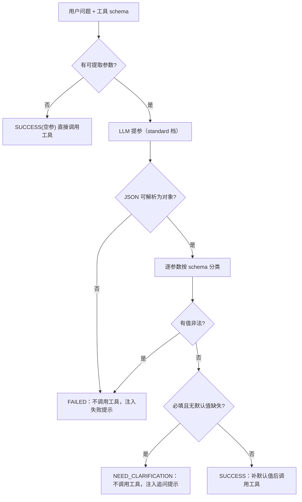

# UP-22b MCP 提参三态校验

上游对照提交：`f104042a feat(core): 支持模型调用档位机制与MCP提参三态校验`（其中的 MCP 提参部分）

## 功能介绍

调用 MCP 工具前需要先用 LLM 从用户问题里抽取参数。分叉点版本的返回类型是 `Map<String, Object>`，只有「有参数 / 空 Map」两种结果，消费端无法区分三种截然不同的情况：

| 真实情况 | 分叉点行为 | 后果 |
| --- | --- | --- |
| 参数已齐 | 正常调用 | 正确 |
| **用户没提供必填参数** | 返回只含默认值的 Map（必填项缺失）→ 照样调用工具 | 工具拿到残缺参数：要么报错，要么按错误条件查询后给出**看似正常但错误**的答案 |
| **模型输出畸形 / 值非法** | JSON 解析失败 → 降级为默认值 Map → 照样调用 | 同上，还把「模型没遵守协议」伪装成「查询无结果」 |

本功能把返回类型改为**三态**：

```java
public record McpExtractionResult(Status status, Map<String, Object> params, List<String> missingRequired)
public enum Status { SUCCESS, NEED_CLARIFICATION, FAILED }
```

| 结局 | 判定条件 | 消费端行为 |
| --- | --- | --- |
| `SUCCESS` | 必填参数齐备，且出现的值都通过类型/枚举校验 | 补齐 schema 默认值 → **调用工具** |
| `NEED_CLARIFICATION` | 「必填且无默认值」的参数缺失或为 `null`（模型省略 key 与显式 null 不可区分，统一按用户未提供处理） | **不调用工具**，注入结构化提示让 LLM 主动向用户追问 |
| `FAILED` | JSON 解析失败 / 空响应 / 不是 JSON 对象 / 值类型或枚举非法 / LLM 调用异常 | **不调用工具**，注入失败提示进入「工具调用失败」段 |

两条关键设计：

1. **非法值一律 FAILED，包括可选字段**：静默丢弃可选/有默认字段会让过滤条件被无声移除（例如枚举写错 → 时间过滤消失 → 查询范围被放大），这比直接失败更危险；
2. **值类型校验保守但实用**：数字/布尔/数组/对象要求类型匹配；字符串参数接受标量并转字符串（学号、编号被模型写成数字很常见）；存在 `enum` 时必须命中其中之一。

MCP 提参决定工具调用与过滤条件是否正确，因此**走默认档（standard）而不是快速档**（上游同样如此）。这修正了 UP-22a 迁移时把本调用点归入 fast 档的判断。

## 验收标准

1. **无参工具直接成功**：`inputSchema().properties()` 为空时返回 `SUCCESS` + 空参数，且不调用 LLM。
2. **缺必填 → 澄清**：必填且无默认值的参数缺失或为 `null` 时结局为 `NEED_CLARIFICATION`，`missingRequired` 精确列出缺失项，`params` 保留已抽到的其它参数。
3. **协议畸形 → 失败**：响应为空、非 JSON 对象、JSON 语法错误、LLM 调用抛异常时结局为 `FAILED`。
4. **值非法 → 失败**：类型不符（如 `integer` 参数给了 `"十条"`）或枚举未命中时 `FAILED`，非法值不进入 `params`；**可选字段同样按失败处理**。
5. **成功才补默认值**：仅 `SUCCESS` 用 schema `default` 补齐缺失参数；`NEED_CLARIFICATION` / `FAILED` 不补（不把默认值当用户输入）。
6. **消费端分流**：`SUCCESS` 才调用远端工具；`NEED_CLARIFICATION` 注入 `isError=false` 的追问提示；`FAILED` 注入 `isError=true` 的失败提示。
7. **日志安全**：LLM 原始响应只以截断预览落日志（`LogSafe.preview`，默认 500 字符），不整段打印用户问题与工具参数。
8. 可执行验证：

```bash
./mvnw test -pl bootstrap -am -Dtest=LLMMcpParameterExtractorTest -Dsurefire.failIfNoSpecifiedTests=false
```

期望结果：全部通过（9 项用例）。

## 代码位置

| 作用 | 位置 |
| --- | --- |
| 三态结果模型 | `bootstrap/src/main/java/com/nageoffer/ai/ragent/rag/core/mcp/McpExtractionResult.java` |
| 提取器接口（返回类型改为三态） | `bootstrap/src/main/java/com/nageoffer/ai/ragent/rag/core/mcp/McpParameterExtractor.java` |
| 校验与分类实现 | `bootstrap/src/main/java/com/nageoffer/ai/ragent/rag/core/mcp/LLMMcpParameterExtractor.java`（`validateMcpParams` / `parseAndClassify` / `coerceAndValidate` / `parseJsonObject`） |
| 消费端分流 | `bootstrap/src/main/java/com/nageoffer/ai/ragent/rag/core/retrieve/RetrievalEngine.java`（`executeSingleMcpTool` / `clarificationResult` / `extractionFailedResult`） |
| 日志安全 | `infra-ai/src/main/java/com/nageoffer/ai/ragent/infra/util/LogSafe.java` |
| 单元测试 | `bootstrap/src/test/java/com/nageoffer/ai/ragent/rag/core/mcp/LLMMcpParameterExtractorTest.java` |

## 相关图表



三态对提示词上下文的影响（`isError` 决定进入哪一段）：

| 结局 | `CallToolResult.isError` | 进入上下文的位置 |
| --- | --- | --- |
| `SUCCESS` | 工具自身返回值 | 工具数据段 |
| `NEED_CLARIFICATION` | `false` | 正文提示：要求模型向用户追问 |
| `FAILED` | `true` | 工具失败段 |

## 后续（UP-22c）

上游同一提交还把档位信息暴露到设置页（`RAGSettingsController` / `SystemSettingsVO` / 前端设置页）。本仓库设置页为自研实现，暴露档位属于展示层改造，列为 **UP-22c**，在 [roadmap](../roadmap.md) 跟踪。
