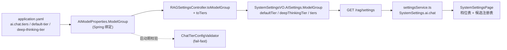

# UP-22c 档位设置暴露（系统设置接口与设置页）

上游对照提交：`f104042a feat(core): 支持模型调用档位机制与MCP提参三态校验`（同一提交里的
`RAGSettingsController` / `SystemSettingsVO` / `SystemSettingsPage.tsx` / `settingsService.ts` 改动）

本文是 [`up-22-model-tiers.md`](up-22-model-tiers.md) 的第三段落地，前两段为 UP-22a（档位机制）与
UP-22b（MCP 提参三态）。

## 功能介绍

UP-22a 之后，「哪个模型服务哪个场景」由 `ai.chat.tiers` 决定：档位是「质量 / 成本 / 时延预算」，
每个档位 = 一组**有序候选** + 一个 **`timeout-ms` 预算**，`default-tier`（默认 `standard`）与
`deep-thinking-tier`（默认 `deep`）决定未显式指定档位时走哪一档。

这套配置当时只存在于 `application.yaml`，后台「系统设置」页的 Chat 模型配置卡仍然展示
`defaultModel` / `deepThinkingModel` 与候选列表。带来的问题是：

1. **看不到真正的路由依据**：档位候选顺序与超时预算是实际生效的路由规则，页面上完全缺失，
   排查「为什么这次回答走了小模型」必须登录服务器看 yaml；
2. **看得到的是过时信息**：`deepThinkingModel` 在 chat 组已不再参与路由（thinking 请求走
   `deep-thinking-tier`），继续展示会误导排障方向。

本功能把档位配置通过 `GET /rag/settings` 暴露，并在设置页新增档位表：

| 暴露字段 | 含义 |
| --- | --- |
| `ai.chat.defaultTier` | 未显式指定档位时的兜底档位 |
| `ai.chat.deepThinkingTier` | `thinking=true` 时优先走的档位 |
| `ai.chat.tiers.<档位>.candidates` | 该档位的**有序**候选 id 列表（靠前优先） |
| `ai.chat.tiers.<档位>.timeoutMs` | 该档位的调用预算（流式 = 首包 TTFT 预算，同步 = 整段上限） |

**只读**：本功能只暴露现状，不提供写接口。档位在启动期由 `ChatTierConfigValidator` 校验并固化成
路由候选，改档位仍需改 `application.yaml` 并重启，因此设置页定位是「看清当前生效的路由」，而不是
在线改档。

## 验收标准

1. **档位字段暴露**：`GET /rag/settings` 返回的 `ai.chat` 含 `defaultTier`、`deepThinkingTier`、
   `tiers`；`tiers` 的 key 为档位名，value 含 `candidates` 与 `timeoutMs`。
2. **候选顺序保真**：`tiers.<档位>.candidates` 与 yaml 中的顺序**完全一致**（有序列表，不排序、
   不去重、不截断），否则页面展示的顺序会与实际路由顺序不符。
3. **非 chat 组不带档位**：`ai.embedding` / `ai.rerank` 仍按 `defaultModel` + `priority` 路由，其
   `tiers`、`defaultTier`、`deepThinkingTier` 为 `null`，避免前台误以为它们也走档位（`vlm` 组不在
   设置接口暴露范围内）。
4. **缺配置不报错**：`ai.chat.tiers` 为空或 `timeout-ms` 未配置时，接口正常返回（前者为 `null`，
   后者 `timeoutMs` 为 `null`），不抛异常、不返回空对象。
5. **设置页档位表**：Chat 模型配置卡出现「档位（Tiers）」表，列为 `Tier` / 候选（`→` 连接）/
   `Timeout (ms/候选)`；档位按 `fast → standard → deep` 的固定顺序展示，未在枚举内的档位排在其后
   并保持接口顺序；`timeoutMs` 缺失显示 `-`。
6. **不再误导**：`defaultModel` / `deepThinkingModel` 标注为「兼容字段（chat 组不再参与路由）」，
   页面主视图改为档位表 + 候选注册表。
7. 可执行验证：

```bash
./mvnw test -pl bootstrap -am '-Dtest=RAGSettingsControllerTest' -Dsurefire.failIfNoSpecifiedTests=false
cd frontend && npm run test:tier-settings
```

期望结果：全部通过。

## 代码位置

| 作用 | 位置 |
| --- | --- |
| 设置视图对象（新增档位字段与 `TierConfig`） | `bootstrap/src/main/java/com/nageoffer/ai/ragent/rag/controller/vo/SystemSettingsVO.java` |
| 设置接口映射（`toModelGroup` / `toTiers`） | `bootstrap/src/main/java/com/nageoffer/ai/ragent/rag/controller/RAGSettingsController.java` |
| 档位配置来源（只读绑定） | `infra-ai/src/main/java/com/nageoffer/ai/ragent/infra/config/AIModelProperties.java`（`ModelGroup.defaultTier` / `deepThinkingTier` / `tiers`） |
| 档位启动期校验（档位语义的来源） | `infra-ai/src/main/java/com/nageoffer/ai/ragent/infra/model/ChatTierConfigValidator.java` |
| 前端接口类型 | `frontend/src/services/settingsService.ts` |
| 前端档位展示逻辑（可单测） | `frontend/src/lib/settingsTiers.ts` |
| 前端设置页档位表 | `frontend/src/pages/admin/settings/SystemSettingsPage.tsx` |
| 后端单元测试 | `bootstrap/src/test/java/com/nageoffer/ai/ragent/rag/controller/RAGSettingsControllerTest.java` |
| 前端单测 | `frontend/tests/settingsTiers.test.mjs`（`npm run test:tier-settings`） |

配置（`application.yaml`，只读来源）：

```yaml
ai:
  chat:
    default-tier: standard
    deep-thinking-tier: deep
    tiers:
      fast:
        candidates: [ qwen3-local, qwen-plus ]
        timeout-ms: 5000
      standard:
        candidates: [ qwen3-max, qwen-plus, qwen3-local ]
        timeout-ms: 120000
    candidates: [ ... ]   # 全局候选注册表：id / provider / model / supports-thinking / priority
```

## 相关图表

配置从 yaml 到设置页的只读链路：



档位字段在各模型组上的取值差异：

| 模型组 | `defaultModel` | `defaultTier` / `deepThinkingTier` / `tiers` |
| --- | --- | --- |
| `chat` | 兼容字段（chat 组路由已改走档位） | 有值 |
| `embedding` / `rerank` | 生效（`defaultModel` + `priority` 排序） | `null` |

## 与上游的差异

- 上游在 `f104042a` 中把 `deepThinkingModel` 从 `AIModelProperties.ModelGroup` 与设置 VO 中**删除**。
  本仓库的 `ModelGroup` 是四个模型组共用的类，`defaultModel` 仍被 embedding / rerank / vlm 使用，
  且既有前端与 yaml 仍引用 `deep-thinking-model`；因此这里**保留字段**，但把它在设置页标为
  「chat 组不再参与路由」的兼容字段，主视图改为档位表。
- 上游候选注册表去掉了 `Priority` 列。本仓库 `priority` 仍是 embedding / rerank / vlm 的排序依据
  （也是档位内候选的兜底排序），故保留该列。
- 档位表的展示顺序由上游的「对象键顺序」改为本仓库显式的 `fast → standard → deep` 固定顺序，
  未知档位排后，保证页面顺序稳定可测。
