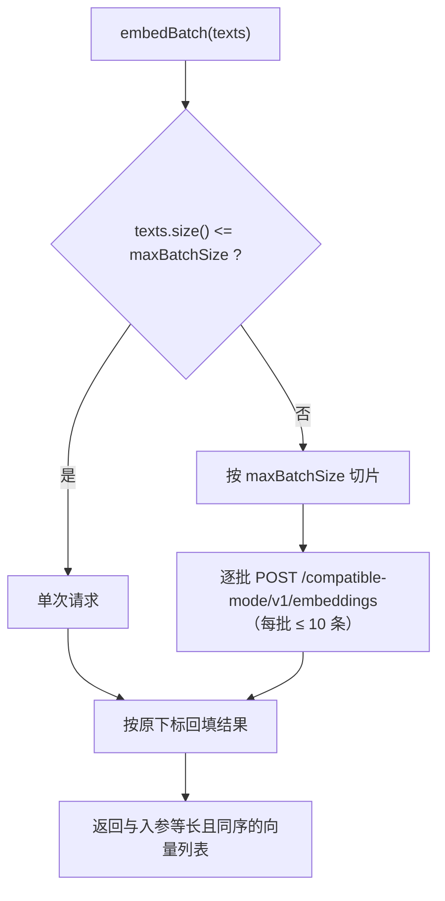

# UP-23 百炼（DashScope）向量客户端对齐

上游对照提交：`a6fb7139 feat(embedding): 新增百炼向量接口客户端并更新配置`

## 功能介绍

上游这个提交做两件事：给百炼（DashScope）增加 OpenAI 兼容模式的向量客户端，并把默认向量模型切到百炼。其中**真正带 bug 修复性质的约束**是批量上限：

> 百炼 compatible-mode 单次请求最多 **10 条**文本，比其它家（常见 32）小得多。超限不是「慢」，而是**整批 400**——摄取长文档时必然踩到。

本仓库的现状（见 [分叉判定](../fork-divergence.md)）：分叉之后本仓库**已经自研实现了同一条约束**，且在抽象层统一处理批量切分：

| 能力 | 本仓库位置 | 与上游的差异 |
| --- | --- | --- |
| 百炼向量客户端 | `infra-ai/.../embedding/BaiLianEmbeddingClient.java` | 同类实现（`provider=bailian`），本仓库另在 `AbstractOpenAIStyleEmbeddingClient.maxBatchSize()` 里统一提供批量切分钩子 |
| 批量上限 10 | `BaiLianEmbeddingClient#maxBatchSize` 返回 10 | 与上游取值一致 |
| 批量切分逻辑 | `AbstractOpenAIStyleEmbeddingClient#embedBatch`：按 `maxBatchSize` 切片、逐批请求、按原顺序回填 | 上游在同一抽象层做同样的事；本仓库实现更早落地 |
| 百炼 embedding 端点 | `ai.providers.bailian.endpoints.embedding = /compatible-mode/v1/embeddings` | 一致 |
| 默认向量模型 | `ai.embedding.default-model = qwen3.7-text-embedding`（provider=bailian，priority=1） | 上游切到 `text-embedding-v4`（同为 DashScope 向量模型）；本仓库保持自己的模型命名，意图一致：**默认向量走百炼** |

因此本功能的落地重点是：**把「百炼单批 ≤10」这条隐式约束变成有测试守护的显式契约**，并在文档里固定下来，避免以后有人改 `maxBatchSize()` 或换成非切分路径时静默踩 400。

## 验收标准

1. **批量上限生效**：`BaiLianEmbeddingClient.maxBatchSize()` 为 10；请求 25 条文本时发出 **3 次** HTTP 请求，单次请求体 `input` 数组长度依次为 10、10、5。
2. **顺序不乱**：`embedBatch` 返回的向量数量等于入参数量，且第 i 个向量来自第 i 条文本（按批回填，不因分批而错位）。
3. **不超限**：任何一次请求的 `input` 长度都不超过 10（多批拼装不会把两批合成一批）。
4. **端点正确**：请求打到 `provider.url + endpoints.embedding`，使用 `Authorization: Bearer <api-key>`。
5. 可执行验证：

```bash
./mvnw test -pl infra-ai -Dtest=BaiLianEmbeddingBatchTest
```

期望结果：全部通过。

## 代码位置

| 作用 | 位置 |
| --- | --- |
| 百炼向量客户端与批量上限 | `infra-ai/src/main/java/com/nageoffer/ai/ragent/infra/embedding/BaiLianEmbeddingClient.java` |
| 批量切分与顺序回填 | `infra-ai/src/main/java/com/nageoffer/ai/ragent/infra/embedding/AbstractOpenAIStyleEmbeddingClient.java`（`embedBatch` / `maxBatchSize`） |
| 请求构建（model / input / dimensions / encoding_format） | 同上（`doEmbed`） |
| 端点与模型配置 | `bootstrap/src/main/resources/application.yaml`（`ai.providers.bailian.endpoints.embedding`、`ai.embedding.*`） |
| 单元测试 | `infra-ai/src/test/java/com/nageoffer/ai/ragent/infra/embedding/BaiLianEmbeddingBatchTest.java` |

## 相关图表

批量切分（`maxBatchSize` 是唯一旋钮，超限会整批 400 而不是部分成功）：



错误语义：

| 情况 | 表现 |
| --- | --- |
| 单批 > 10 条 | 百炼整批 400（`PROVIDER_ERROR`），不是部分成功——所以必须由客户端切分 |
| 返回 `data` 缺失/为空 | `INVALID_RESPONSE` |
| 响应条数与请求条数不一致 | 现有实现按 `data` 顺序回填；条数偏少时对应下标保持未填充，属异常场景（由上游调用方按需校验） |

## 与上游的差异说明

- 上游把客户端与配置放在同一个提交；本仓库在同一能力上**先有实现**（`BaiLianEmbeddingClient` + `maxBatchSize` 钩子），只是缺少守护测试与文档。本轮补齐这两项，不重复造客户端。
- 模型命名不同（本仓库 `qwen3.7-text-embedding` vs 上游 `text-embedding-v4`），二者都是百炼向量模型；本仓库通过 `ai.embedding.candidates` 的 priority 保证默认仍走百炼，切换模型只需改配置，不需要改代码。
