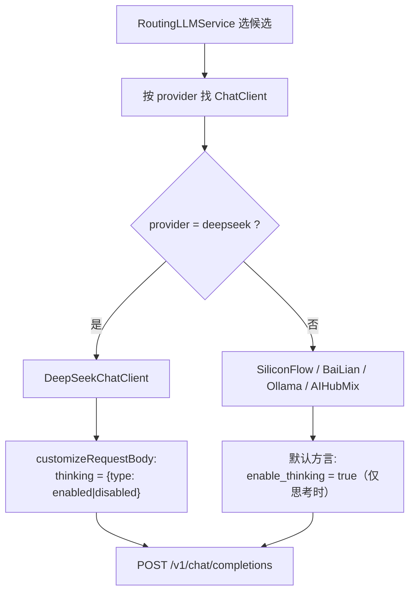

# UP-24 DeepSeek 供应商支持

上游对照提交：`27366d12 feat(deepseek): 新增 DeepSeek 供应商支持及相关测试覆盖`

## 功能介绍

本仓库的模型客户端按「OpenAI 兼容方言」抽象：`AbstractOpenAIStyleChatClient` 提供模板方法，子类只声明 `provider()` 与请求体方言。分叉点版本已支持 `ollama` / `bailian` / `siliconflow` / `aihubmix`，但**深度思考的方言只覆盖了 DashScope 系**：

- 默认实现发送 `enable_thinking: true`；
- DeepSeek 官方开放平台不认这个字段，思考开关走 `thinking: {"type": "enabled" | "disabled"}` 对象；
- 不显式关闭时 DeepSeek V4 系思考模式默认开启且 effort 偏高，标准档会白等一段思考时间。

本功能新增 `DeepSeekChatClient` 与 `ModelProvider.DEEP_SEEK`，把思考开关翻译成 DeepSeek 的 `thinking` 对象方言，并接入既有的「按 provider 选择客户端」路由（`RoutingLLMService` 按 `provider()` 匹配）。

## 验收标准

1. **方言正确**：`DeepSeekChatClient` 构造请求体时写入 `thinking` 对象：`thinking=true` → `{"type":"enabled"}`，否则 `{"type":"disabled"}`；**不写** `enable_thinking`。
2. **不污染其它供应商**：非 DeepSeek 客户端（如 `SiliconFlowChatClient`）仍走默认实现，只写 `enable_thinking`，请求体中不出现 `thinking` 对象。
3. **路由可达**：`ModelProvider.DEEP_SEEK.matches("deepseek")`（大小写不敏感）为真，`provider()` 返回 `deepseek`，因而 `ai.providers.deepseek` + 候选中声明 `provider: deepseek` 即可被路由选中。
4. **配置就绪**：`application.yaml` 中存在 `ai.providers.deepseek`（url / api-key / endpoints.chat）与一条可用的模型候选声明。
5. 可执行验证：

```bash
./mvnw test -pl infra-ai -Dtest=DeepSeekChatClientTest
```

期望结果：全部通过。

## 代码位置

| 作用 | 位置 |
| --- | --- |
| 供应商枚举 | `infra-ai/src/main/java/com/nageoffer/ai/ragent/infra/enums/ModelProvider.java`（`DEEP_SEEK`） |
| DeepSeek 客户端与思考方言 | `infra-ai/src/main/java/com/nageoffer/ai/ragent/infra/chat/DeepSeekChatClient.java` |
| 模板方法与默认方言 | `infra-ai/src/main/java/com/nageoffer/ai/ragent/infra/chat/AbstractOpenAIStyleChatClient.java`（`customizeRequestBody`） |
| 供应商与候选配置 | `bootstrap/src/main/resources/application.yaml`（`ai.providers.deepseek`、`ai.chat.candidates`） |
| 单元测试 | `infra-ai/src/test/java/com/nageoffer/ai/ragent/infra/chat/DeepSeekChatClientTest.java` |

配置项（默认不参与路由，需显式启用）：

```yaml
ai:
  providers:
    deepseek:
      url: https://api.deepseek.com
      api-key: ${DEEPSEEK_API_KEY:}
      endpoints:
        chat: /v1/chat/completions
  chat:
    candidates:
      - id: deepseek-flash
        provider: deepseek
        model: deepseek-flash
        supports-thinking: true
```

启用步骤：设置 `DEEPSEEK_API_KEY` 环境变量，并把该候选加入目标档位的 `candidates` 列表（如 `standard` / `deep`）。默认不加入，避免未配置密钥时新候选被路由选中后熔断计数被污染。

## 相关图表



思考开关的方言对照：

| 供应商 | 开启思考 | 关闭思考 |
| --- | --- | --- |
| DeepSeek 官方 | `thinking: {"type":"enabled"}` | `thinking: {"type":"disabled"}` |
| DashScope / 兼容端点 | `enable_thinking: true` | 不发送该字段 |
