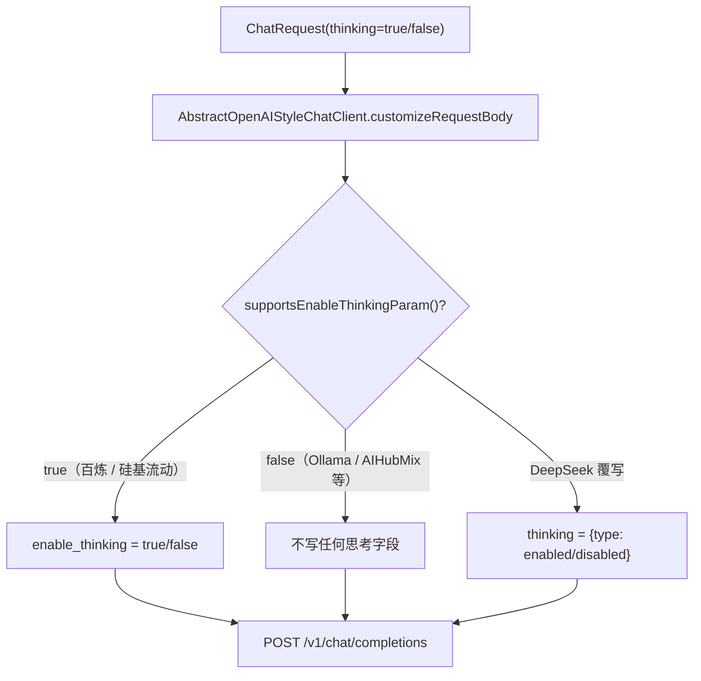

# UP-25 供应商自定义 `enable_thinking` 参数

上游对照提交：`6e1a55ab feat(chat): 支持提供商自定义 enable_thinking 参数`（含 embedding 耗时日志与流式空响应处理）

## 功能介绍

`enable_thinking` 是 DashScope（百炼）系的**私有扩展字段**，OpenAI 兼容协议本身没有它。分叉点版本的默认实现对所有供应商一律追加该字段，于是出现两类问题：

1. **不认识的网关直接 400**：部分 OpenAI 兼容网关把未知字段判为 `unknown_parameter`，整次调用失败；
2. **默认思考拖慢标准档**：Qwen3 系模型不显式传 `enable_thinking=false` 时会默认开启思考，标准档平白多等一段思考时间。

修复方式：抽象客户端新增钩子 `supportsEnableThinkingParam()`（默认 `false`），只有**声明支持**的供应商才写入该字段，且开启与关闭都显式写入布尔值。百炼与硅基流动声明支持；DeepSeek 走自己的 `thinking` 对象方言（见 UP-24）；其余供应商两者都不发。

同时做了两处工程改进：

- **embedding 调用补耗时日志**（成败两路都记）：embedding 是检索链路上唯一的远端同步调用，慢在这里会被上游按「通道无结果」吞掉，失败路径的慢失败尤其需要可见；
- **流式响应体为空不再直接抛错**：改为按空流处理（跳过解析、正常收尾），避免个别网关在 `finish` 后返回空体时把一次成功的回答变成异常。

## 验收标准

1. **默认不发**：未声明支持的供应商（如 Ollama / AIHubMix）请求体里既不出现 `enable_thinking`，也不出现 `thinking`。
2. **声明支持的供应商**：百炼 / 硅基流动在 `thinking=true` 时写 `enable_thinking=true`，`thinking=false` 时显式写 `enable_thinking=false`。
3. **方言互不污染**：DeepSeek 仍只写 `thinking: {type: ...}`，不写 `enable_thinking`。
4. **空流不报错**：流式响应体为 `null` 时按空流处理，不抛 `ModelClientException`。
5. **embedding 日志**：请求失败与请求异常两条路径都打印模型名、条数与耗时。
6. 可执行验证：

```bash
./mvnw test -pl infra-ai -Dtest=ChatClientThinkingParamTest
```

期望结果：全部通过。

## 代码位置

| 作用 | 位置 |
| --- | --- |
| 钩子与默认请求体方言 | `infra-ai/src/main/java/com/nageoffer/ai/ragent/infra/chat/AbstractOpenAIStyleChatClient.java` |
| 声明支持的供应商 | `infra-ai/src/main/java/com/nageoffer/ai/ragent/infra/chat/BaiLianChatClient.java`、`SiliconFlowChatClient.java` |
| DeepSeek 方言（对照） | `infra-ai/src/main/java/com/nageoffer/ai/ragent/infra/chat/DeepSeekChatClient.java` |
| embedding 耗时日志 | `infra-ai/src/main/java/com/nageoffer/ai/ragent/infra/embedding/AbstractOpenAIStyleEmbeddingClient.java` |
| 单元测试 | `infra-ai/src/test/java/com/nageoffer/ai/ragent/infra/chat/ChatClientThinkingParamTest.java` |

## 相关图表



三类方言对照：

| 供应商 | 字段 | 说明 |
| --- | --- | --- |
| 百炼 / 硅基流动 | `enable_thinking: true \| false` | DashScope 系私有扩展，需显式关闭以避免默认思考 |
| DeepSeek | `thinking: {"type":"enabled"\|"disabled"}` | 官方方言，不认识 `enable_thinking` |
| Ollama / AIHubMix 等 | 无 | 未知字段会被判 `unknown_parameter`，一律不发 |
