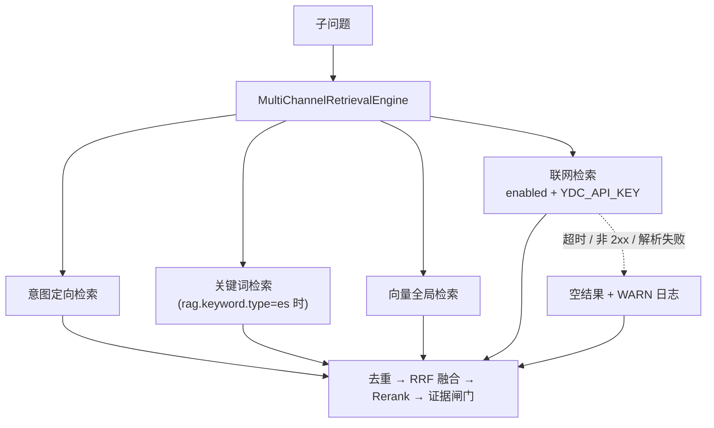
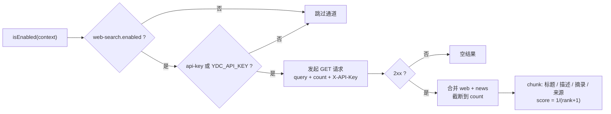

# UP-26 You.com 联网检索通道与 `youcom_search` MCP 工具

上游对照提交：

| 提交 | 内容 |
| --- | --- |
| `6a1ecf7f feat(rag): 新增 You.com 联网检索通道与 youcom_search MCP 工具 (#49)` | 通道、MCP 工具、配置与单测 |
| `a5994e6a optimize(search): 优化 You.com 联网检索结果数量合并及截断逻辑` | `count` 改为「网页 + 新闻合计上限」，两段合并后统一截断 |

## 功能介绍

本仓库的召回全部来自**本地知识库**（向量 / 意图定向 / 可选关键词）。校内资料能覆盖制度、培养方案这类
静态知识，但覆盖不到时效性内容（最新政策通知、公开资讯、外部技术文档）。用户问这类问题时，检索必然
空手而归，模型要么说「知识库没有」，要么靠参数记忆硬答。

本功能补一条**联网检索通道**，再加一个同能力的 **MCP 工具**：

| 能力 | 消费者 | 定位 |
| --- | --- | --- |
| `YouComWebSearchChannel` | RAG 主链路（`MultiChannelRetrievalEngine`） | 作为第 4 类通道与本地通道**并行**召回，结果经去重 / RRF 融合 / Rerank 后与本地证据一起进上下文 |
| `youcom_search` MCP 工具 | 外部 MCP 客户端（含将来的 Agent 工具调用） | 让模型**主动**发起联网搜索，返回带链接与摘录的编号结果 |

两者共用同一份 You.com Search 契约（`GET {api-url}?query=&count=[&freshness=]`，`X-API-Key` 鉴权，
响应 `{"results":{"web":[...],"news":[...]}}`）。

### 启用条件（缺一不可）

| 位置 | 条件 |
| --- | --- |
| 通道 | `rag.search.channels.web-search.enabled=true` **且**能解析到 API Key（配置 `api-key`，为空回退环境变量 `YDC_API_KEY`） |
| MCP 工具 | 环境变量 `YDC_API_KEY` 存在（`@ConditionalOnProperty`），未配置时工具**不注册** |

「工具存在 ⟺ 可用」是刻意的：工具清单是给 LLM 消费的能力目录，登记一个必然失败的工具只会诱导模型调用
后失败、污染清单。

### 失败语义：绝不拖垮本地检索

联网通道是**补充**通道，本地知识库才是主链路，因此：

- 网络异常、非 2xx（401 鉴权失败 / 429 限流 / 5xx）、响应格式异常、超时 → 一律记 `WARN` + 返回**空结果**，
  不向上抛异常；日志不打印 Key；
- 通道级超时（UP-08）仍然生效：即使通道内部超时配置更宽，也会被 `channels.timeout-ms` 钳制；
- 结果评分用「按名次递减的中性分」`1/(rank+1)`：只表达通道内相对顺序，不与向量余弦 / BM25 做量纲比较；
  多通道时由 RRF 按名次重算覆盖，单通道且关 Rerank 时保留本通道顺序；
- 结果 `id` 取 url（联网结果的天然唯一键，供去重处理器使用），`docId` / `chunkIndex` / `docName` 保持 `null`，
  元数据富化阶段按 id 查不到会跳过，组装上下文时作为「无标题文档块」渲染，不影响出证据。

## 验收标准

1. **启用条件**：`web-search.enabled=true` 且配置（或环境变量）有 Key 时 `isEnabled=true`；
   `enabled=false` 或无 Key 时为 `false`（通道被跳过，检索链路行为与未引入联网检索一致）。
2. **请求契约**：以 `GET` 调用 `api-url`，带 `query` 与 `count` 查询参数、`X-API-Key` 请求头；
   `count` 非法（`<=0`）时回退默认 5，超过 20 时按 20 处理。
3. **结果合并与截断**：`results.web` 与 `results.news` 合并后统一截断到 `count`——
   `count` 对外表示「返回结果总条数上限」（You.com 的 `count` 是「每 section」语义）。
4. **结果文本可溯源**：每个 chunk 的 text 含标题、描述、snippets 与来源链接；
   只有链接的条目仍保留（text 即来源链接），**标题 / 描述 / 摘录 / 链接全空**的条目被丢弃；`id` 为 url。
5. **降级**：非 2xx、非法 JSON、连接异常、超时都返回**空结果**且不抛异常；`api-url` 非法时同样返回空结果。
6. **MCP 工具**：未设置 `YDC_API_KEY` 时 `youcom_search` 不注册；调用时 `query` 必填，
   `freshness` 仅接受 `day/week/month/year`；返回编号化的「标题 / 链接 / 摘录」文本；
   Key 缺失时返回可读的错误提示（引导去申请 Key），不抛异常。
7. 可执行验证：

```bash
./mvnw test -pl bootstrap -am '-Dtest=YouComWebSearchChannelTest' -Dsurefire.failIfNoSpecifiedTests=false
./mvnw test -pl mcp-server '-Dtest=YouComSearchMcpExecutorTest' -Dsurefire.failIfNoSpecifiedTests=false
```

期望结果：全部通过（用例用 JDK 内置 `HttpServer` 做本地 stub，不需要真实 Key）。

## 代码位置

| 作用 | 位置 |
| --- | --- |
| 联网检索通道 | `bootstrap/src/main/java/com/nageoffer/ai/ragent/rag/core/retrieve/channel/YouComWebSearchChannel.java` |
| 通道类型枚举（新增 `WEB_SEARCH`） | `bootstrap/src/main/java/com/nageoffer/ai/ragent/rag/core/retrieve/channel/SearchChannelType.java` |
| 通道配置 | `bootstrap/src/main/java/com/nageoffer/ai/ragent/rag/config/SearchChannelProperties.java`（`Channels.webSearch`） |
| MCP 工具 | `mcp-server/src/main/java/com/nageoffer/ai/ragent/mcp/executor/YouComSearchMcpExecutor.java` |
| 配置 | `bootstrap/src/main/resources/application.yaml`（`rag.search.channels.web-search.*`） |
| 单元测试 | `bootstrap/src/test/java/.../channel/YouComWebSearchChannelTest.java`、`mcp-server/src/test/java/.../executor/YouComSearchMcpExecutorTest.java` |

配置示例：

```yaml
rag:
  search:
    channels:
      web-search:
        enabled: false                # 默认关闭，与本地知识库通道互补
        count: 5                      # 返回结果总条数上限（网页 + 新闻合并后截断），最大 20
        timeout-seconds: 10           # 通道内请求超时，超时降级为空结果
        api-key: ${YDC_API_KEY:}      # 建议走环境变量，不要把明文 Key 写进配置
        api-url: https://ydc-index.io/v1/search
```

## 相关图表

通道在检索链路中的位置（并行 fan-out，失败只降级为空结果）：



启用条件与判定顺序：



## 与上游的差异

- 上游通道实现了 `getPriority()`（当时通道按优先级排序）。本仓库在 UP-07 中已**取消通道优先级**，
  改为「所有启用通道并行、融合阶段按名次合并」，因此本实现不提供优先级；通道执行顺序由
  `SearchChannelType` 的枚举顺序决定（`WEB_SEARCH` 排在本地通道之后）。
- 上游把 You.com 调用实现在 `bootstrap` 与 `mcp-server` **各留一份**（`mcp-server` 是零内部依赖、
  可独立部署的服务，抽公共模块会打破隔离）。本仓库保持同样的「服务级重复」，并在两处 Javadoc 中标注
  修改契约时需同步。
- 未引入 `LiveTest`（需要真实 Key 与出网）。本仓库的两个单测都用 JDK 内置 `HttpServer` 做本地 stub，
  离线可跑；线上联调按上面的配置示例在本地环境手工验证。
