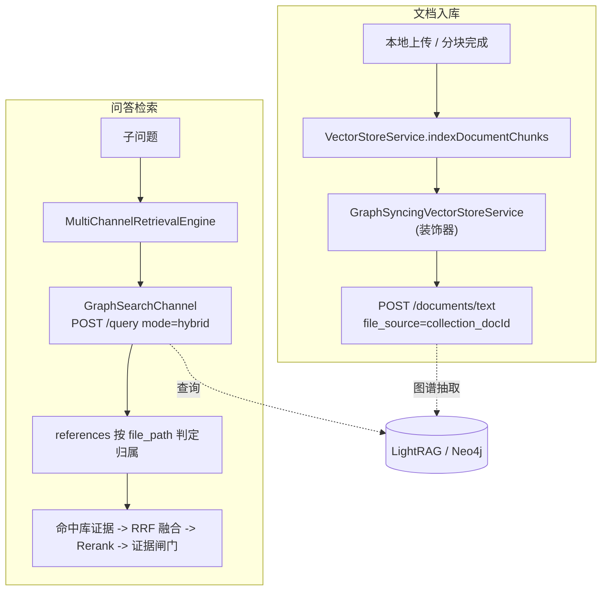
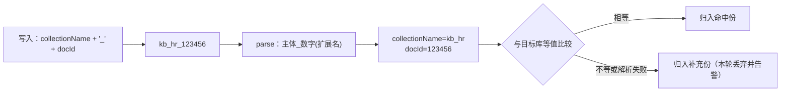

# UP-27 知识图谱检索通道（LightRAG）与图谱可视化

上游对照提交：

| 提交 | 内容 |
| --- | --- |
| `173f17a9 feat(graph): 集成知识图谱功能及图谱数据清理支持` | 图谱后端配置、LightRAG 客户端、写入同步与删除清理 |
| `b6fd8c9e feat(rag): 集成图谱检索通道并优化融合与归因日志` | 图谱检索通道接入多通道引擎、证据归属 |
| `33acb48b` / `4620364d` | 收敛图谱配置与同步逻辑（去掉冗余项） |
| `5276bad2` / `4fa882d8` | 前端图谱可视化页与默认关闭的通道开关 |

## 功能介绍

向量与关键词检索都是「**找相似文本**」：问题与某个 chunk 必须长得像才可能被召回。但校内场景里大量问题
需要的是**多跳关系**：「某专业的培养方案里哪几门课属于同一个课程组」「这份通知提到的责任部门还负责哪些
事项」——这类答案散落在多个文档片段里，单块相似度召回必然漏。

本功能引入**图谱召回**这条与向量 / 关键词正交的通道：

1. **后端是 LightRAG 微服务**（`rag.graph.type=lightrag`）：实体与关系抽取、图存储都在 LightRAG 侧完成
   （其自身可对接 Neo4j），本仓库只通过 HTTP 调用它——**不引入图数据库驱动与连接配置**，换图存储亦不受影响；
2. **写入自动同步**：`GraphSyncingVectorStoreService` 作为 `VectorStoreService` 的装饰器，在向量写入 / 删除
   成功后按**文档粒度**同步图谱（抽取需跨 chunk 合并实体，故按整文而非单块），调用方零改动；
3. **检索通道** `GraphSearchChannel`：`rag.graph.type=lightrag` 时注册，与其它通道并行执行，结果统一进
   RRF 融合与证据闸门；
4. **后台可视化**：`GET /graph/view` 与 `GET /graph/entities` 把 LightRAG 的 `{nodes,edges}` 映射成前端
   可直接渲染的视图，支持按知识库 / 文档过滤与实体搜索。

### 归属判定：单实例即单图

LightRAG 的 `/query` **没有 per-request workspace 参数**（workspace 是实例级、由服务端环境变量固定），
因此「一次查询看的永远是全图」，知识库归属只能在**结果侧**判定：

- 写入时 `file_source` 用 `{collectionName}_{docId}` 编码（`GraphFileSource.encode`）；
- 检索时按 `file_path` 解析回来源（`GraphFileSource.parse`，右锚定末段 `_数字`，因为 docId 是雪花纯数字），
  解析出全名后与目标库**等值比较**——库名可互为前缀（`kb` 与 `kb_hr` 合法共存），子串匹配会串库：
  读侧把别库证据划进主路，删侧连带删光别库数据且不可逆；
- 命中目标库的证据进主份，不归属的进「补充份」（本次实现只保留主份，并对残留记 WARN，见「与上游的差异」）。

### 失败语义：图谱是补充能力

图谱服务的可用性不应决定 RAG 的可用性：检索失败降级为空结果、写入失败只记 WARN、删除是 best-effort；
`rag.graph.type=none`（默认）时通道与装饰器**都不注册**，运行期与「从未引入图谱」等价。

## 验收标准

1. **默认关闭**：`rag.graph.type=none` 时不注册 `LightRagClient` / `GraphSearchChannel` / 图谱装饰器；
   检索链路与未引入图谱时完全一致（通道数量、召回结果不变）。
2. **来源编解码**：`GraphFileSource.encode("kb_hr", "123456")` → `kb_hr_123456`；
   `parse` 能还原 `{collectionName=kb_hr, docId=123456}`，并跳过服务端追加的扩展名与目录前缀；
   不符合编码的 `file_path` 返回 `null`。
3. **检索契约**：`POST {baseUrl}/query`，body 含 `query` / `mode` / `only_need_context=true` /
   `include_references=true` / `include_chunk_content=true` / `top_k`；
   `GET /graphs`、`GET /graph/label/popular`、`GET /graph/label/search` 供可视化使用；
   配置了 `api-key` 时附带 `X-API-Key` 头，未配置时不发送。
4. **证据映射**：`references[].content[]` 拼为 chunk 文本（空则回退 `file_path`），`id` 取 `reference_id`；
   分数为按全图名次递减的中性分 `1/(rank+1)`；`/query` 超时取 `rag.search.channels.timeout-ms`。
5. **降级**：非 2xx、非法 JSON、连接异常、`references` 缺失（`response` 兜底）都不抛异常；
   按库过滤时无法归属的兜底块被丢弃并记 WARN。
6. **写入同步**：向量 `indexDocumentChunks` 成功 → 以文档全文调用 `POST /documents/text`，
   `file_source={collectionName}_{docId}`；`deleteDocumentVectors` 成功 → 按 docId 匹配 `file_path` 后
   `DELETE /documents/delete_document`；单块粒度的更新 / 删除不同步图谱；图谱侧失败只记 WARN。
7. **可视化接口**：`GET /graph/view?entity=&collection=&doc=&depth=&limit=` 返回
   `{nodes:[{id,name,type,description}], edges:[{id,source,target,label,description}], truncated}`；
   范围过滤（doc 优先于 collection）后丢弃悬空边；图谱未启用时返回业务异常提示而不是 500。
8. 可执行验证：

```bash
./mvnw test -pl bootstrap -am '-Dtest=GraphFileSourceTest,LightRagClientTest,GraphQueryServiceTest' -Dsurefire.failIfNoSpecifiedTests=false
cd frontend && npm run test:knowledge-graph
```

期望结果：全部通过（用例用 JDK 内置 `HttpServer` 做本地 stub，不需要真实 LightRAG）。

## 代码位置

| 作用 | 位置 |
| --- | --- |
| 图谱后端配置 | `bootstrap/src/main/java/com/nageoffer/ai/ragent/rag/config/GraphProperties.java` |
| 通道开关与范围 | `bootstrap/src/main/java/com/nageoffer/ai/ragent/rag/config/SearchChannelProperties.java`（`channels.graph`） |
| 来源编解码 | `bootstrap/src/main/java/com/nageoffer/ai/ragent/rag/core/graph/GraphFileSource.java` |
| LightRAG 客户端 | `bootstrap/src/main/java/com/nageoffer/ai/ragent/rag/core/graph/LightRagClient.java` |
| 证据切分结果 | `bootstrap/src/main/java/com/nageoffer/ai/ragent/rag/core/graph/GraphEvidence.java` |
| 图谱检索通道 | `bootstrap/src/main/java/com/nageoffer/ai/ragent/rag/core/retrieve/channel/GraphSearchChannel.java` |
| 写入同步装饰器 | `bootstrap/src/main/java/com/nageoffer/ai/ragent/rag/core/vector/GraphSyncingVectorStoreService.java`、`rag/config/GraphSyncVectorStorePostProcessor.java` |
| 可视化服务与接口 | `bootstrap/src/main/java/com/nageoffer/ai/ragent/rag/core/graph/GraphQueryService.java`、`rag/controller/GraphController.java`、`rag/controller/vo/GraphViewVO.java` |
| 前端 | `frontend/src/services/knowledgeGraphService.ts`、`frontend/src/lib/graphLayout.ts`、`frontend/src/pages/admin/knowledge-graph/KnowledgeGraphPage.tsx` |
| 部署 | `resources/docker/graphrag/README.md`（LightRAG + Neo4j 编排示例，默认不启用） |
| 单元测试 | `bootstrap/src/test/java/.../graph/**`、`frontend/tests/graphLayout.test.mjs` |

配置示例（默认关闭）：

```yaml
rag:
  graph:
    type: none                  # none（默认）/ lightrag
    lightrag:
      base-url: http://127.0.0.1:9621
      api-key: ${LIGHTRAG_API_KEY:}   # 本地部署可留空，留空则不发送鉴权头
      query-mode: hybrid              # naive / local / global / hybrid / mix
  search:
    channels:
      graph:
        enabled: false          # 通道开关；需先把 rag.graph.type 设为 lightrag
        mode: both              # global / intent / both（与关键词通道同款语义）
```

## 相关图表

写入与检索两条链路（装饰器一处覆盖全部向量写调用点）：



GraphFileSource 编解码与归属判定（右锚定末段数字，避免库名互为前缀时串库）：



## 与上游的差异

- **证据配额模型**：上游此时已引入 `RetrievalScope` / `ScopeQuota`（主份 + 补充份按比例分名额）。
  本仓库尚未引入该模型，图谱通道按「命中库证据按 `recallBudget` 截断、补充份丢弃并 WARN」的简化口径实现；
  待 `RetrievalScope` 落地后再对齐分名额语义。
- **前端可视化**：上游用 `@antv/g6`（新增运行时依赖）。本仓库为离线构建环境选择**零依赖 SVG 自绘**
  （力导向布局在 `frontend/src/lib/graphLayout.ts` 中实现并有单测），保留节点 / 边 / 类型配色 / 搜索 /
  缩放 / 点击查看详情等能力；后续如需更强交互再评估引入图可视化库。
- **删除残留**：上游图谱删除是 best-effort（按 `file_path` 反查内部 doc_id 后批量删）。本仓库保持一致，
  并在检索侧对「不归属任何有效库」的证据记 WARN，便于发现残留。
