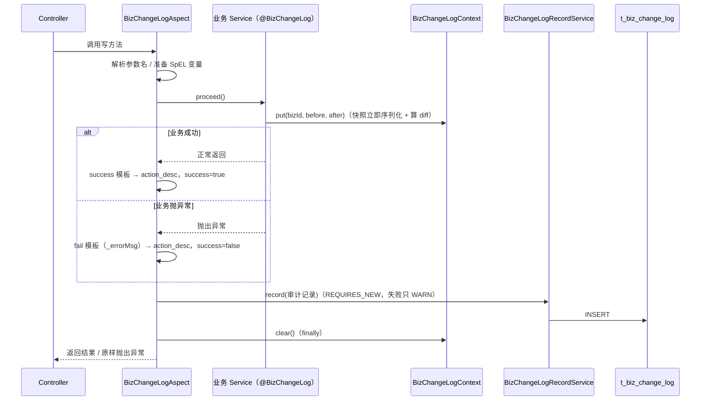
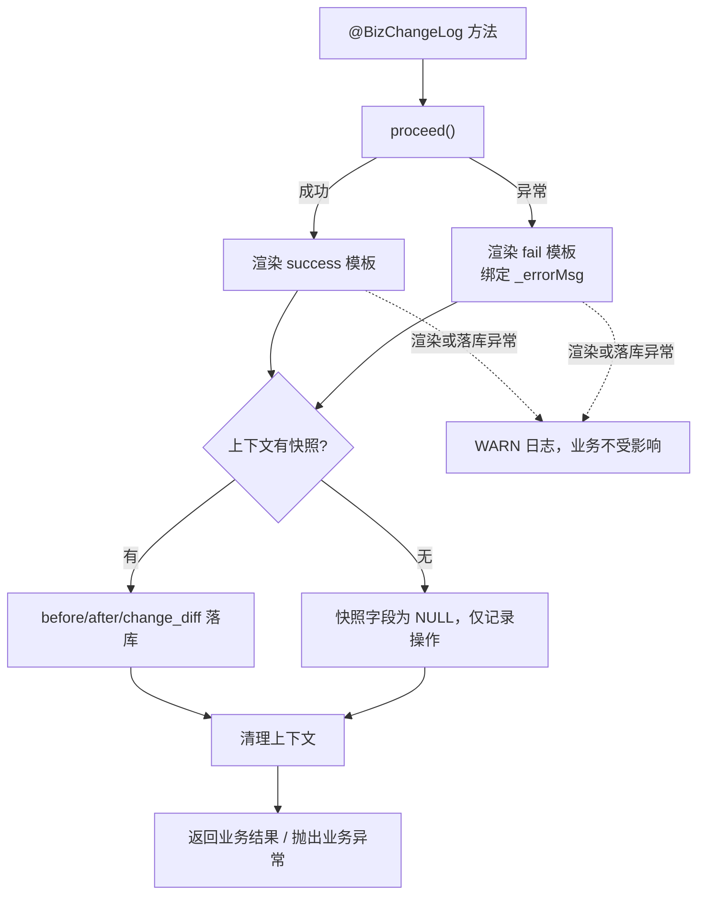

# UP-28 业务变更审计日志

上游对照提交：`951d813e feat(audit): 集成审计日志及变更记录功能`

## 功能介绍

后台管理侧对知识库、文档、意图树、示例问题、关键词映射、用户等对象都有增删改入口，但**谁在什么时候把
什么字段改成了什么**没有任何记录：出问题时只能翻业务表的 `updated_by` / `update_time`，既看不到字段级
差异，也看不到失败的操作（失败的操作连 `updated_by` 都不会落库）。

本功能提供**业务数据变更审计**：在业务方法上标注 `@BizChangeLog`，由 AOP 在方法结束时落一条审计记录，
内容包括：

| 字段 | 含义 |
| --- | --- |
| `biz_type` / `biz_id` | 业务对象类型与主键（如 `KNOWLEDGE_BASE` + kbId） |
| `operation_type` | `CREATE` / `UPDATE` / `DELETE` / `ENABLE` / `DISABLE` / `RUN` |
| `action_desc` | 可读操作描述，模板渲染（如「创建知识库：湖大制度库」） |
| `before_snapshot` / `after_snapshot` | 变更前 / 后快照（JSONB） |
| `change_diff` | 字段级差异数组（JSONB，JSON Pointer 路径 + before/after） |
| `operator_id` / `operator_name` / `operator_role` | 操作人（来自 `UserContext`） |
| `success` / `error_message` | 是否成功、失败原因 |
| `class_name` / `method_name` / `ip` / `user_agent` | 触发位置与来源 |

设计要点：

1. **业务代码只描述「改了什么」**：业务方法内调用 `bizChangeLogContext.put(bizId, before, after)` 提供
   快照，AOP 负责落库。快照在 `put` 时立刻序列化成 JSON，后续实体继续被修改也不会污染已记录的快照。
2. **差异由后端算**：`change_diff` 递归比较两个 JSON，输出 JSON Pointer 路径（数组按下标、对象按键名），
   只保留真正变化的字段；前端不需要再实现一套 diff。
3. **只读流程不参与**：查询方法不标注，审计只覆盖写操作。
4. **失败也要留痕**：业务抛异常时记录 `success=false` + 错误信息，并在**新事务**（`REQUIRES_NEW`）中写入，
   因此业务事务回滚不会把失败记录一起回滚掉——这正是审计最需要的那部分数据。
5. **审计不能影响业务**：快照渲染、表达式求值、落库全部包裹异常处理，审计组件自身的任何异常只记
   `WARN` 日志，不改变业务方法的返回值与异常。
6. **批量操作逐条留痕**：上下文按方法收集多条快照（如意图节点批量启用/停用/删除），切面为每条记录写
   一行审计日志，而不是把整批压成一条看不出差异的记录。
7. **敏感字段不入快照**：用户口令在写入快照前显式置空，审计表不保存明文口令。

### 附带修正：无分块的文档也能「启用」

同一次上游提交还顺手修了一处状态问题：文档在**没有分块**时点「启用」原本直接 `return`，
既不落库也不提示，用户会觉得按钮失效。现在这类情况仍会更新启用状态（跳过向量重建），
审计记录也如实反映这次状态变更。

### 与上游实现的差异（有意为之）

上游用第三方库 `io.github.mouzt:bizlog-sdk`（`@LogRecord` + `LogRecordContext` + SpEL 模板）。本仓库**不引入
该依赖**，改为自带一套等价实现：

| 关注点 | 上游 | 本仓库 |
| --- | --- | --- |
| 注解 | `@LogRecord(success/fail/type/subType/bizNo/extra/condition)` | `@BizChangeLog(success/fail/bizType/operationType/bizId)` |
| 上下文 | `LogRecordContext`（bizlog 提供） | `BizChangeLogContext`（自带 `ThreadLocal`） |
| 模板 | bizlog 的 `{{#var}}` + SpEL | 同形态 `{{...}}` 模板，用 Spring 自带 `SpelExpressionParser` 求值 |
| 依赖 | 新增 `bizlog-sdk` + `javax.validation:validation-api` | 无新增依赖（Spring AOP / SpEL / Jackson 均为既有依赖） |

理由：本仓库是校内自研版本，模块边界保持 `bootstrap` / `framework` / `infra-ai` / `mcp-server`，且构建走
离线（`./mvnw -o`）；为一条审计链路引入新依赖与 `javax.validation` 老版本传递依赖得不偿失。语义（字段、
失败留痕、差异计算、降级不影响业务）与上游一致。

## 验收标准

1. **落库内容完整**：一次成功的新增/更新/删除操作后，`t_biz_change_log` 新增一行，`biz_type`、`biz_id`、
   `operation_type`、`action_desc`、`operator_id`、`success=true` 均正确；更新操作同时写入
   `before_snapshot` / `after_snapshot` / `change_diff`。
2. **差异只含变化字段**：`change_diff` 是数组，元素形如 `{"field":"/name","before":"旧","after":"新"}`；
   未变化的字段不出现；嵌套对象用 `/a/b`、数组用 `/list/0` 表示。
3. **失败留痕且不吞异常**：业务方法抛异常时写入 `success=false`，`error_message` 含异常信息，且异常继续
   向调用方抛出（业务错误码不变）；该记录在业务事务回滚后**仍存在**（新事务写入）。
4. **审计故障不影响业务**：审计落库或模板渲染抛异常时，业务方法照常返回结果，仅输出 `WARN` 日志。
5. **上下文不串场**：`put` 的记录只归当次标注方法所有，方法结束后上下文被清理（线程复用/池化不会把
   上一次的快照带到下一次记录）。
6. **查询接口**：`GET /biz-change-logs` 支持 `bizType` / `bizId`（模糊）/ `operationType` / `operatorId` /
   `operatorName`（模糊）/ `success` / 时间范围分页查询，按 `create_time` 倒序返回；
   `GET /biz-change-logs/{id}` 返回单条详情。
7. **批量操作多条记录**：一次批量启用 / 停用 / 删除 N 个意图节点时写入 N 行审计，每行的
   `before_snapshot` / `after_snapshot` / `change_diff` 对应该节点自身的变化。
8. **口令不入快照**：用户新增 / 更新 / 删除的审计记录中，`password` 字段不出现在快照与差异里。
9. **前端可看**：管理台「变更记录」页可按业务类型、操作类型、结果、时间范围筛选并分页；列表展示时间、
   业务对象、操作、操作人、结果；点击某行展开详情，展示字段级差异（旧 → 新）与原始 JSON 快照。
10. **可执行验证**：

```bash
./mvnw test -pl bootstrap -am '-Dtest=BizChangeLogContextTest,BizChangeLogAspectTest' -Dsurefire.failIfNoSpecifiedTests=false
cd frontend && npm run test:change-logs
```

期望结果：全部通过。

### 已知边界

- 审计记录在业务方法返回/抛异常**当下**写入，若业务方法正常返回、但所在事务在提交阶段才失败（如延迟到
  `commit` 的约束冲突），该行会记为 `success=true`。这与上游行为一致；如需覆盖该场景，需要把落库挂到
  事务同步回调上，属后续可选项。
- 快照是**整对象**序列化，含 `create_time` / `update_time` 等字段的更新也会出现在 `change_diff` 中。

## 代码位置

| 作用 | 位置 |
| --- | --- |
| 业务类型 / 操作类型常量 | `bootstrap/src/main/java/com/nageoffer/ai/ragent/audit/constant/BizChangeBizType.java`、`BizChangeOperationType.java` |
| 变更注解 | `bootstrap/src/main/java/com/nageoffer/ai/ragent/audit/annotation/BizChangeLog.java` |
| 上下文与差异计算 | `bootstrap/src/main/java/com/nageoffer/ai/ragent/audit/support/BizChangeLogContext.java` |
| 模板求值（`{{}}` + SpEL） | `bootstrap/src/main/java/com/nageoffer/ai/ragent/audit/support/BizChangeLogTemplateEvaluator.java` |
| AOP 切面 | `bootstrap/src/main/java/com/nageoffer/ai/ragent/audit/aspect/BizChangeLogAspect.java` |
| 审计落库（新事务） | `bootstrap/src/main/java/com/nageoffer/ai/ragent/audit/service/BizChangeLogRecordService.java` |
| 表实体 / Mapper | `bootstrap/src/main/java/com/nageoffer/ai/ragent/audit/dao/entity/BizChangeLogDO.java`、`dao/mapper/BizChangeLogMapper.java` |
| 查询服务 | `bootstrap/src/main/java/com/nageoffer/ai/ragent/audit/service/BizChangeLogService.java`、`service/impl/BizChangeLogServiceImpl.java` |
| 查询接口 | `bootstrap/src/main/java/com/nageoffer/ai/ragent/audit/controller/BizChangeLogController.java`（`request/`、`vo/`） |
| 表结构与升级脚本 | `resources/database/schema_pg.sql`、`resources/database/upgrades/v1.1.0/006_biz_change_log.sql` |
| 埋点（写操作） | `knowledge/service/impl/KnowledgeBaseServiceImpl`、`knowledge/service/impl/KnowledgeDocumentServiceImpl`、`ingestion/service/impl/IntentTreeServiceImpl`、`rag/service/impl/SampleQuestionServiceImpl`、`rag/service/impl/QueryTermMappingAdminServiceImpl`、`user/service/impl/UserServiceImpl` |
| 前端接口 / 页面 | `frontend/src/services/bizChangeLogService.ts`、`frontend/src/pages/admin/change-logs/BizChangeLogPage.tsx`、`frontend/src/lib/changeLogDiff.ts` |
| 单元测试 | `bootstrap/src/test/java/com/nageoffer/ai/ragent/audit/**`、`frontend/tests/changeLogDiff.test.mjs` |

配置：本功能无需新增配置项（开关随审计埋点，`rag.trace.enabled` 不影响审计）。

埋点示例：

```java
@BizChangeLog(
        bizType = BizChangeBizType.KNOWLEDGE_BASE,
        operationType = BizChangeOperationType.UPDATE,
        bizId = "#requestParam.id",
        success = "更新知识库：{{#requestParam.id}}",
        fail = "更新知识库失败：{{#_errorMsg}}"
)
public void update(KnowledgeBaseUpdateRequest requestParam) {
    KnowledgeBaseDO before = BeanUtil.copyProperties(kb, KnowledgeBaseDO.class);
    ...
    bizChangeLogContext.put(requestParam.getId(), before, knowledgeBaseMapper.selectById(requestParam.getId()));
}
```

## 相关图表

一次写操作从注解到落库的链路：



判定流程与降级：



差异计算示例（只留变化字段）：

| 路径 | before | after |
| --- | --- | --- |
| `/name` | 湖大制度库 | 湖大制度库（2026） |
| `/embeddingModel` | qwen3.7-text-embedding | text-embedding-v4 |
| `/updateTime` | 2026-09-01 10:00:00 | 2026-09-26 12:30:00 |
