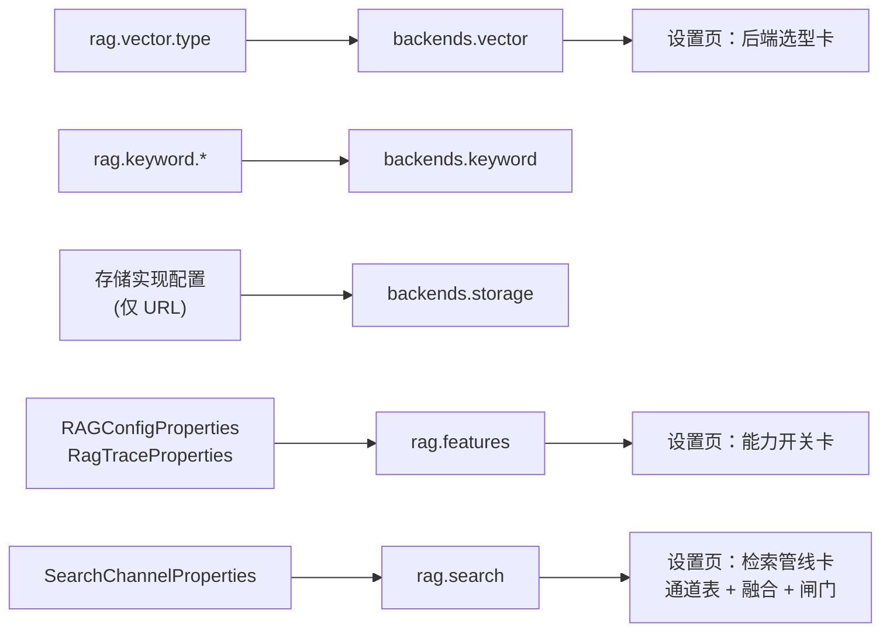

# UP-29 系统配置页与设置接口（引擎 / 后端选型 / 检索管线）

上游对照提交：`5a1af64b feat(admin): 完善系统配置页展示和后端设置接口`

## 功能介绍

分叉点之后的检索内核发生了多次结构性变化（多通道 fan-out、RRF 融合、召回预算、通道超时降级、
关键词后端可切换、证据闸门），但这些**真正决定检索结果的参数**只存在于 `application.yaml`，
后台「系统设置」页看不到。运营与开发要回答「线上到底开了几个通道、召回预算多少、闸门阈值多少、
关键词后端接的是谁」只能登录服务器翻配置。

本功能把配置拆成三块只读视图，和既有 AI 模型配置一起，构成「设置页 = 当前生效配置的唯一视图」：

| 视图 | 内容 |
| --- | --- |
| **后端选型** `backends` | 向量后端（`rag.vector.type`）、关键词后端（`rag.keyword.type` 与 ES 索引/地址/分词器）、文件存储（平台与访问地址） |
| **能力开关** `rag.features` | 查询改写、Rerank、行内引用、上下文富化、链路追踪 |
| **检索管线** `rag.search` | 最终 TopK、召回预算、融合（策略 / RRF k / 候选上限）、证据闸门阈值、通道开关与阈值（含通道级超时） |

同时把 `rag.default.sse-timeout-ms` 补进原有的 `rag.default` 视图。

**只读**：本功能不提供写接口。检索参数会改变检索顺序与阈值，线上变更必须走配置 + 重启，
页面只负责让现状可核对；后续若要做在线改配置，需要先有配置中心与热更新语义（不在本功能范围）。

**安全**：后端选型里的访问地址只暴露 URL / 索引名 / 分词器，**不暴露任何凭据**（`rustfs.access-key-id`、
`secret-access-key`、数据源口令、模型 api-key 一律不返回；模型 api-key 沿用既有掩码逻辑）。

## 验收标准

1. **后端选型**：`ai` 之外新增 `backends`，`vector.type` 取自 `rag.vector.type`；
   `keyword.type` 取自 `rag.keyword.type`，为 `es` 时返回 `index` / `uris` / `analyzer` / `searchAnalyzer`；
   `storage.platform` 与 `storage.endpoint` 反映当前使用的存储实现。
2. **能力开关**：`rag.features` 返回 `queryRewrite` / `rerank` / `citation` / `contextEnrich` / `trace`
   五个布尔值，取值与 `RAGConfigProperties`、`RagTraceProperties` 一致（不是硬编码）。
3. **检索管线**：`rag.search` 返回 `defaultTopK`、`recallBudget`、`fusion.{strategy,rrfK,rerankCandidateLimit}`、
   `evidence.minRerankScore`、`channels.timeoutMs`、以及三个通道的开关与阈值
   （`vectorGlobal.enabled/confidenceThreshold/singleIntentSupplementThreshold`、
   `intentDirected.enabled/minIntentScore`、`keyword.enabled/mode`）。
4. **召回预算口径一致**：接口返回的 `recallBudget` 与后端实际生效值一致——显式配置 `>0` 时用配置值，
   否则回退 `fusion.rerankCandidateLimit`（与 `SearchChannelProperties.Scope.resolveRecallBudget` 同源）。
5. **不泄露凭据**：响应中不出现 `access-key-id` / `secret-access-key` / 数据源口令等字段。
6. **前端可核对**：设置页新增「后端选型」「能力开关」「检索管线」三张卡片；
   检索管线卡展示通道表（通道名 / 开关 / 关键阈值）与融合、闸门参数；
   所有字段缺失时显示 `-` 而不是空白或报错。
7. 可执行验证：

```bash
./mvnw test -pl bootstrap -am '-Dtest=RAGSettingsControllerTest' -Dsurefire.failIfNoSpecifiedTests=false
cd frontend && npm run test:retrieval-settings
```

期望结果：全部通过。

## 代码位置

| 作用 | 位置 |
| --- | --- |
| 设置视图对象（新增 `BackendSettings` / `FeatureSettings` / `SearchSettings`） | `bootstrap/src/main/java/com/nageoffer/ai/ragent/rag/controller/vo/SystemSettingsVO.java` |
| 设置接口（`toBackendSettings` / `toFeatureSettings` / `toSearchSettings`） | `bootstrap/src/main/java/com/nageoffer/ai/ragent/rag/controller/RAGSettingsController.java` |
| 配置来源 | `rag/search=SearchChannelProperties`、`rag/keyword=KeywordProperties`、`rag/config=RAGConfigProperties`、`rag/trace=RagTraceProperties`、`rag/default=RAGDefaultProperties` |
| 前端接口类型 | `frontend/src/services/settingsService.ts` |
| 前端展示逻辑（可单测） | `frontend/src/lib/settingsRetrieval.ts` |
| 前端页面 | `frontend/src/pages/admin/settings/SystemSettingsPage.tsx` |
| 后端单元测试 | `bootstrap/src/test/java/com/nageoffer/ai/ragent/rag/controller/RAGSettingsControllerTest.java` |
| 前端单测 | `frontend/tests/settingsRetrieval.test.mjs`（`npm run test:retrieval-settings`） |

新增返回结构（节选）：

```json
{
  "backends": {
    "vector": { "type": "pg" },
    "keyword": { "type": "none", "index": "rag_keyword_store", "uris": "http://127.0.0.1:9200" },
    "storage": { "platform": "s3-compatible", "endpoint": "http://127.0.0.1:9000" }
  },
  "rag": {
    "features": { "queryRewrite": true, "rerank": true, "citation": true, "contextEnrich": true, "trace": true },
    "search": {
      "defaultTopK": 10,
      "recallBudget": 50,
      "channels": { "timeoutMs": 15000, "vectorGlobal": { "enabled": true }, "keyword": { "enabled": false } },
      "fusion": { "strategy": "rrf", "rrfK": 60, "rerankCandidateLimit": 50 },
      "evidence": { "minRerankScore": 0.2 }
    }
  }
}
```

## 相关图表

配置来源到页面的只读映射：



检索管线的展示口径（页面看到的即线上生效值）：

| 展示项 | 来源 | 说明 |
| --- | --- | --- |
| 最终 TopK | `rag.search.default-top-k` | 进入上下文的条数（不是通道取数深度） |
| 召回预算 | `scope.recall-budget`，`<=0` 时取 `fusion.rerank-candidate-limit` | 通道取数深度，超预算部分下游必被截断 |
| 融合 | `fusion.strategy` / `rrf-k` / `rerank-candidate-limit` | 多通道按名次融合后的候选池上限 |
| 证据闸门 | `evidence.min-rerank-score` | 整批最高精排分低于该值即整批丢弃，`0` 关闭 |
| 通道 | `channels.*` | 各通道开关、阈值与通道级超时（超时按空结果降级） |

## 与上游的差异

- 上游该提交把设置页整体重写（约 900 行页面 + 264 行全局样式）。本仓库维持自研设置页的布局与样式，
  只**增补三张卡片**并复用既有 `Card` / `Table` / `Badge` 组件，避免为展示层引入一次性样式债。
- 上游返回 `engine.type`（Agent / RAG 编排模式）。本仓库尚无编排模式（随批次八的 Agent 体系落地），
  因此不返回该字段；接入编排模式时在 `SystemSettingsVO` 上补 `engine` 即可。
- 上游的存储后端支持 `s3` / `oss` 两种平台。本仓库当前只有 S3 兼容实现（`rustfs`），
  故 `backends.storage.platform` 固定为 `s3-compatible`，待接入多存储实现后再按 `type` 分流。
