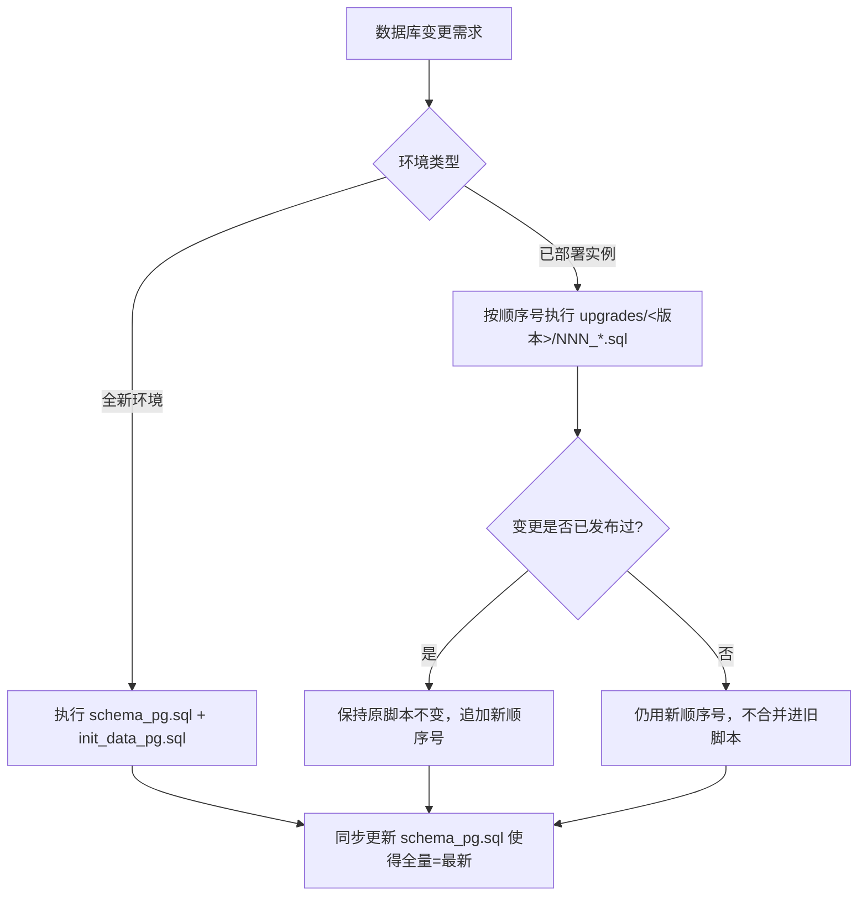

# UP-30 数据库升级脚本体系

上游对照提交：

- `53730fe2 feat(database): 完成 v1.1.0 版本数据库结构升级`
- `abcf9095 refactor(database): 优化数据库升级脚本命名规范`
- `fc50ca8d fix(database): 更新意图节点表注释以兼容旧版本`

## 功能介绍

随着上游能力补齐，数据库会持续新增字段与表（消息思考内容、资料引用、业务变更日志、意图多知识库等）。分叉点版本只有一个「按源版本到目标版本」命名的升级脚本，随着版本推进会出现三个问题：

1. **命名无法排序**：`upgrade_v1.0_to_v1.1.sql`、`upgrade_v1.1_to_v1.2.sql` 隐含了「必须恰好从上一版升级」，跳版或补执行时无法判断顺序；
2. **脚本被就地修改**：后来的变更继续写进同一个文件，已经执行过的实例无法判断自己缺哪一段；
3. **没有目录级说明**：新人不知道全量初始化与增量升级的边界，容易出现「删数据卷重跑 schema」这类危险动作。

本功能把数据库脚本收敛成一套可排序、可审计的约定：

```
resources/database/
├── README.md              # 目录级维护说明
├── schema_pg.sql          # 最新全量结构
├── init_data_pg.sql       # 最新初始化数据
├── backups/               # 历史备份，不作为变更入口
└── upgrades/
    └── v1.1.0/
        ├── 001_knowledge_chunk_log_duration.sql
        └── 002_message_thinking.sql
```

规则：

1. `upgrades/<正式版本>/` 按发布版本分目录，目录内用「三位顺序号_变更含义」命名；
2. 已部署实例按顺序号逐个执行，**不合并**成过程脚本；
3. 已经对外提供或被执行过的脚本保持不变，新变更一律追加新顺序号（如 `003_xxx.sql`）；
4. 全量初始化只跑 `schema_pg.sql` + `init_data_pg.sql`，不需要再跑历史升级脚本。

本仓库同时把既有的两个脚本迁入新结构（内容不变，仅改文件头注释与路径）：

| 原路径 | 新路径 | 含义 |
| --- | --- | --- |
| `upgrade_v1.0_to_v1.1.sql` | `upgrades/v1.1.0/001_knowledge_chunk_log_duration.sql` | 分块日志表拆分计时字段 |
| `upgrade_v1.1_to_v1.2.sql` | `upgrades/v1.1.0/002_message_thinking.sql` | `t_message` 新增思考内容与耗时 |

## 验收标准

1. `resources/database/upgrades/v1.1.0/` 下存在按顺序号命名的两个脚本，文件名与文档表格一致；
2. 两个脚本的 SQL 语句与迁移前**完全一致**（本功能只做重命名与文件头注释调整，不改变任何 DDL）；
3. `resources/database/` 根目录不再存在 `upgrade_vX_to_vY.sql` 形式的脚本，仓库内也没有引用旧路径的地方；
4. `resources/database/README.md` 与 `docs/database/README.md` 都描述同一套约定（目录划分、顺序号、禁止就地修改、禁止重跑全量）；
5. `deploy/compose.yaml` 仍只挂载 `schema_pg.sql` 与 `init_data_pg.sql`，行为不变；
6. 可执行验证：

```bash
# 脚本仍可被 PostgreSQL 解析（无语法改动，做静态核对）
git log --oneline -1 -- resources/database/upgrades/v1.1.0
node test/validate-ai-dev-template.mjs
```

期望结果：模板校验脚本通过，且 `docs/database/README.md` 中不再出现旧的 `upgrade_vX_to_vY.sql` 约定。

## 代码位置

| 作用 | 位置 |
| --- | --- |
| 目录级维护说明 | `resources/database/README.md` |
| 升级脚本目录 | `resources/database/upgrades/v1.1.0/` |
| 项目数据库约定 | `docs/database/README.md` |
| 部署挂载点（不变） | `deploy/compose.yaml` |

后续新增数据库变更（如 UP-10 的意图多知识库、UP-28 的审计日志、UP-33 的智能体管理）都必须在本目录下追加脚本。

## 相关图表



版本目录与脚本的对应关系：

| 正式版本 | 目录 | 脚本数 |
| --- | --- | --- |
| v1.1.0 | `resources/database/upgrades/v1.1.0/` | 2（001、002） |
