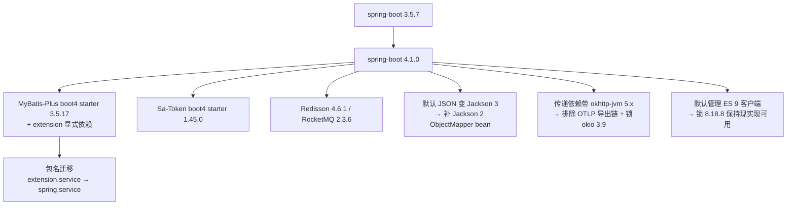

# UP-31 Spring Boot 4 升级

上游对照提交：`7f3a7f38 Spring Boot 4 升级与依赖架构调整`。

## 功能介绍

上游把 Spring Boot 升到 4.x，这是批次八（Agentic 体系）的前置：AgentScope、新的可观测性栈与 Boot 4 的
自动配置模型是配套的。本仓库此前停在 3.5.7，本次按要求完成升级。

升级不是「改一个版本号」，而是一次**依赖矩阵重排**：Boot 4 换了默认 JSON 实现、若干第三方 starter
也换了坐标。本次落地范围：

| 位置 | 变更 | 原因 |
| --- | --- | --- |
| `spring-boot.version` | `3.5.7` → `4.1.0` | 主版本升级（上游同版本） |
| MyBatis-Plus | `mybatis-plus-spring-boot3-starter:3.5.14` → `mybatis-plus-spring-boot4-starter:3.5.17` + 显式 `mybatis-plus-extension` | Boot 4 需要 boot4 starter；3.5.17 起 `extension` 不再传递依赖，`IService` / `ServiceImpl` 也迁到了新包 |
| Sa-Token | `sa-token-spring-boot3-starter:1.43.0` → `sa-token-spring-boot4-starter:1.45.0` | 官方为 Boot 4 提供的新 starter 坐标 |
| Redisson | `4.0.0` → `4.6.1` | Boot 4 适配版（自动配置类为 `RedissonAutoConfigurationV4`） |
| RocketMQ starter | `2.3.5` → `2.3.6` | 与 Boot 4 共存的可用版本 |
| **Jackson 2 `ObjectMapper` bean** | 新增 `Jackson2Config` | Boot 4 默认 JSON 换成了 Jackson 3，容器里不再有 `com.fasterxml.jackson.databind.ObjectMapper`；本项目大量既有代码基于 Jackson 2 |
| **排除 RocketMQ 的 OTLP 导出链** | `framework/pom.xml` 排除 `io.opentelemetry:opentelemetry-exporter-otlp` | 该导出链会带 `okhttp-jvm:5.x`，与本项目使用的 OkHttp 4.12 同名类冲突（运行期 `NoSuchMethodError: Okio.socket`）；本项目不使用 OTel 导出 |
| **Okio 锁 3.9.0** | 新增 `okio.version` | 链路里仍存在 `okhttp-jvm 5.3.2`（其他传递依赖），OkHttp 4.12 默认的 okio 3.6 缺它需要的方法，统一到 3.9 后两者都能跑 |
| **Elasticsearch 客户端锁 8.18.8** | 新增 `elasticsearch-client.version` | Boot 4 默认管理 ES 9 客户端，其传输层已换名；本项目 `EsClientConfig` 基于 ES 8 的 low-level REST client。关键词检索默认关闭，先锁版本保持可用，迁 ES 9 客户端另行评估 |
| 意图树 Service 导入 | `com.baomidou.mybatisplus.extension.service[.impl]` → `com.baomidou.mybatisplus.spring.service[.impl]` | MyBatis-Plus 3.5.17 的包结构调整 |

**刻意不做的**：不迁移到 Jackson 3（影响面覆盖所有 JSON 处理与客户端兼容性，属独立议题）；
不迁到 ES 9 客户端（关键词检索默认关闭，先保可用）；不引入 AgentScope（架构决策 2 已定自研引擎）。

## 验收标准

1. **编译**：`./mvnw -pl bootstrap -am -DskipTests compile` 与 `-pl mcp-server` 均通过。
2. **测试**：`./mvnw -pl bootstrap -am clean test` → **291 项、0 失败、1 跳过**；错误仅为环境依赖
   （Redis / PostgreSQL / Milvus / 真实模型未启动）的 `@SpringBootTest`，与本项目 3.5.7 基线的错误类别一致。
   `./mvnw -pl mcp-server -am test` → **18 项、0 失败**。
3. **上下文可启动**：容器启动阶段不再出现 `No qualifying bean of type 'com.fasterxml.jackson.databind.ObjectMapper'`
   之类的装配错误；Boot 4 下 Redisson 自动配置类为 `RedissonAutoConfigurationV4`（证明确实跑在 Boot 4）。
4. **无运行期版本冲突**：infra-ai 的 OkHttp 相关测试（`BaiLianEmbeddingBatchTest`、`BaiLianRerankClientTest`）
   不再抛 `NoSuchMethodError: okio.Okio.socket`。
5. **离线可构建**：新依赖已进本地仓库后，`./mvnw -o -pl bootstrap -am clean test` 能解析全部依赖。
6. 可执行验证：

```bash
./mvnw -pl bootstrap -am clean test
./mvnw -pl mcp-server -am test
```

## 代码位置

| 作用 | 位置 |
| --- | --- |
| 版本与依赖矩阵 | `pom.xml`（`spring-boot.version`、`mybatis-plus-*`、`sa-token`、`redisson`、`rocketmq`、`okio.version`、`elasticsearch-client.version`） |
| Jackson 2 `ObjectMapper` | `framework/src/main/java/com/nageoffer/ai/ragent/framework/config/Jackson2Config.java` |
| MyBatis-Plus / Sa-Token 坐标与排除 | `framework/pom.xml` |
| OTLP 排除（OkHttp 版本单一） | `framework/pom.xml`（RocketMQ starter 的 exclusion） |
| ES 客户端锁版本 | `pom.xml` dependencyManagement |
| 意图树包名调整 | `bootstrap/src/main/java/.../ingestion/service/IntentTreeService.java`、`.../service/impl/IntentTreeServiceImpl.java` |

## 相关图表



## 与上游的差异

- **版本细节**：上游用 `mybatis-plus 3.5.17`、`sa-token 1.45.0`、`redisson 4.6.1`、`rocketmq 2.3.6`（本次完全对齐）；
  上游 MCP SDK 用 `0.17.0`（其 AgentScope 传递依赖压制后的版本），本仓库仍用已落地的 `1.1.2`，因此**多了一组
  OkHttp/Okio 冲突需要自己收口**（见上表）。
- **不上 Jackson 3**：上游同期代码也已改为 Jackson 3 体系；本仓库为控制改动面先保留 Jackson 2，
  迁移作为独立议题（涉及注解包名、Feature 开关与 ES/MCP 客户端兼容性）。
- **不上 ES 9 客户端**：上游用 ES 9 客户端；本仓库关键词检索默认关闭，先锁 8.18.8 保证「打开就能用」。
