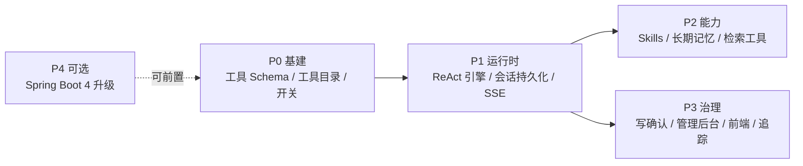
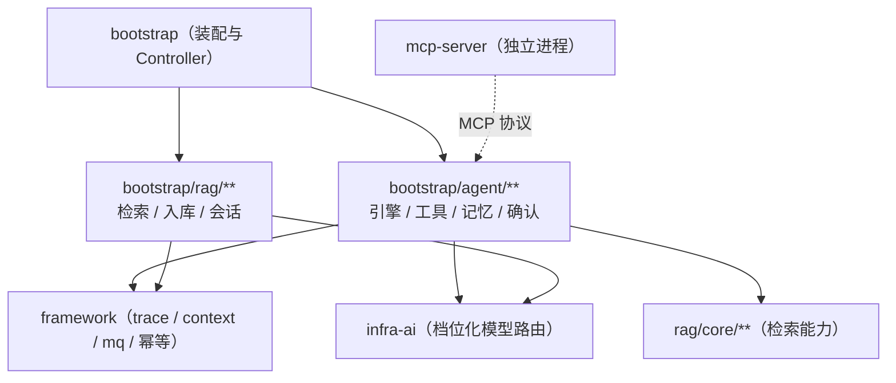

# 批次八（Agentic 体系）架构决策与实施计划

上游对照范围：`020e5c3d`（模块拆分与 Agent 执行架构）之后的 Agent 相关提交，覆盖
UP-31 Spring Boot 4、UP-32 Agent 运行时、UP-33 智能体管理、UP-34 写操作确认、UP-35 Skills、
UP-36 长期记忆、UP-37 LangFuse、UP-39/40 工具目录与身份透传、UP-41 初始化器、UP-44 前端仪表盘。

本文是**动手前的架构决策记录（ADR）**：先把「搬什么、按什么顺序搬、哪些地方要有意不同」定下来，
再逐阶段实现。上游在这一批里单次提交涉及数百个文件与一次 Spring Boot 大版本升级，
不做分阶段与决策记录直接搬运，风险不可控。

## 一、上游 Agent 体系的真实范围（调研结论）

上游 `agent` 模块（约 131 个源文件）由这些部分构成：

| 包 | 职责 | 代表类 |
| --- | --- | --- |
| `agent/config` | 引擎装配与开关 | `AgentEngineConfiguration`、`AgentProperties`、`ReActAgentProvider`、`ConditionalOnAgentEngine` |
| `agent/tool` | 工具目录与 MCP 桥接 | `AgentToolCatalog`、`McpToolBridge`、`KnowledgeSearchTool` |
| `agent/confirm` | 写操作人工确认 | `AgentConfirmDenialMiddleware`、`AgentConfirmPayload` |
| `agent/memory` | 长期记忆与上下文压缩 | `AgentMemoryExtractor`、`AgentMemoryConsolidator`、`AgentContextCompactor` |
| `agent/skill` | 技能手册加载 | 技能加载工具与 Skill 目录 |
| `agent/dao` + `agent/state` | 会话 / 消息 / 记忆 / 运行态持久化 | `AgentConversationDO`、`AgentMemoryDO`、`AgentStateMapper` |
| `agent/controller` + `agent/dto` | SSE 事件、消息块、元信息 | `AgentChatController`、`AgentBlock`、`AgentSSEEventType` |
| `agent/admin` + `agent/trace` + `agent/dashboard` | 后台指标与链路 | `AgentDashboardService`、LangFuse 集成 |
| `frontend` | Agent 聊天页、确认卡片、记忆管理、图谱页 | — |

依赖侧上游引入了 **AgentScope**（`io.agentscope:agentscope-core 2.0.2`）作为 ReAct 引擎，
并把 Spring Boot 升到 **4.1.0**；同时 module 结构调整为
`framework / infra-ai / system / rag / agent / bootstrap / mcp-server`。

## 二、决策

### 决策 1：不照搬模块拆分，Agent 先以「包边界」内聚在 `bootstrap`

| 选项 | 结论 |
| --- | --- |
| A. 同步把工程拆成 `system` / `rag` / `agent` 模块 | **不采用**。一次改动 Maven 结构 + 包名 + 依赖方向 + 部署脚本 + 前端构建，回归面远大于收益；且我们尚未做 Spring Boot 4 迁移，在旧版本上做结构性搬迁会把两类风险叠在一起 |
| B. 保持现有模块边界，Agent 代码以 `bootstrap/com/nageoffer/ai/ragent/agent/**` 包内聚 | **采用**。依赖方向仍是 `bootstrap → framework + infra-ai`，与 `docs/upstream/roadmap.md`「不搬运模块架构」一致；包边界足以约束「Agent 不反向依赖 rag 的 Controller」 |

包边界约定（等同模块边界纪律）：

- `agent/**` 可以依赖 `framework`、`infra-ai`、`rag/core/**`（检索能力）、`rag/dao/**`；
- `rag/**` **不得**依赖 `agent/**`（避免循环）；
- 跨切面能力（SSE 事件、确认卡、消息块）放在 `agent/dto`，由 `bootstrap` 的 Controller 层组装。

### 决策 2：ReAct 引擎先自研最小实现，抽象成接口预留替换空间

上游用 AgentScope 承载 ReAct 循环、中间件与记忆钩子。本仓库的环境约束是**离线构建**、
且已有一套自研基建（档位化模型路由 `LLMService`、MCP 工具执行器、SSE 流式回答、`@RagTraceNode` 链路追踪）。

| 选项 | 结论 |
| --- | --- |
| A. 引入 AgentScope | 暂不采用：新增第三方依赖需联网下载，且 AgentScope 自带 MCP SDK 0.17.0 会与既有 1.1.2 冲突（上游要靠 `dependencyManagement` 压制并禁止 agent 模块使用其 MCP 客户端）；校内版没有必要为引擎能力付这个复杂度 |
| B. 自研最小 ReAct 循环：`think → tool call → observe → think`，工具目录复用既有执行器 | **采用**。引擎以 `AgentEngine` 接口暴露，`bootstrap/agent/engine/ReActAgentEngine` 为默认实现 |

自研引擎的边界（刻意不做的事）：不做多智能体编排、不做工具并行调度、不做可视化编排。
这些能力在本仓库的实际使用场景里没有明确需求。

### 决策 3：Spring Boot 4 升级单独一轮做，先不混在 Agent 里

Spring Boot 4 会牵动 MyBatis-Plus、RocketMQ、Sa-Token、Milvus SDK、Elasticsearch 客户端等一整套依赖，
必须先完成「构建 + 全量测试基线通过」再谈业务迁移。执行顺序：**Boot 4 升级（UP-31）→ Agent 运行时（UP-32）**。
若升级中遇到阻塞依赖，优先保持 Boot 3 并记录阻塞点，不为了版本号牺牲可运行性。

### 决策 4：数据库独立升到 v1.2.0

Agent 需要新表（会话、消息、运行态、记忆、记忆抽取任务、上下文压缩）。按既有约定：
新增 `resources/database/upgrades/v1.2.0/NNN_*.sql`，同步 `schema_pg.sql` 与 `docs/database/README.md`，
不修改已发布的 v1.1.0 脚本。

### 决策 5：写操作确认（UP-34）是**能力边界**，不是可选装饰

Agent 会调用写工具（下单、改资产）。本仓库的定位是校内知识问答 + 受控工具，因此确认流程按
「**默认拒绝、显式确认**」实现：写工具未拿到确认即不执行（`AgentConfirmDenialMiddleware` 同款语义），
且确认卡展示的字段名使用工具 schema 里的 `title`（`McpToolSchema` 已支持）。

## 三、分阶段实施计划

每个阶段都遵循既有约定：先补 `docs/upstream/features/` 下的实现文档（功能介绍 / 验收标准 / 代码位置 /
相关图表），再改代码，验证后本地提交。

| 阶段 | 内容 | 依赖 | 交付物 |
| --- | --- | --- | --- |
| **P0 基建**（可立即开始） | MCP 工具基建（✅ `McpToolSchema` / `McpToolResults` / `McpToolException` 已落地）、工具目录 `AgentToolDescriptor` + 只读工具注册、Agent 开关配置 `ai.agent.enabled` | 无 | 文档 + 单测 |
| **P1 运行时** | `AgentEngine` 接口 + `ReActAgentEngine`（think/tool/observe 循环、最大步数、工具白名单、取消语义复用 `TaskCancellation`）、会话与消息持久化（v1.2.0）、`/agent/chat` SSE 接口与消息块协议 | P0 | 文档 + 单测 + 一次端到端冒烟（需真实 LLM Key） |
| **P2 能力** | Skills（技能手册加载）、长期记忆（抽取 / 合并 / 上下文压缩）、知识库检索工具接入 Agent | P1 | 文档 + 单测 |
| **P3 治理** | 写操作确认卡（UP-34）、Agent 管理后台（UP-33）、前端 Agent 聊天页与仪表盘（UP-44）、LangFuse 追踪（UP-37） | P1 | 文档 + 单测 + 前端构建通过 |
| **P4 可选** | UP-31 Spring Boot 4 升级（✅ 已独立轮落地，见 [`up-31-spring-boot4.md`](up-31-spring-boot4.md)）、UP-41 初始化器示例（✅ 已落地） | — | 文档 + 全量测试基线 |

阶段验收统一口径：

1. 阶段内每个功能都有四节齐全的 `docs/upstream/features/up-*.md`；
2. 新增配置写入 `application.yaml` 并以 `@ConfigurationProperties` 绑定；
3. 行为变化有单测（纯逻辑）或可复现的验收步骤（涉及真实模型的走冒烟用例，标注需要 Key）；
4. 涉及表结构时同步 `resources/database/` 与 `docs/database/README.md`；
5. `./mvnw -o -pl bootstrap -am clean test` 与 `node test/validate-ai-dev-template.mjs` 通过
   （已知环境依赖用例 Error 不变），前端相关阶段追加 `npm run build` 与对应 `node --test`。

## 四、相关图表

阶段依赖关系：

包边界与依赖方向（决策 1）：

## 五、风险与待确认事项

| 风险 | 影响 | 应对 |
| --- | --- | --- |
| AgentScope 缺失导致部分上游实现无法 1:1 对照 | 记忆中间件、ReAct 细节需自研 | 以接口隔离引擎（决策 2）；文档显式记录差异 |
| 引入 Agent 后链路复杂度上升 | 排障成本 | 复用 `@RagTraceNode`，新增 Agent 专属节点类型；SSE 事件类型与既有 `SSEEventType` 并列而非混用 |
| 写工具误执行 | 数据损坏 | 默认拒绝 + 显式确认（决策 5），并在工具目录层面标注读写属性 |
| Spring Boot 4 升级阻塞 | 升级停滞 | 单独一轮、可回退；阻塞点记录在 `docs/upstream/roadmap.md` |
| 需要真实模型 / 出网的验收 | 无法在离线环境自动化 | 单测覆盖协议与状态机，冒烟用例标注前置条件并默认跳过 |

待用户确认的取舍（不阻塞 P0 开工）：

1. Agent 范围是否包含**写操作工具**（下单 / 改资产类）。若只做只读问答 + 检索工具，UP-34 可整体后置，
   风险面显著变小；
2. 是否接受「自研最小 ReAct 引擎」而非引入 AgentScope（决策 2 的 B 选项）；
3. Spring Boot 4 是否必须升（若不作为交付目标，UP-31 可直接标记为「不计划」）。
