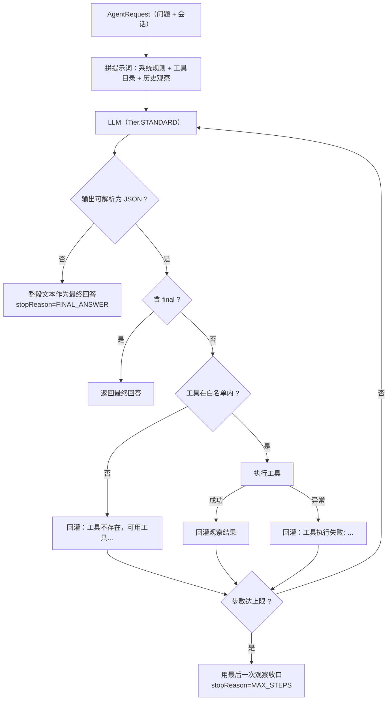
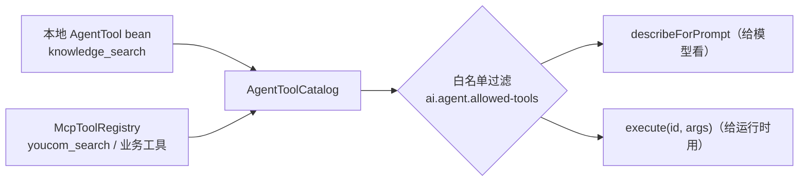
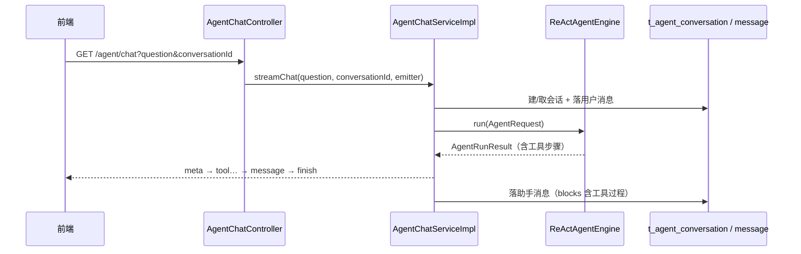

# UP-32 Agent 运行时（P0 基建 + P1 引擎核心）

上游对照范围：`020e5c3d` 起的 Agent 执行架构（`agent/config`、`agent/tool`、ReAct 引擎装配）
及其配套能力。取舍与分阶段计划见
[`up-32-agent-architecture-decision.md`](up-32-agent-architecture-decision.md)。

本文档覆盖**阶段 P0（基建）与 P1（引擎核心 + 会话持久化 + `/agent/chat` SSE）**；
写操作确认、Skills、长期记忆、后台与前端按架构决策的 P2/P3 另开文档落地。

## 功能介绍

RAG 链路是**单轮固定流程**：改写 → 意图 → 检索 → 组装 → 回答。它解决不了两类问题：

1. **需要多步工具协作**：「先查学校的转专业政策，再看看我这种情况的学籍处理流程，最后告诉我需要哪些材料」
   ——一步检索拿不到全部信息，需要模型自己决定「先查什么、再查什么」；
2. **需要判断信息是否已足够**：检索没命中时，RAG 只能告诉模型「没有资料」，而 Agent 可以换关键词再查一次，
   或者调用别的工具（联网检索、MCP 工具、知识库检索）。

本阶段交付 Agent 的**运行时骨架**：一个可测的 ReAct 循环 + 一套统一的工具目录。

### 1. 工具目录（`AgentToolCatalog`）

把「本机工具」和「MCP 工具」收进同一份目录，供模型选择、供运行时执行：

| 来源 | 说明 |
| --- | --- |
| 本地工具（`AgentTool` bean） | 直接跑在本进程，例如知识库检索工具 `knowledge_search` |
| MCP 工具（`McpToolRegistry`） | 已注册的 MCP 工具，例如 `youcom_search`（需 `YDC_API_KEY`）、业务工具 |

统一描述：`id` / `name` / `description` / 参数 schema（名、类型、是否必填、说明、枚举）/ 是否只读 / 来源。
参数 schema 会在提示词里渲染成模型可读的一段文本——**description 是模型判断「该不该填这个参数」的唯一依据**，
因此本地工具的参数说明与 MCP 工具一样强制给出。

### 2. ReAct 引擎（`ReActAgentEngine`）

循环体：**想（think）→ 调工具（act）→ 看结果（observe）→ 再想**，直到模型给出最终回答或达到步数上限：

```
system: 你是校内问答助手；可用工具如下；每步只输出一个 JSON：
        {"thought":"...","action":{"tool":"knowledge_search","arguments":{"query":"..."}}}
        或 {"thought":"...","final":"最终回答"}
user:   用户问题 + 之前的观察结果
```

关键设计：

| 关注点 | 实现 |
| --- | --- |
| 模型档位 | 走 `Tier.STANDARD`（思考 + 工具选择需要质量，不宜用快档） |
| 步数上限 | `ai.agent.max-steps`（默认 6），超限时用最后一次观察兜底收口，不无限循环 |
| 工具白名单 | `ai.agent.allowed-tools`（为空表示目录内全部可用）；目录侧过滤 + 运行期二次校验 |
| 协议容错 | 模型输出不是合法 JSON 时**不报错**，直接当作最终回答（Agent 不能因为格式抖一下就整体失败） |
| 工具异常 | 捕获后作为 `observation` 回灌给模型（`工具执行失败: xxx`），让模型自行决定换工具或收口 |
| 未知工具 | 回灌「工具不存在，可用工具：…」，不中断循环 |
| 用户取消 | 循环每步检查 `TaskCancellation.isCancelled()`，取消即抛出 `CancellationException`，不记成模型故障 |
| 过程留痕 | 每步记录 `thought` / `toolId` / `arguments` / `observation` / 耗时，供 SSE 展示与 trace |

**只读优先**：目录里标注了工具的读写属性，当前实现的本地工具只有只读的 `knowledge_search`；
写操作工具要在 P3 的确认流程（默认拒绝 + 显式确认）就绪后才允许注册。

## 验收标准

1. **目录组装**：本地工具与 MCP 工具都出现在目录里，字段齐全（id / 名称 / 描述 / 参数 / 只读标记 / 来源）；
   MCP 工具无法判定读写属性时按**非只读**处理（保守）。
2. **白名单**：`ai.agent.allowed-tools` 非空时只暴露其中的工具；空白项被忽略；命中不到任何工具时目录为空。
3. **提示词可读**：`describeForPrompt()` 输出包含每个工具的名称、描述与参数（必填项有标记），
   参数为空时也给出「无参数」而不是空串。
4. **一轮工具调用**：模型先返回 `action`（工具 + 参数）→ 引擎执行工具 → 把观察结果回灌 → 模型返回 `final`；
   最终 `answer` 等于模型给出的 final，`steps` 记录两步（一步工具调用 + 一步收口）。
5. **步数上限**：模型一直只返回 `action` 时，达到 `max-steps` 后停止，`stopReason=MAX_STEPS`，
   `answer` 为最后一次观察（不返回空、不抛异常）。
6. **协议容错**：模型返回自然语言（非 JSON）时，视为最终回答，`stopReason=FINAL_ANSWER`。
7. **工具容错**：工具抛异常时回灌错误观察，循环继续；未知工具 id 回灌可用工具清单。
8. **取消语义**：线程被中断时引擎抛 `CancellationException`（由 `TaskCancellation` 判定）。
9. 可执行验证：

```bash
./mvnw test -pl bootstrap -am '-Dtest=AgentToolCatalogTest,ReActAgentEngineTest' -Dsurefire.failIfNoSpecifiedTests=false
```

期望结果：全部通过（用例用 mock 模型与假工具，不需要真实 LLM）。

## 代码位置

| 作用 | 位置 |
| --- | --- |
| 配置（开关 / 步数 / 温度 / 白名单） | `bootstrap/src/main/java/com/nageoffer/ai/ragent/agent/config/AgentProperties.java` |
| 本地工具接口与参数描述 | `bootstrap/src/main/java/com/nageoffer/ai/ragent/agent/tool/AgentTool.java`、`AgentToolParameter.java` |
| 工具目录 | `bootstrap/src/main/java/com/nageoffer/ai/ragent/agent/tool/AgentToolCatalog.java` |
| 知识库检索工具 | `bootstrap/src/main/java/com/nageoffer/ai/ragent/agent/tool/KnowledgeSearchTool.java` |
| 引擎接口与实现 | `bootstrap/src/main/java/com/nageoffer/ai/ragent/agent/engine/AgentEngine.java`、`ReActAgentEngine.java` |
| 请求 / 结果 / 步骤 | `bootstrap/src/main/java/com/nageoffer/ai/ragent/agent/dto/AgentRequest.java`、`AgentRunResult.java`、`AgentStep.java` |
| 提示词模板 | `bootstrap/src/main/resources/prompt/agent-react.st`（路径常量在 `rag/constant/RAGConstant.java`） |
| 单元测试 | `bootstrap/src/test/java/com/nageoffer/ai/ragent/agent/**` |

配置示例：

```yaml
ai:
  agent:
    enabled: false        # 默认关闭：不注册引擎 bean，RAG 链路行为完全不变
    max-steps: 6          # 单轮最多几次「想 + 调工具」
    temperature: 0.2
    allowed-tools: []     # 空表示目录内全部可用；可写 [knowledge_search, youcom_search] 收窄
```

## 相关图表

ReAct 循环与降级出口：



工具目录的来源合并：



## 与上游的差异

- 上游用 AgentScope 承载 ReAct 循环与中间件。本仓库按架构决策 2 自研最小实现，并把引擎收在
  `AgentEngine` 接口后：日后若要换成 AgentScope 或别的引擎，替换实现即可，调用方（Controller / SSE）
  不受影响。
- 上游 `AgentToolCatalog` 同时管理「提示词快照」与 MCP 工具状态；本仓库当前只需要「描述 + 执行 + 白名单」，
  状态管理随 P3 的确认流程与后台管理一起做。
- 上游的 Agent 会写会话/消息表并推 SSE 消息块；本仓库这部分在 P1 后半段单独落地（见架构决策 P1），
  本阶段先把引擎与目录做成**纯逻辑可测**的形态。

## P1 后半段：会话持久化与 `/agent/chat` SSE

### 功能介绍

Agent 的一轮对话包含「用户提问 + 多次工具调用 + 最终回答」，比 RAG 单轮问答多两类数据：**工具过程**与
**运行状态**。因此会话与消息**不与 RAG 版 `t_conversation` / `t_message` 混存**（那两张表的语义是
「问题—回答」，塞进工具块会让两侧的历史回放逻辑互相污染），单独建两张表：

| 表 | 关键列 | 说明 |
| --- | --- | --- |
| `t_agent_conversation` | `conversation_id` / `user_id` / `title` / `last_time` | 会话列表按 `last_time` 倒序；`(conversation_id, user_id) WHERE deleted = 0` 唯一，逻辑删后可复用同 ID |
| `t_agent_message` | `role` / `content` / `blocks` / `reply_to_message_id` / `message_status` / `duration_ms` | `blocks` 存工具调用块（工具名、参数、观察结果、耗时），`message_status` 记录 `NORMAL` / `INTERRUPTED` / `FAILED` |

SSE 事件协议（与 RAG 版 `SSEEventType` 分立）：`meta` → 每个工具步骤一条 `tool` → （达上限时）`hint`
→ `message`（最终回答）→ `finish`。事件在服务层**先组装成列表再下发**：组装是纯函数，能脱离 SSE 单测；
下发只负责按序发送。

用户取消时写一条 `INTERRUPTED` 的助手消息并下发 `finish(reason=INTERRUPTED)`，不写正文；模型或工具异常时写
`FAILED` 并给用户统一文案（实现细节只进日志）。

### 验收标准（P1 后半段）

1. **建表**：`upgrades/v1.2.0/001_agent_conversation_message.sql` 幂等可重复执行，`schema_pg.sql` 已同步。
2. **会话复用与标题**：会话不存在时创建、标题取问题前 30 字；已存在时复用不重复建；
   逻辑删后的同 ID 会话可重新创建（部分唯一索引保证）。
3. **消息落库**：用户消息带 `role=user` / `message_status=NORMAL`；助手消息带 `reply_to_message_id`、
   `blocks`（无工具调用时为 `null`，不写空数组）与 `duration_ms`；每次落库都会刷新会话 `last_time`。
4. **事件顺序**：正常收口为 `meta → tool… → message → finish`；达步数上限时在 `message` 前多一条 `hint`；
   无工具调用时只有 `meta → message → finish`。
5. **失败与取消**：取消写 `INTERRUPTED` + `finish(INTERRUPTED)`；异常写 `FAILED` + 统一文案 + `finish(FAILED)`。
6. **接口**：`GET /agent/chat?question=&conversationId=`（SSE）、`GET /agent/conversations`、
   `GET /agent/conversations/{id}/messages`、`DELETE /agent/conversations/{id}`；
   `ai.agent.enabled=false` 时这些路由**不存在**（不暴露必然失败的接口）。
7. 可执行验证：

```bash
./mvnw test -pl bootstrap -am '-Dtest=AgentChatServiceImplTest,AgentConversationServiceImplTest' -Dsurefire.failIfNoSpecifiedTests=false
```

### 代码位置（P1 后半段）

| 作用 | 位置 |
| --- | --- |
| 建表与升级脚本 | `resources/database/upgrades/v1.2.0/001_agent_conversation_message.sql`、`resources/database/schema_pg.sql` |
| 实体与 Mapper | `bootstrap/src/main/java/com/nageoffer/ai/ragent/agent/dao/**` |
| 会话与消息持久化 | `agent/service/AgentConversationService.java`、`agent/service/impl/AgentConversationServiceImpl.java` |
| 事件组装与下发 | `agent/dto/AgentStreamEvent.java`、`agent/service/impl/AgentChatServiceImpl.java` |
| SSE 事件协议 | `agent/enums/AgentSSEEventType.java`（`meta` / `tool` / `message` / `hint` / `finish`） |
| 接口与视图 | `agent/controller/AgentChatController.java`、`agent/controller/vo/**` |
| 单元测试 | `bootstrap/src/test/java/.../agent/service/impl/AgentChatServiceImplTest.java`、`AgentConversationServiceImplTest.java` |


