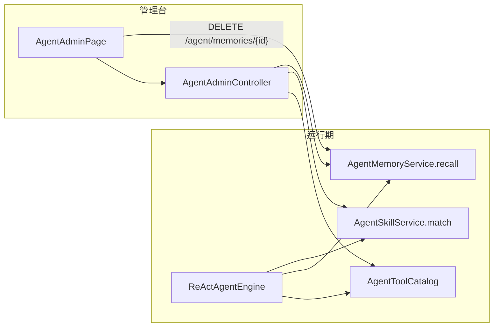

# UP-33 Agent 配置视图与记忆维护

上游对照范围：`17eaaa6f`（智能体管理与相关功能）。本仓库按架构决策的 P3 落地其中**当前真有需求**的部分。

## 功能介绍

Agent 上线后有三个必须能核对的问题，否则出问题只能靠猜：

1. **Agent 现在到底能调哪些工具？** 尤其「哪些是非只读、会弹确认」——这决定了误操作面有多大；
2. **加载了哪些技能手册、内容是什么？** 手册写错会让模型稳定地做错事；
3. **它记住了我什么？** 记忆写错比不写更糟，必须让用户能看见并删掉。

本功能提供一个只读视图（记忆可删）：

| 区块 | 内容 |
| --- | --- |
| 可用工具 | `id` / 名称 / 来源（LOCAL / MCP）/ 只读标记 / **是否需要确认** / 说明 / 参数（含必填与取值白名单） |
| 技能手册 | 名称、触发词、说明与手册正文 |
| 我的长期记忆 | 类型、内容、记录时间；`忘掉` 触发失效（不物理删除） |

交互：管理台侧边栏「Agent 配置」入口；页面顶部有刷新按钮。

## 验收标准

1. **接入条件**：`ai.agent.enabled=false` 时这些接口不存在（404），页面给出明确错误提示；
   打开后 `GET /agent/tools`、`/agent/skills`、`/agent/memories` 均可返回。
2. **工具视图**：`readOnly` 取目录判定结果（本地工具自声明或登记在 `ai.agent.read-only-tools`）；
   `requiresConfirmation` 与运行期确认策略同源（同一处 `requiresConfirmation`）；参数带必填标记与取值白名单。
3. **技能视图**：即使 `ai.agent.skills.enabled=false` 也能看到手册（停的是注入，不是加载），便于核对手册内容。
4. **记忆视图**：只列出生效记忆（`invalid_at IS NULL`）；`DELETE /agent/memories/{id}` 只失效本人记忆，
   重复调用是空操作。
5. **页面**：三个区块缺数据时给出可读提示（如「暂无记忆（记忆默认关闭…）」），不出现空白或报错。
6. 可执行验证：

```bash
./mvnw -o -pl bootstrap -am '-DskipTests' compile   # 接口编译通过
cd frontend && npm run build                        # 页面构建通过
```

人工验收：打开「Agent 配置」页，核对工具只读/确认标记与配置一致；删除一条记忆后刷新，该条不再出现。

## 代码位置

| 作用 | 位置 |
| --- | --- |
| 管理接口 | `agent/controller/AgentAdminController.java`（`GET /agent/tools|skills|memories`、`DELETE /agent/memories/{id}`） |
| 视图对象 | `agent/controller/vo/AgentToolVO.java`、`AgentSkillVO.java`、`AgentMemoryVO.java` |
| 数据来源 | `agent/tool/AgentToolCatalog.java`、`agent/skill/AgentSkillService.java`、`agent/service/AgentMemoryService.java`（均已有单测） |
| 前端接口 | `frontend/src/services/agentService.ts` |
| 前端页面与入口 | `frontend/src/pages/admin/agent/AgentAdminPage.tsx`、`frontend/src/router.tsx`（`/admin/agent`）、`frontend/src/pages/admin/AdminLayout.tsx`（侧边栏） |

## 相关图表



## 与上游的差异

- **不做智能体配置编辑**：上游支持在后台增删改智能体（人设、提示词、可用工具集、模型档位）。本仓库当前只有
  一个内置 ReAct Agent，配置项都在 `ai.agent.*`，因此管理页只做**核对**；等出现「多智能体」需求时再引入
  配置表与管理表单。
- **技能不做在线编辑**：见 [`up-35-skills.md`](up-35-skills.md) 的差异说明（手册随代码版本发布）。
- **无权限分层**：上游管理台按角色控制可见性。本仓库沿用现有 `RequireAdmin`（管理台整体仅管理员可见）。
- **无新增单测**：本页是既有服务的只读投影（服务层逻辑已有 `AgentToolCatalogTest`、`AgentSkillTest`、
  `AgentMemoryServiceImplTest` 覆盖），因此以「编译 + 构建 + 人工验收」作为验证手段，不新增重复用例。
