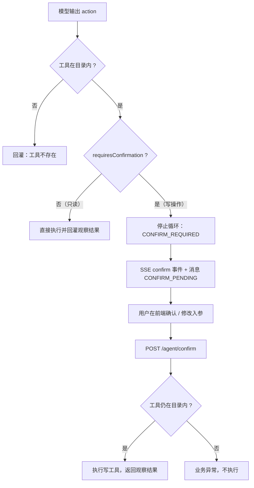

# UP-34 Agent 写操作确认（默认拒绝 + 显式确认）

上游对照范围：`24e6b4a4`（Agent 写操作确认流程与人工确认卡片）。本仓库按架构决策的**决策 5**落地
「默认拒绝」语义；确认卡前端见「与上游的差异」。

## 功能介绍

Agent 能调工具之后，第一次真正的风险出现了：模型可能**直接调用写工具**（下单、改资产、提交申请）。
模型判断错一次，用户的数据就被改了——而且用户当时甚至没看见模型要做什么。

本功能把「写操作」变成一条**必须用户点头才执行**的路径：

| 环节 | 做法 |
| --- | --- |
| 读写判定 | 本地工具用 `AgentTool#readOnly()` 自行声明；MCP 协议无法表达读写属性，**默认按写操作处理**，确认确实只读的工具（如联网检索）在 `ai.agent.read-only-tools` 里登记 |
| 拦截 | 引擎在**执行前**检查 `requiresConfirmation(toolId)`：命中即停止循环，返回 `CONFIRM_REQUIRED` + 待确认调用（工具、入参、字段说明、步序号） |
| 告知 | SSE 下发 `confirm` 事件（与 `finish` 相邻、不落正文），助手消息以 `message_status=CONFIRM_PENDING` 落库；这一轮**不沉淀记忆**（没有真实回答） |
| 执行 | 用户确认后调 `POST /agent/confirm`，服务端校验工具仍在目录内（白名单/启用状态生效），再执行并把观察结果返回 |

关键取舍：

1. **默认拒绝**：`ai.agent.confirm.required` 默认 `true`。关掉它等于允许模型自主写数据，
   因此这个开关只应出现在本地调试环境；
2. **入参以用户提交为准**：确认时前端回传的 `arguments` 覆盖模型原参数——用户可以在确认卡上改正模型
   填错的字段，服务端不回放模型当时的原参数；
3. **确认不落正文**：待确认时助手消息正文只说明「需要确认」，状态为 `CONFIRM_PENDING`，
   避免历史回放时把「还没发生的事」当成已经发生的回答。

## 验收标准

1. **读写判定**：本地工具按 `readOnly()` 判定；MCP 工具默认**非只读**；出现在
   `ai.agent.read-only-tools` 里的工具一律视为只读；`confirm.required=false` 时任何工具都不需要确认。
2. **拦截语义**：模型给出写工具调用时，引擎**不执行该工具**，返回 `StopReason=CONFIRM_REQUIRED`，
   `pendingCall` 含 `toolId` / `arguments` / `fieldLabels` / `stepIndex`，且 `steps` 只包含这一步。
3. **确认卡字段**：`fieldLabels` 对本地工具取参数描述，MCP 或未声明的参数回退原值；入参为空时返回空表。
4. **事件与落库**：SSE 序列为 `meta → tool → confirm → message → finish`；
   助手消息 `message_status=CONFIRM_PENDING`；`finish.reason=CONFIRM_REQUIRED`。
5. **确认执行**：`POST /agent/confirm` 工具不在目录内时返回业务异常（不执行）；
   在目录内时执行并返回观察结果；入参缺省时按空参数执行。
6. 可执行验证：

```bash
./mvnw test -pl bootstrap -am '-Dtest=AgentToolCatalogTest,ReActAgentEngineTest,AgentChatServiceImplTest' -Dsurefire.failIfNoSpecifiedTests=false
```

期望结果：全部通过。

## 代码位置

| 作用 | 位置 |
| --- | --- |
| 读写判定与确认策略 | `agent/tool/AgentToolCatalog.java`（`requiresConfirmation` / `describeArguments`） |
| 待确认调用与结束原因 | `agent/dto/AgentRunResult.java`（`PendingToolCall` / `StopReason.CONFIRM_REQUIRED`） |
| 引擎拦截 | `agent/engine/ReActAgentEngine.java` |
| SSE 事件 | `agent/enums/AgentSSEEventType.java`（`confirm`）、`agent/service/impl/AgentChatServiceImpl.java`（事件组装 + `CONFIRM_PENDING` 落库） |
| 确认执行接口 | `agent/controller/AgentChatController.java`（`POST /agent/confirm`）、`agent/controller/request/AgentConfirmRequest.java` |
| 配置 | `ai.agent.confirm.required`、`ai.agent.read-only-tools` |
| 单元测试 | `AgentToolCatalogTest`、`ReActAgentEngineTest`、`AgentChatServiceImplTest` |

## 相关图表



## 与上游的差异

- **确认卡前端未做**：上游有完整的确认卡片组件（字段渲染、批量调用、确认/拒绝按钮）。本仓库当前交付
  服务端语义 + `confirm` 事件 + `POST /agent/confirm` 执行口；前端卡片随 P3 的 Agent 聊天页一起做。
- **无拒绝原因回传**：上游支持用户填写拒绝理由并回灌给模型。本仓库先实现「不确认就不执行」；
  需要「拒绝并说明」时可复用同一事件协议扩展字段。
- **持久化状态更少**：上游把待确认调用与其结算状态单独落表（`AgentConfirmSettlement`）。
  本仓库把待确认状态放在助手消息的 `message_status` 上，等确认卡前端落地、需要跨轮结算时再拆表。
