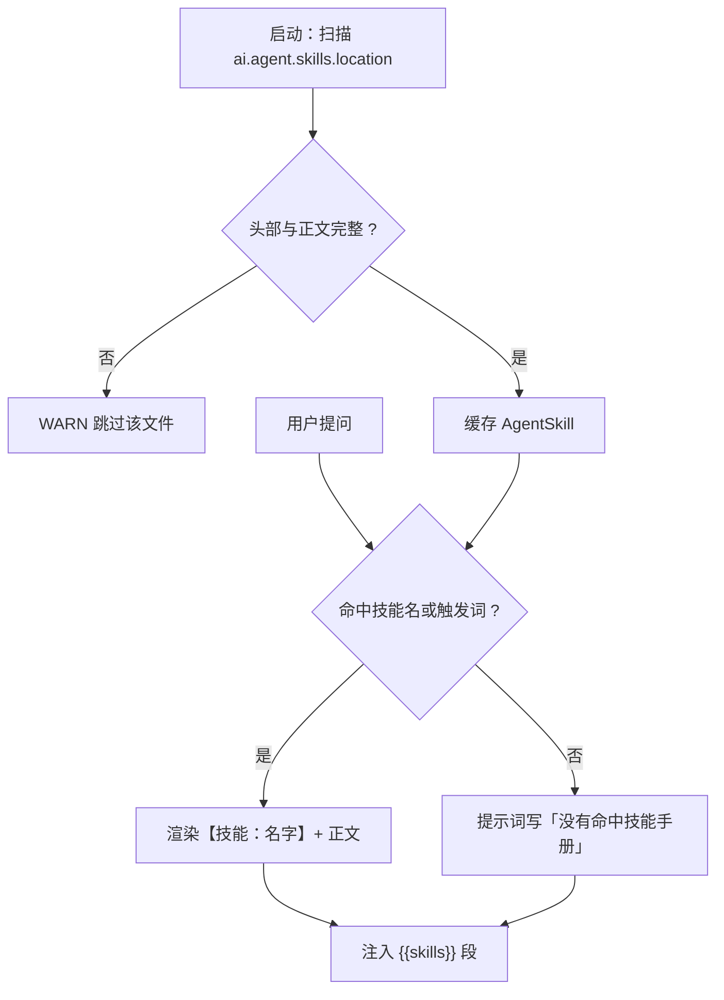

# UP-35 Skills 技能手册

上游对照范围：`c71f0750` / `42a2b918` / `7e522563`（技能手册、Skill 管理、AgentScope 原生 Skill Tool）。
本仓库按架构决策的 P2 落地其中的**手册注入主链路**；技能管理与原生工具见「与上游的差异」。

## 功能介绍

同一类问题（「转专业要什么材料」）在不同轮次里，模型的做法会飘：有时先检索、有时直接凭记忆回答、
有时查一次没命中就放弃。**技能手册**把「这类任务的固定做法」写成 markdown 放在仓库里，命中触发词时
注入提示词，让模型按既定步骤做事。

技能是**内容**而不是**数据**：随代码版本走、可 review、可回滚，因此用 classpath 下的
`agent/skills/*.md` 承载，不建表、不配管理台。

| 能力 | 说明 |
| --- | --- |
| 加载 | 启动时扫描 `ai.agent.skills.location`（默认 `classpath*:agent/skills/*.md`），解析头部后缓存；坏文件只记 WARN 跳过，不影响启动 |
| 匹配 | 问题包含技能名或任一触发词即命中；单轮注入数量受 `ai.agent.skills.max-skills` 限制 |
| 注入 | 命中手册以「【技能：名字】说明 + 正文」形式进入提示词；无命中时明确写「（本次没有命中技能手册）」 |
| 开关 | `ai.agent.skills.enabled=false` 时只停匹配、不停加载（前端仍可列出全部手册） |

手册格式（不引入 YAML 依赖，`---` 包住头部，其余为正文）：

```markdown
---
name: 知识库问答
description: 校内制度、培养方案、通知类问题的标准处理流程
triggers: 规定, 政策, 制度, 流程
---
1. 先用 knowledge_search 检索：关键词取「对象 + 动作」。
2. 没命中时换更短、更具体的关键词再查一次。
```

仓库自带一份示例手册 `agent/skills/knowledge-qa.md`（知识库问答流程），可直接作为模板复制新增。

## 验收标准

1. **解析**：头部 `name` 与正文都存在才算合法；`triggers` 支持中英文逗号、顿号、分号分隔并去重；
   缺名字、缺正文、没有头部、非 `---` 开头的文件都被跳过（返回 `null`，不抛异常）。
2. **加载**：目录内的合法文件全部加载；坏文件只记 WARN；加载数量与 `listSkills()` 一致。
3. **匹配**：问题包含技能名 → 命中；包含任一触发词 → 命中；都不包含 → 不注入；
   命中数量受 `max-skills` 限制（调用方传入正数时以传入值为准）。
4. **开关**：`enabled=false` 时 `match()` 返回空，但 `listSkills()` 仍返回全部手册。
5. **注入**：命中手册渲染为 `【技能：{name}】{description}\n{content}`；提示词里有独立的技能段；
   未命中时提示词显式说明「没有命中技能手册」。
6. 可执行验证：

```bash
./mvnw test -pl bootstrap -am '-Dtest=AgentSkillTest' -Dsurefire.failIfNoSpecifiedTests=false
```

期望结果：全部通过。

## 代码位置

| 作用 | 位置 |
| --- | --- |
| 技能模型与解析 | `agent/skill/AgentSkill.java`、`agent/skill/AgentSkillParser.java` |
| 加载与匹配 | `agent/skill/AgentSkillService.java`、`agent/skill/FileSystemAgentSkillService.java` |
| 示例手册 | `bootstrap/src/main/resources/agent/skills/knowledge-qa.md` |
| 注入点 | `agent/dto/AgentRequest.java`（`skills`）、`agent/engine/ReActAgentEngine.java`（提示词技能段）、`agent/service/impl/AgentChatServiceImpl.java`（匹配并传入） |
| 提示词模板 | `bootstrap/src/main/resources/prompt/agent-react.st`（`{{skills}}`） |
| 配置 | `ai.agent.skills.*`（`AgentProperties.Skills`） |
| 单元测试 | `bootstrap/src/test/java/.../agent/skill/AgentSkillTest.java` |

## 相关图表



## 与上游的差异

- **不建表、不做管理台**：上游有 `t_agent_skill` 表与技能管理页，技能可在线上增删改。本仓库把技能当
  「随版本发布的内容」，用 markdown 承载；需要在线编辑时再迁到数据库（`AgentSkillService` 是接口，
  换实现即可，调用方不变）。
- **不引入 AgentScope 原生 Skill Tool**：上游把技能做成 Agent 可主动加载的工具（模型自己决定加载哪份
  手册）。本仓库按触发词在服务端匹配后注入，省一次模型决策；手册数量增长后可再补「技能检索工具」。
- **无版本与权限**：上游技能有版本与可见性；校内场景按仓库提交历史做版本管理。
