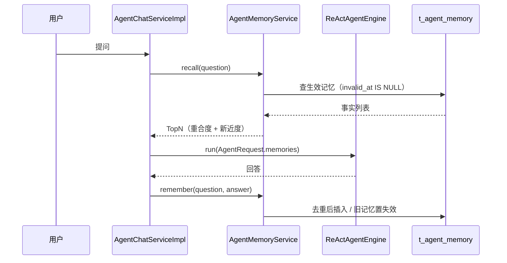
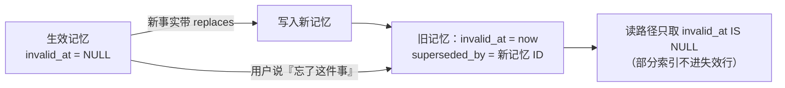

# UP-36 Agent 长期记忆（P2 记忆）

上游对照范围：`1cb684ed` / `b36a8b16`（Agent 长期记忆与记忆回归测试框架）。
本仓库按架构决策的 P2 落地其中的**记忆主链路**；并发台账与上下文压缩见「与上游的差异」。

## 功能介绍

Agent 默认只看得见**当前这一轮**：用户上一轮说过「我是 2024 级本科生」，下一轮问「转专业要什么材料」时，
模型并不知道他是本科生，只能把问题当通用问题回答。跨会话更是完全断片。

长期记忆补的就是这一段：把跨轮、跨会话**仍然有效**的用户事实沉淀下来，在后续回答前按需注入。

| 环节 | 做法 |
| --- | --- |
| **沉淀** | 每轮回答成功后，用 FAST 档模型从「用户问题 + 助手回答」中抽取 0~N 条事实（`PREFERENCE` 偏好 / `FACT` 背景 / `CONTEXT` 约束），按用户维度落库 |
| **取代** | 新事实带 `replaces` 指向被取代的旧记忆原文 → 旧记忆写 `invalid_at` + `superseded_by`，**不物理删除**（「改了什么、什么时候改的」可回溯） |
| **召回** | 回答前按「问题与记忆的字符重合度 + 时间新近度」排序，取前 `recall-limit` 条注入提示词 |
| **管理** | `invalidate(memoryId)` 支持手工遗忘；`listActive()` 供管理台/前端展示生效中的记忆 |

设计取舍：

1. **默认关闭**（`ai.agent.memory.enabled=false`）：抽取要多调一次模型，而**记忆写错比不写更糟**，
   必须先确认收益再打开；
2. **召回不引入向量**：记忆条数在几十条量级，字符重合度 + 新近度足够；为此加一条 embedding 依赖与
   一致性负担不划算。条数增长后可平滑替换为向量召回（接口不变）；
3. **抽取用 FAST 档**：高频小任务、判错可降级；**解析失败就不写任何记忆**（宁可少记，不可记错）；
4. **best-effort**：记忆写入失败只记 WARN，不影响已经答完的这一轮。

## 验收标准

1. **开关语义**：`memory.enabled=false` 时既不召回也不抽取（不产生任何模型调用与数据库写入）。
2. **召回排序与上限**：与问题字符重合度高的记忆排前，同分按创建时间新→旧；条数受 `recall-limit` 限制。
3. **抽取解析**：只保留 `content` 非空的项；`type` 归一到 `PREFERENCE / FACT / CONTEXT`（未知值落 `FACT`）；
   单轮条数受 `max-facts-per-turn` 限制；`content` 超 500 字截断（列宽约束）。
4. **容错**：模型返回非 JSON / 非法 JSON / 调用异常时**不写任何记忆**且不影响主链路。
5. **去重**：与生效记忆完全相同的事实不重复写。
6. **取代**：带 `replaces` 的新事实落库后，被取代的旧记忆被置为失效并指向新记忆 ID；
   旧记忆行仍在表中（不物理删除）；新记忆落库时不应残留临时占位值。
7. **手工遗忘**：只能失效**本人**的**生效中**记忆；他人或已失效的记忆不产生写入。
8. 可执行验证：

```bash
./mvnw test -pl bootstrap -am '-Dtest=AgentMemoryServiceImplTest' -Dsurefire.failIfNoSpecifiedTests=false
```

期望结果：全部通过。

## 代码位置

| 作用 | 位置 |
| --- | --- |
| 建表与升级脚本 | `resources/database/upgrades/v1.2.0/002_agent_memory.sql`、`resources/database/schema_pg.sql` |
| 实体与 Mapper | `agent/dao/entity/AgentMemoryDO.java`、`agent/dao/mapper/AgentMemoryMapper.java` |
| 记忆服务 | `agent/service/AgentMemoryService.java`、`agent/service/impl/AgentMemoryServiceImpl.java` |
| 抽取提示词 | `bootstrap/src/main/resources/prompt/agent-memory-extract.st`（常量 `RAGConstant.AGENT_MEMORY_EXTRACT_PROMPT_PATH`） |
| 配置 | `ai.agent.memory.*`（`AgentProperties.Memory`） |
| 注入与沉淀接入点 | `agent/dto/AgentRequest.java`（`memories`）、`agent/engine/ReActAgentEngine.java`（提示词记忆块）、`agent/service/impl/AgentChatServiceImpl.java`（召回 + 沉淀） |
| 单元测试 | `bootstrap/src/test/java/.../agent/service/impl/AgentMemoryServiceImplTest.java` |

## 相关图表



记忆的失效语义（取代而非删除）：



## 与上游的差异

- **并发台账未落地**：上游有 `t_agent_memory_extraction`（抽取台账 + 部分唯一索引做分布式 claim，
  保证同一会话同时只有一次在飞抽取）。本仓库的抽取**同步执行在当前请求里**，没有并发 claim 问题，
  故先不建该表；等抽取改成异步/批量时再补，避免先造一张没人写的表。
- **上下文压缩未落地**：上游的 `AgentContextCompactor` / `t_agent_context_compaction` 属于「会话太长时压缩
  历史」的能力，依赖流式引擎的上下文装配；本仓库当前的引擎只带本轮观察，尚无长上下文问题，
  随 P2 后续或按需再做。
- **召回实现不同**：上游记忆召回走各自的检索实现；本仓库按「字符重合度 + 新近度」实现并单测，
  接口保持可替换。
