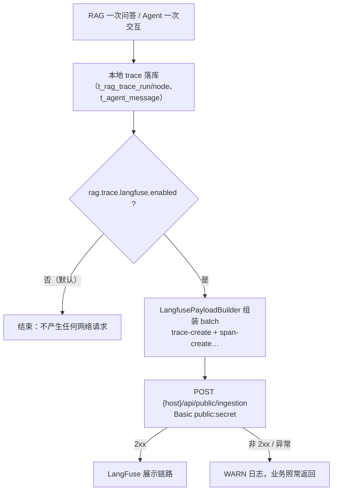

# UP-37 LangFuse 链路追踪上报

上游对照范围：`177108bb` / `96c528d0`（LangFuse 链路追踪与 ReAct 时间线）。

## 功能介绍

本地已有 `t_rag_trace_run` / `t_rag_trace_node`：一次问答的全部节点耗时、状态、错误都落库，管理台可查。
这套东西解决单机排障，但解决不了两件事：

1. **跨服务看一条链路**：链路里既有 RAG 主流程，又有 MCP 远程工具、LightRAG、Agent 工具步骤，
   本地表看不出它们之间的先后与占比；
2. **长期留存与对比**：本地表会清理，想看「上周这版提示词的耗时分布」就没有数据了。

本功能把本地 trace **再上报一份到 LangFuse**（可选能力）：

| 能力 | 说明 |
| --- | --- |
| RAG 运行 | 一次运行 → LangFuse `trace`，每个 trace 节点 → 挂在它下面的 `span`（含节点类型、类名、方法名、耗时、错误） |
| Agent 运行 | 一次 Agent 交互 → `trace`（带结束原因、总耗时、步数），每个工具步骤 → `span`（含思考、参数、观察结果、耗时） |
| 上报时机 | RAG 在 `finishRun` 落库后；Agent 在消息落库后 |
| 失败语义 | **best-effort**：网络 / 鉴权 / 限流 / 序列化失败一律只记 WARN，绝不改变业务结果 |

设计取舍：

1. **默认关闭**（`rag.trace.langfuse.enabled=false`）：没有对应平台时不应产生任何网络请求；
2. **同步上报而非异步队列**：一次运行一条批量请求，量级很小；引入线程池与队列会让「上报失败」更难排查。
   真出现上报拖慢业务时再改成异步（`LangfuseReporter` 是唯一出口，改动面小）；
3. **不引入 LangFuse SDK**：只需 `POST /api/public/ingestion` + Basic 鉴权，用既有 OkHttp 与 Jackson 即可，
   少一个依赖、少一份版本兼容负担；
4. **映射与网络分离**：`LangfusePayloadBuilder` 是纯函数（可单测），`LangfuseReporter` 只管发。

## 验收标准

1. **开关语义**：`enabled=false` 时不注册上报组件，链路行为与「没有 LangFuse」一致；
   开启但 `host` / 公私钥缺失时只记 WARN 并跳过上报（`usable()` 判定）。
2. **RAG 映射**：批量里第一条是 `trace-create`（id / name / userId / sessionId=会话 ID / timestamp / metadata 含
   taskId、entryMethod、status、durationMs）；每个节点一条 `span-create`，`traceId` 指向本 trace，
   `parentObservationId` 指向父节点，metadata 含节点类型、类名、方法名、耗时与错误。
3. **Agent 映射**：`trace` 的 name 为 `agent-chat`，`input` 为问题、`output` 为回答，metadata 含结束原因、总耗时、步数；
   每个工具步骤一条 span（含 thought / arguments / observation / latencyMs）；纯思考收口的那一步**不产生 span**。
4. **输入保护**：`traceId` 缺失、run 为 null、Agent 结果为 null 时返回空负载，不产生无效事件。
5. **失败不影响业务**：上报异常只打 WARN（单测覆盖的映射逻辑 + 代码中的 try/catch 兜底）。
6. 可执行验证：

```bash
./mvnw test -pl bootstrap -am '-Dtest=LangfusePayloadBuilderTest' -Dsurefire.failIfNoSpecifiedTests=false
```

人工验收：填好 `host` 与 `LANGFUSE_PUBLIC_KEY` / `LANGFUSE_SECRET_KEY`、把 `enabled` 置 `true`，提一个问题，
在 LangFuse 的 Traces 里看到该次运行与各节点 span；Agent 页问一次同样能看到工具 span。

## 代码位置

| 作用 | 位置 |
| --- | --- |
| 配置 | `rag.trace.langfuse.*`（`bootstrap/src/main/java/com/nageoffer/ai/ragent/rag/config/LangfuseProperties.java`） |
| 负载映射（纯函数） | `bootstrap/src/main/java/com/nageoffer/ai/ragent/rag/trace/LangfusePayloadBuilder.java` |
| 上报（HTTP + 鉴权 + 降级） | `bootstrap/src/main/java/com/nageoffer/ai/ragent/rag/trace/LangfuseReporter.java` |
| RAG 接入点 | `bootstrap/src/main/java/com/nageoffer/ai/ragent/rag/service/impl/RagTraceRecordServiceImpl.java`（`finishRun` 之后，`ObjectProvider` 惰性解析） |
| Agent 接入点 | `bootstrap/src/main/java/com/nageoffer/ai/ragent/agent/service/impl/AgentChatServiceImpl.java`（消息落库之后） |
| 单元测试 | `bootstrap/src/test/java/com/nageoffer/ai/ragent/rag/trace/LangfusePayloadBuilderTest.java` |

## 相关图表



本地 trace 与 LangFuse 的职责划分：

| 关注点 | 本地 `t_rag_trace_*` | LangFuse |
| --- | --- | --- |
| 单机排障（含 SQL 级别的耗时） | ✅ 首选 | 不必要 |
| 跨服务（MCP / 图谱 / Agent 工具）串联 | ❌ 看不到 | ✅ |
| 长期留存与版本对比 | 受清理策略限制 | ✅ |
| 依赖外部平台 | 无 | 需要 |

## 与上游的差异

- **不引入 LangFuse SDK**：上游直接接 SDK 并做 ReAct 时间线渲染。本仓库按「一条批量 HTTP + 纯函数映射」实现，
  覆盖同样的可观测诉求（trace / span / metadata），少一个依赖；若日后需要 prompt 管理、评分等能力再评估 SDK。
- **同步上报**：上游是异步队列 + 定时 flush。本仓库先同步发一条批量请求，理由见设计取舍 2；接口不变，可平滑改异步。
- **不重放本地 trace 历史**：只上报新产生的运行，不做历史回填（回填属运维动作，需要时用查询接口批量补发即可）。
