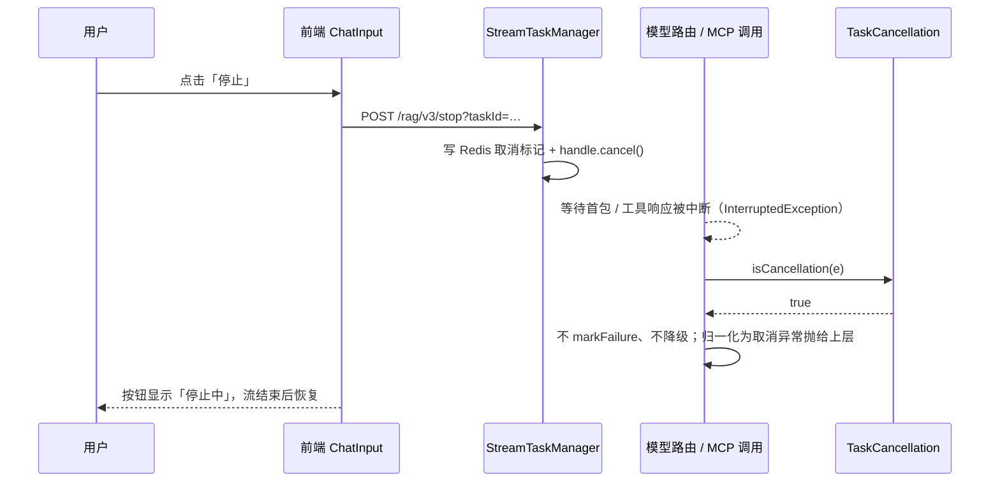

# UP-38 任务取消与中断反馈（RAG 侧适用范围）

上游对照提交：

| 提交 | 内容 | 本仓库落地 |
| --- | --- | --- |
| `67624931 feat(cancellation): 完善任务取消支持与用户停止反馈` | 框架层 `TaskCancellation` 统一判定取消；Agent 工具/追踪/前端停止态 | 框架层与 RAG 侧已落地；Agent 侧随批次八 |
| `05f045ff feat(agent): 支持中断提示作为独立 error 块增强流式体验` | Agent 消息块新增 `error` 类型与中断提示 | 随批次八（本仓库尚无 Agent 模块） |

**范围说明**：上游这两个提交绝大部分位于 `agent` 模块（Agent 工具、Agent 消息块、AgentChat 组件、
`AgentRunHandle`），本仓库当前是 RAG 版、尚无该模块，因此本功能只落地与 RAG 链路相关的部分；
Agent 侧随批次八的 Agentic 体系一并实现。

## 功能介绍

分布式任务取消本身在分叉点已具备：`/rag/v3/stop` → `StreamTaskManager.cancel(taskId)` 写 Redis 取消标记
并触发本地 `StreamCancellationHandle.cancel()`，前端也有「停止生成」按钮。缺的是**统一判定**：

用户点「停止」后，取消会以两种形态向上冒泡：

1. **线程中断**：`InterruptedException`（等待首包、等待 MCP 响应时被中断）——JVM 会**清掉中断标记**，导致上游再判 `isInterrupted()` 时失真；
2. **取消异常**：`CancellationException`（CompletableFuture 链、Reactor 风格取消）。

各层代码各自判断（甚至根本不判断），后果是：

- **模型被误标不健康**：取消异常走上「失败 → 换下一个候选」的降级路径，`markFailure` 把正常模型推进熔断；
- **工具调用被误报为错误**：用户主动停止导致 MCP 调用中断，日志按 `log.error("MCP 工具调用异常")` 记录，排障时噪声掩盖真实故障。

本功能引入框架层 `TaskCancellation`，把「这是一次用户取消」变成可复用的判据：

| 方法 | 用途 |
| --- | --- |
| `isCancelled()` | 下游「降级返回而非抛异常」的出口只剩中断标记可判 |
| `isCancellation(Throwable)` | 遍历异常因果链识别 `InterruptedException` / `CancellationException` |
| `asCancellation(Throwable)` | 归一化为取消异常，并**补回被清掉的中断标记**，避免上游判据失灵 |

接入点（RAG 侧）：

1. **模型路由执行器**：识别取消后**不再 markFailure、不再继续降级**，直接把取消抛给上层——用户主动停止不该污染模型健康度；
2. **MCP 工具调用**：取消路径按 debug 记录并返回「用户已停止，本次调用未完成」的中断结果，不再按 `error` 记日志；
3. **流式首包等待**：中断时释放熔断半开探测名额（UP-21 已落地），并归一化为取消异常。

前端补齐「停止中」交互态：点击停止后按钮进入禁用 + 文案「停止中」，避免用户重复点击、也给出明确反馈。

## 验收标准

1. **判定完备**：`isCancellation` 能识别异常链上的 `InterruptedException`、`CancellationException`，以及当前线程已中断的情况；普通业务异常返回 false。
2. **中断标记复原**：`asCancellation(InterruptedException)` 后 `Thread.currentThread().isInterrupted()` 为 true（否则上游判据失灵）。
3. **取消不降级**：模型路由中候选抛取消异常时，**不** `markFailure`、不尝试下一个候选，而是抛取消异常；同一模型后续仍可正常调用（未被熔断）。
4. **取消不误报**：MCP 工具调用被取消时日志级别为 debug 且消息为「用户已停止…」，不是 `error`。
5. **前端停止态**：点击停止后按钮禁用并显示「停止中」，流真正结束后恢复。
6. 可执行验证：

```bash
./mvnw test -pl framework -Dtest=TaskCancellationTest
./mvnw test -pl infra-ai -Dtest=ModelRoutingExecutorCancellationTest
cd frontend && npm run build
```

期望结果：全部通过。

## 代码位置

| 作用 | 位置 |
| --- | --- |
| 取消判定工具 | `framework/src/main/java/com/nageoffer/ai/ragent/framework/cancellation/TaskCancellation.java` |
| 模型路由取消语义 | `infra-ai/src/main/java/com/nageoffer/ai/ragent/infra/model/ModelRoutingExecutor.java` |
| 流式首包中断处理 | `infra-ai/src/main/java/com/nageoffer/ai/ragent/infra/chat/RoutingLLMService.java`（`awaitFirstPacket`） |
| MCP 工具取消处理 | `bootstrap/src/main/java/com/nageoffer/ai/ragent/rag/core/retrieve/RetrievalEngine.java`（`executeMcpTools`） |
| 任务取消与状态 | `bootstrap/src/main/java/com/nageoffer/ai/ragent/rag/service/handler/StreamTaskManager.java`、`StreamChatEventHandler` |
| 前端停止态 | `frontend/src/components/chat/ChatInput.tsx`、`frontend/src/stores/chatStore.ts`（`cancelRequested`） |
| 单元测试 | `framework/src/test/java/com/nageoffer/ai/ragent/framework/cancellation/TaskCancellationTest.java`、`infra-ai/src/test/java/com/nageoffer/ai/ragent/infra/model/ModelRoutingExecutorCancellationTest.java` |

## 相关图表



取消判定与「真实失败」的分流：

| 出口 | 真实失败 | 用户取消 |
| --- | --- | --- |
| 模型健康度 | `markFailure` + 降级下一个候选 | **不动健康度、不降级** |
| 日志级别 | warn/error | debug |
| 前端消息状态 | `error` | `INTERRUPTED`（UP-20 已落地） |
