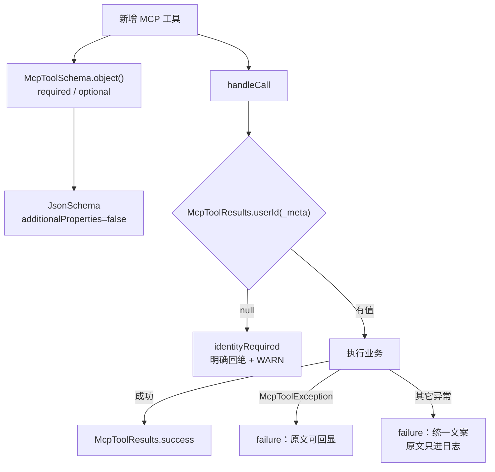

# UP-39 / UP-40（mcp-server 侧）MCP 工具基建：参数 Schema 构造器、统一结果封装与身份透传

上游对照提交：

| 提交 | 内容 |
| --- | --- |
| `cb4438c7 feat(mcp-server): 新增 MCP 工具异常类与工具参数 Schema 构造器` | `McpToolSchema` + `McpToolException` + 单测 |
| `c2dcc12c refactor(mcp-server): 重构MCP工具输入schema构建方式为链式API` | `McpToolResults` 共用封装并重构内置工具 |
| `da32db76 feat(mcp): 调用 MCP 工具时通过 _meta 透传登录身份` | 调用方透传身份，工具侧取用（本仓库先落地服务端侧） |

## 功能介绍

mcp-server 里每个工具执行器都要手写三件事：入参 schema、取参与结果封装、异常兜底。手写带来三类问题：

1. **schema 是给模型看的契约**：手拼 `Map.of("type","string","description","...")` 时最容易漏 `description`
   ——而 description 是模型判断「该不该填这个参数」的唯一依据；也容易漏 `required`、漏 `enum` 白名单；
2. **异常文案混进了实现细节**：`e.getMessage()` 里可能是 SQL 片段、连接串、空指针栈顶，
   拼进返回值等于直接交给模型，模型会把它当业务结论转述给用户；
3. **用户态工具拿不到身份时会静默返回空**：看起来像「你没有订单」，是静默失败里最难查的一种。

本功能把这三件事收成三个共用件（都在 `mcp-server` 模块内，零新增依赖）：

| 共用件 | 作用 |
| --- | --- |
| `McpToolSchema` | 链式构造工具入参 schema：`string/integer/number` + `title/description/default/enum`；参数名与描述**强制在构造时给出**；`additionalProperties=false` 防止模型自造参数名；重复参数名直接抛错 |
| `McpToolException` | 「消息可以原样返回给模型」的异常类型：抛出方声明一次，兜底出口照此判断，catch 方不必猜 |
| `McpToolResults` | 统一结果封装（`success` / `error` / `failure`）、取参（`args` / `parseDate`）、身份读取（`userId`）与缺失身份的统一回绝（`identityRequired`） |

### 身份透传的边界（UP-40 服务端侧）

调用方在 `_meta` 里带上当前登录用户（键 `com.nageoffer.ragent/userId`，与 rag 侧约定一致），
工具侧用 `McpToolResults.userId(request)` 取用；取不到时**不降级成按 null 查询**，而是用
`identityRequired(toolId)` 明确回绝并打 WARN（区分「整条链断了」与「这一个工具漏带身份」）。

`_meta` 是 client-supplied 的扩展点，规范明确服务端不得据此做**认证**决策：本进程只绑本机、
只服务同一个应用，用它**圈定数据范围**成立；对外暴露时须换成 OAuth，而不是加固这里。

## 验收标准

1. **必填与可选**：`required(p)` 把参数名写进 schema 的 `required` 列表，`optional(p)` 不写；
   两者都出现在 `properties`。
2. **参数顺序稳定**：`properties` 保持声明顺序（`Map.copyOf` 会打乱顺序，不许使用）。
3. **契约完整性**：`additionalProperties=false`；`string/integer/number` 三种类型的 `type` 正确；
   `title` / `default` / `enum` 按需写入。
4. **早失败**：参数名为空、描述为空、参数名重复都在构造/组装期抛出，不产出半成品 schema。
5. **异常文案分级**：`McpToolResults.failure("下单", new McpToolException("库存不足"))` 把原文交给模型；
   普通异常只返回「下单失败，请稍后重试」，原文只进日志。
6. **身份语义**：`userId` 取不到时返回 `null` 且被 `identityRequired` 回绝（`isError=true` 且文案不含实现细节）；
   `_meta` 缺失、`_meta` 里值为空白都按「没有身份」处理。
7. 可执行验证：

```bash
./mvnw test -pl mcp-server '-Dtest=McpToolSchemaTest,McpToolResultsTest' -Dsurefire.failIfNoSpecifiedTests=false
```

期望结果：全部通过。

## 代码位置

| 作用 | 位置 |
| --- | --- |
| 参数 Schema 构造器 | `mcp-server/src/main/java/com/nageoffer/ai/ragent/mcp/executor/McpToolSchema.java` |
| 可回显异常 | `mcp-server/src/main/java/com/nageoffer/ai/ragent/mcp/executor/McpToolException.java` |
| 结果 / 取参 / 身份封装 | `mcp-server/src/main/java/com/nageoffer/ai/ragent/mcp/executor/McpToolResults.java` |
| 单元测试 | `mcp-server/src/test/java/com/nageoffer/ai/ragent/mcp/executor/McpToolSchemaTest.java`、`McpToolResultsTest.java` |

使用示例：

```java
private Tool buildTool() {
    JsonSchema inputSchema = McpToolSchema.object()
            .required(McpToolSchema.string("query", "检索关键词或问题"))
            .optional(McpToolSchema.integer("count", "最多返回的结果条数").defaultTo(5))
            .optional(McpToolSchema.string("freshness", "结果时效过滤").options(List.of("day", "week")))
            .build();
    return Tool.builder().name(TOOL_ID).description("...").inputSchema(inputSchema).build();
}

CallToolResult handleCall(CallToolRequest request) {
    String userId = McpToolResults.userId(request);
    if (userId == null) {
        return McpToolResults.identityRequired(TOOL_ID);
    }
    try {
        return McpToolResults.success(doWork(userId, McpToolResults.args(request)));
    } catch (Exception e) {
        return McpToolResults.failure("查询", e);
    }
}
```

## 相关图表



## 与上游的差异

- 上游在 `c2dcc12c` 里把**内置示例工具**（资产 / 请假 / 工单等）一并重构到链式 API。本仓库的示例工具
  （天气 / 工单 / 销售）保持原状，避免为了示例工具做无收益的大面积改动；**新增工具必须使用**
  `McpToolSchema` + `McpToolResults`，规则写在 `docs/upstream/features/up-39-mcp-tool-kit.md`（本文）里。
- 上游的身份透传还包含调用侧（Agent 的 `McpToolBridge` 往 `_meta` 里塞 userId）。本仓库尚无 Agent 运行时，
  该部分随批次八落地；服务端侧（读取 + 回绝语义）本轮已就绪。
