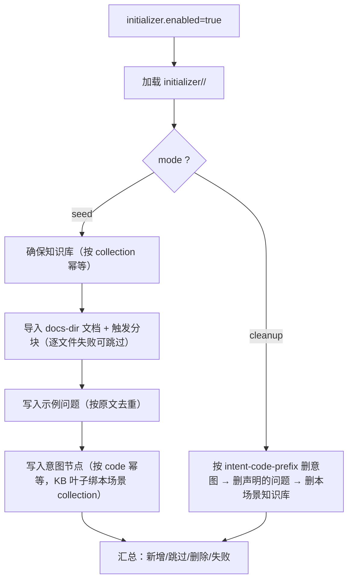

# UP-41 场景初始化器（一键装好可跑的场景）

上游对照范围：`5aabe1ea` / `6d3934d9` / `765d2b80` / `cdace75a`（企业知识库初始化与清理工具、场景示例）。

## 功能介绍

新环境跑起来之后，**没有任何资料**：知识库是空的、示例问题是空的、意图树是空的。要验证
「提问 → 检索 → 回答」这条链路，得手工建库、传文档、等分块、配意图、加示例问题，一遍下来半小时起，
而且**每换一台机器都要重来**。

本功能提供一个**幂等的场景初始化器**：打开开关启动一次，把「一个能跑的场景」装好。

| 能力 | 说明 |
| --- | --- |
| 数据源 | `bootstrap/src/main/resources/initializer/<scenario>/`：`scenario.properties` + `sample-questions.txt` + `intents.tsv` |
| seed | 建知识库 → 导入 `docs-dir` 下文档并触发分块 → 写入示例问题 → 写入示例意图树（KB 叶子自动绑定本场景 collection） |
| cleanup | 只删除**本数据集声明的**数据：`intent-code-prefix` 前缀的意图节点、数据集里的示例问题、本场景的 collection |
| 幂等 | 知识库按 `collection-name` 判定；示例问题按问题原文去重；意图节点按 `intentCode` 判定。重跑等于「补齐缺失项」 |
| 过程可见 | 每一步打印 `新增/跳过/删除/失败`，结束时给汇总，便于判断「从哪一步断的」 |

设计取舍：

1. **走 Service 层而不是直连数据库**：初始化复用上传/建库/意图校验的全部副作用（建桶、建向量空间、
   清意图缓存、文件类型与解析器校验），不制造一条绕过业务的旁路；代价是必须把应用起起来（依赖 PG/Redis 可用）；
2. **默认关闭**（`initializer.enabled`）：它会写业务表，只能由人显式打开一次；
3. **清理按前缀**：意图节点只认 `intent-code-prefix`（默认 `init_`），不会误伤自建意图；
4. **单文档失败不拖垮场景**：文件类型不支持、解析器缺失时记 `失败` 并继续，补齐资料后重跑即可（幂等）；
5. **`fail-fast` 默认开启**：数据集写错（列数不足、code 重复、level 越界）应当立刻停下，
   而不是灌进半套意图树。

仓库自带 `hnu` 数据集（校内制度示例库：1 个知识库 + 1 份示例资料 + 5 个示例问题 + 7 个示例意图节点），
复制目录改 `scenario.properties` 即可派生自己的场景。

## 验收标准

1. **解析**：示例问题忽略注释与空行、按原文去重保序；意图表按制表符取 7 列、示例按 `|` 拆分；列数不足 / code 重复 / level 越界 / kind 非数字都抛异常；`scenario.properties` 缺 `collection-name` 抛异常。
2. **classpath 数据集可加载**：`hnu` 场景的 collection、embedding 模型、前缀、问题数、意图数与文件一致。
3. **空环境 seed**：创建知识库、示例问题与意图节点；KB 类型节点自动带上 `kbId` 与 `collectionNames`；汇总里失败计数为 0。
4. **重复 seed 幂等**：知识库、问题、意图全部命中时**不产生任何新增**，全部计入跳过。
5. **cleanup 精准**：只删除前缀匹配的意图节点与被声明的示例问题与知识库；用户自建意图（非前缀）与自建示例问题不被删除。
6. **开关语义**：`initializer.enabled=false` 时初始化器 bean 不注册，启动行为与「没有初始化器」一致。
7. **文档导入**（人工验收）：`docs-dir` 指向真实目录时，文档出现在知识库下并被触发分块；不支持的扩展名只记失败，不中断其它文档。
8. 可执行验证：

```bash
./mvnw test -pl bootstrap -am '-Dtest=InitializerDatasetTest,InitializerRunnerTest' -Dsurefire.failIfNoSpecifiedTests=false
```

人工验收：把 `initializer.enabled` 置 `true`、`mode=seed` 启动一次，检查日志汇总与页面数据；
再置 `mode=cleanup` 启动一次，确认示例数据被清掉、自建数据保留。**用完把 enabled 关回 false。**

## 代码位置

| 作用 | 位置 |
| --- | --- |
| 配置 | `initializer.*`（`InitializerProperties`）与 `application.yaml` 的 `initializer:` 段 |
| 数据集模型与解析 | `bootstrap/src/main/java/com/nageoffer/ai/ragent/initializer/InitializerDataset.java` |
| 数据集加载 | `initializer/InitializerDatasetLoader.java` |
| 编排与幂等 | `initializer/InitializerRunner.java`、`initializer/InitializerSummary.java` |
| 文件适配 | `initializer/PathMultipartFile.java`（复用上传链路，不绕业务） |
| 数据集资源 | `bootstrap/src/main/resources/initializer/hnu/{scenario.properties,sample-questions.txt,intents.tsv}` |
| 示例资料 | `resources/initializer/hnu/docs/hnu-transfer-major-demo.md` |
| 单元测试 | `bootstrap/src/test/java/.../initializer/InitializerDatasetTest.java`、`InitializerRunnerTest.java` |

## 相关图表



数据集文件职责：

| 文件 | 作用 |
| --- | --- |
| `scenario.properties` | 知识库名、collection（幂等键）、embedding 模型、文档目录、意图 code 前缀 |
| `sample-questions.txt` | 一行一个示例问题，`#` 注释 |
| `intents.tsv` | 意图树：code / 名称 / level / 父 code / kind / 说明 / 示例（`|` 分隔） |

## 与上游的差异

- **不独立成外部工具**：上游在 `resources/initializer/` 下放单文件 Java + JDBC 工具，脱离应用直连数据库、用 properties 描述数据集。本仓库把初始化器做进应用（`ApplicationRunner`，默认关闭），走 Service 层：能复用校验与副作用，也不需要维护一份与业务表结构同步的 SQL；代价是执行时应用必须能起来。
- **不做 Agent Profile / Skill 的数据库初始化**：本仓库的 Agent 只有内置一套（技能手册是 markdown 文件），没有 profile 表，因此数据集只覆盖知识库 / 文档 / 示例问题 / 意图树。
- **不做 checksums**：上游用 `checksums.sha256` 校验数据集完整性。本仓库数据集体量小且随代码走，用「解析即校验 + 幂等重跑」替代。
