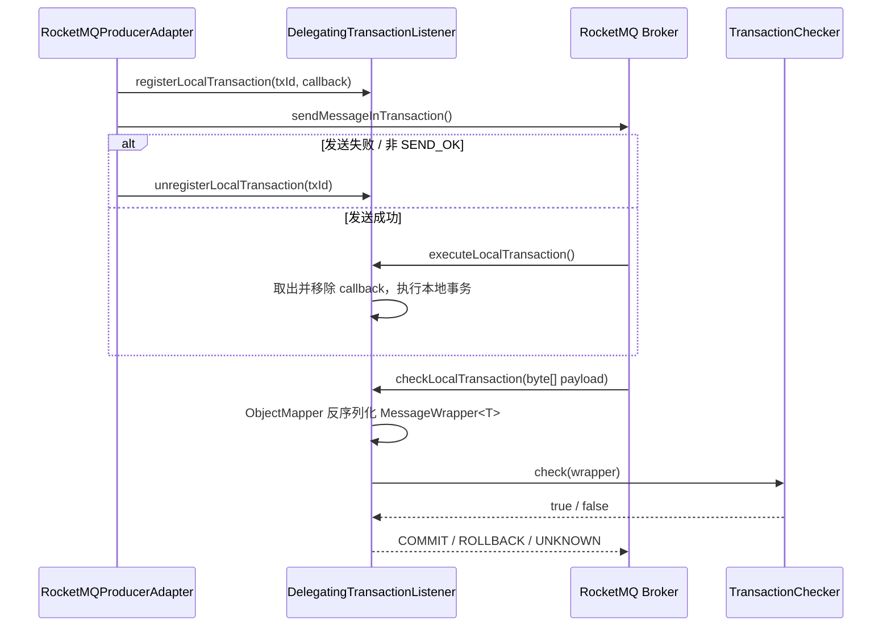
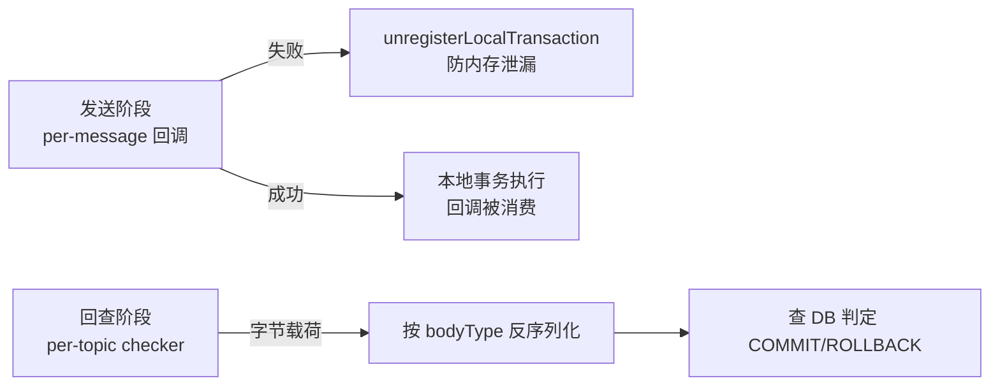

# UP-42 事务消息回查反序列化与本地事务回调清理

上游对照提交：

- `e6342eb1 fix(mq): 事务消息发送失败时清理本地事务回调 (#92)`
- `b0f27491 fix(mq): 修复事务消息回查时消息体类型转换异常`

## 功能介绍

事务消息有两条独立链路，本仓库都还是分叉点版本，各有一个线上可见的缺陷。

### 缺陷一：回查时消息体类型转换必然异常

`DelegatingTransactionListener.checkLocalTransaction()` 原实现把 Broker 回查报文直接强转：

1. Broker 回查投递的是消息**字节**（`payload` 为 `byte[]`）；
2. 原代码执行 `(MessageWrapper<?>) message.getPayload()`，对 `byte[]` 强转必然抛 `ClassCastException`；
3. 异常被兜底捕获后返回 `UNKNOWN`，Broker 反复回查，本地事务状态无法收敛。

修复方式：`TransactionChecker<T>` 增加 `bodyType()`，回查时用 `ObjectMapper` 按 `MessageWrapper<T>` 的参数化类型反序列化 byte[] 载荷，再交给 checker 判定。

### 缺陷二：发送失败时本地事务回调无界泄漏

`RocketMQProducerAdapter.sendInTransaction()` 先注册 `localTransactionMap[txId]`，再调用 `sendMessageInTransaction()`。若调用**同步抛异常**或返回的 `SendStatus != SEND_OK`，本地事务监听器不会被触发，注册的回调永远不会被消费；持续故障会让 `localTransactionMap` 无界增长。

修复方式：未成功发送时按同一 `txId` 注销回调（正常事务路径上已被消费，清理为 no-op），异常与事务语义保持不变。

## 验收标准

1. **回查提交**：Broker 回查载荷为真实字节时，能反序列化为带类型的 `MessageWrapper<T>`；checker 返回 `true` → 回查返回 `COMMIT`。
2. **回查回滚**：checker 返回 `false` → 回查返回 `ROLLBACK`。
3. **发送异常清理**：`sendMessageInTransaction` 抛异常时，异常原样抛出，且 `localTransactionMap` 中该 `txId` 已被移除。
4. **发送非 SEND_OK 清理**：返回 `SendStatus` 非 `SEND_OK`（如 `FLUSH_DISK_TIMEOUT`）时同样移除回调。
5. 可执行验证：

```bash
./mvnw test -pl framework -Dtest='DelegatingTransactionListenerTest,RocketMQProducerAdapterTest'
```

期望结果：两个测试类全部通过，`Failures: 0, Errors: 0`。

## 代码位置

| 作用 | 位置 |
| --- | --- |
| 回查监听器与类型化反序列化 | `framework/src/main/java/com/nageoffer/ai/ragent/framework/mq/producer/DelegatingTransactionListener.java` |
| 回查接口（新增 `bodyType()`） | `framework/src/main/java/com/nageoffer/ai/ragent/framework/mq/producer/TransactionChecker.java` |
| 发送失败清理回调 | `framework/src/main/java/com/nageoffer/ai/ragent/framework/mq/producer/RocketMQProducerAdapter.java` |
| 业务回查实现（需实现 `bodyType()`） | `bootstrap/src/main/java/com/nageoffer/ai/ragent/knowledge/mq/KnowledgeDocumentChunkTransactionChecker.java` |
| 单元测试 | `framework/src/test/java/com/nageoffer/ai/ragent/framework/mq/producer/DelegatingTransactionListenerTest.java`、`RocketMQProducerAdapterTest.java` |

接口变更说明：`TransactionChecker` 由无泛型接口变为 `TransactionChecker<T>`，新增 `Class<T> bodyType()`。本仓库当前只有 `KnowledgeDocumentChunkTransactionChecker` 一个实现，已同步改造；后续新增回查器必须声明载荷类型。

## 相关图表



反查与清理的职责边界：


